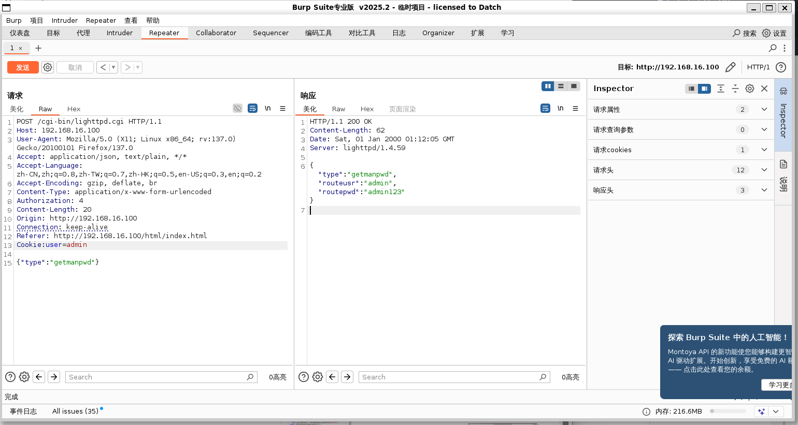
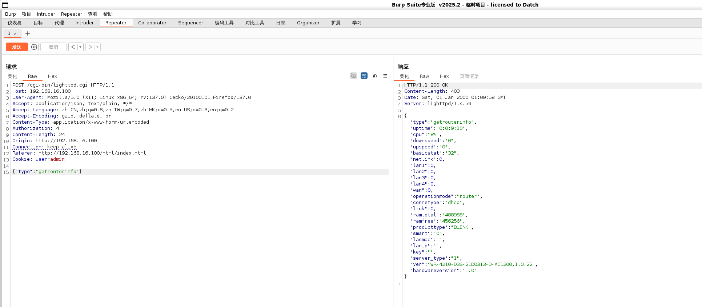
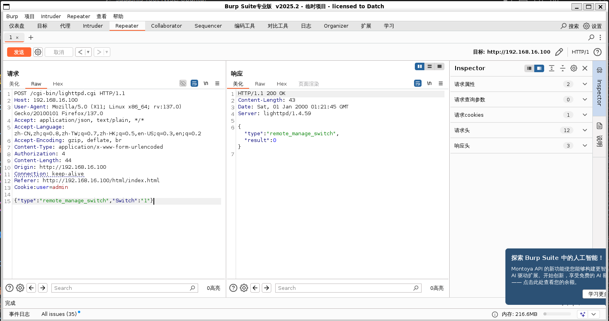
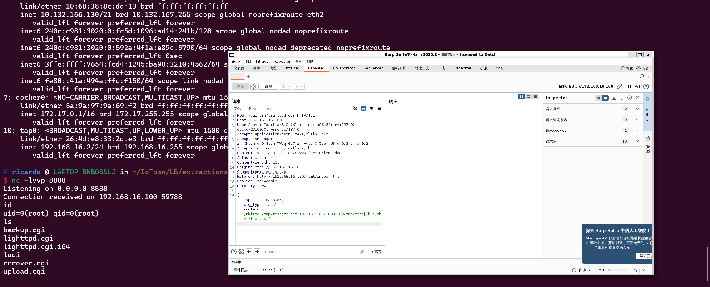
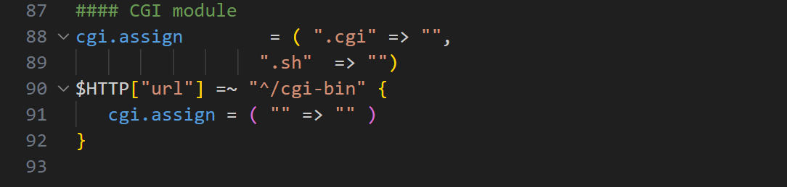
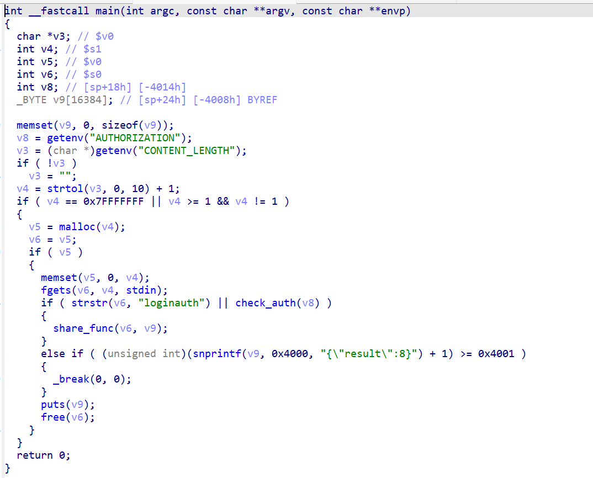
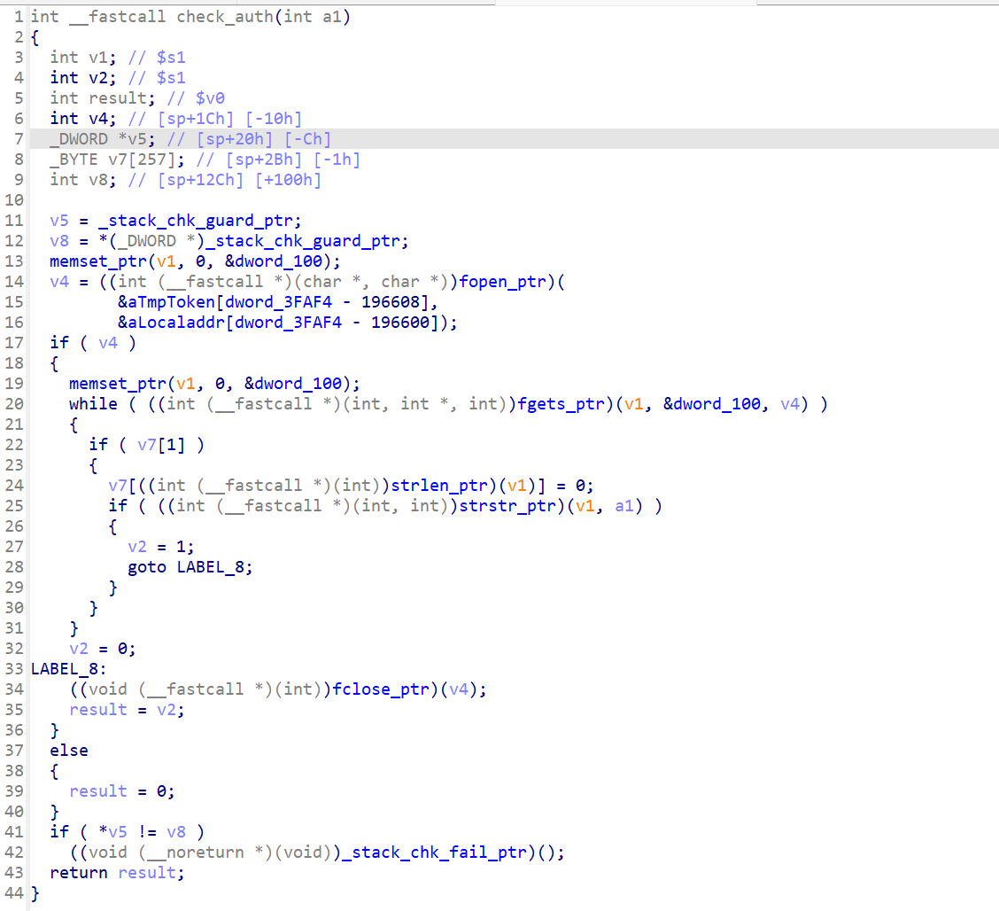
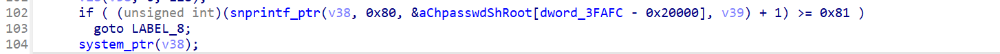
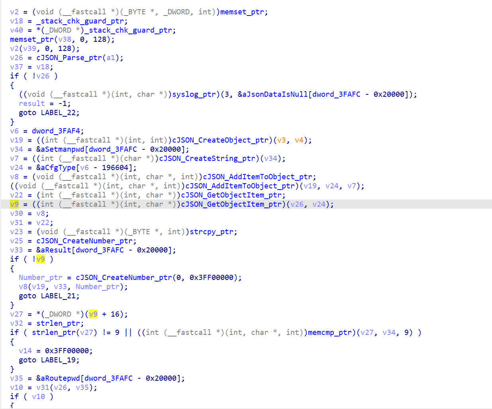
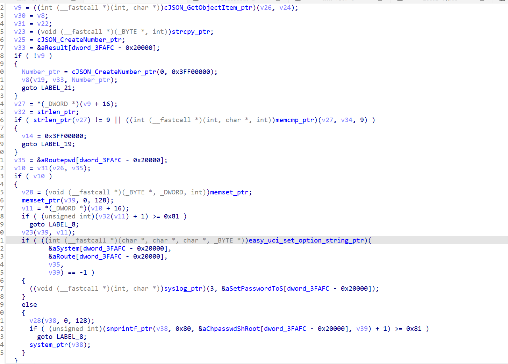

<!-- more -->

# 多款LB-LINK路由器存在未授权访问漏洞

漏洞涉及路由器固件有：

BL-G1200_V2.0(V1.0.20)升级固件

BL-AX5400P(V1.0.19)升级固件

BL-AX1800(V1.0.19)升级固件

BL-AC3600(V1.0.22)升级固件

BL-AC2600(V1.0.22)升级固件

BL-X-PRO_V2.0(V1.0.22)升级固件

固件来源于官方：[下载中心_必联（LB-LINK）官方网站](https://www.b-link.net.cn/downloads_16.html)

## 一、漏洞衍生的危害

### 1.未授权信息泄露

几乎所有的向 `lighttpd.cgi`发送的调用函数请求都可以未授权访问，包括 `setmanpwd`（篡改路由器登录界面密码）、`getmanpwd`（获取路由器当前登录密码）、`getrouterinfo`（获取路由信息）、`set_remote_manage`（开启远程web访问）等等。攻击者只需控制请求中 `type`字段的函数名称和其他字段便可达成攻击，所有POC均会放在 `/POC`文件夹中。

#### 篡改路由器登录界面密码

#### 获取路由器当前登录密码

#### 获取路由信息

#### 开启远程web访问

### 2.未授权远程命令执行（命令注入）

在 `libblinkapi.so`的 `bs_setmanpwd`函数中存在命令注入漏洞，从而可以远程命令执行，获取路由器最高权限。

## 二、漏洞成因

### 1.认证绕过

在 `/etc/lighttpd/lighttpd.conf`中，请求的 URL 以 `/cgi-bin` 开头时，不管文件扩展名是什么，都当作 CGI 脚本并使用系统默认解释器执行。

在 `/www/cgi-bin/lighttpd.cgi`的 `main`函数中，会先执行 `check_auth`函数检查请求中 `Authorization`字段，再进入 `share_func`函数。

在 `/usr/lib/libblinkapi.so`的 `check_auth`函数中，错误的使用 `strstr`函数进行鉴权，攻击者只需使用 `/tmp/token` 中存在的一个字符，并设置在请求的 `Authorization`字段中便可进行绕过， `v1`为用户登录过后留下的 `token`，保存在 `/tmp/token`中，a1是攻击者请求中 `Authorization`字段。`share_fuc`会处理请求的内容将type字段的函数名交给其他函数进行处理。

（下面IDA反编译代码经过自写的脚本进行重命名，脚本会防止在 `/origin_file`文件夹下）

### 2.命令注入

在 `/usr/lib/libblinkapi.so`的bs_SetManPwd函数中

`v39`是经过前面处理得到的routepwd中的字符串，通过 `snprintf`拼接成 `chpasswd.sh root v39`的形式，然后直接执行 `system`。请求中的 `routepwd`类的值并未经过校验（校验功能经测试在前端）。

通过对反编译代码的分析，攻击者的请求中需包含 `“cfg_type”`类（即反编译代码中v9）方能进入system所在的if分支。

（部分反编译代码如下，同样经过脚本进行重命名）

## 三、详细过程

https://github.com/Exploo0Osion/LB-Link_unauth
