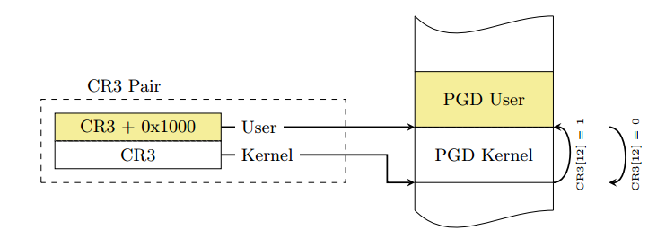
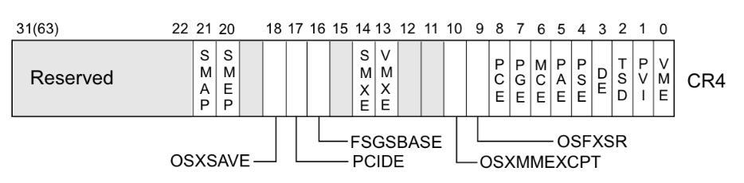
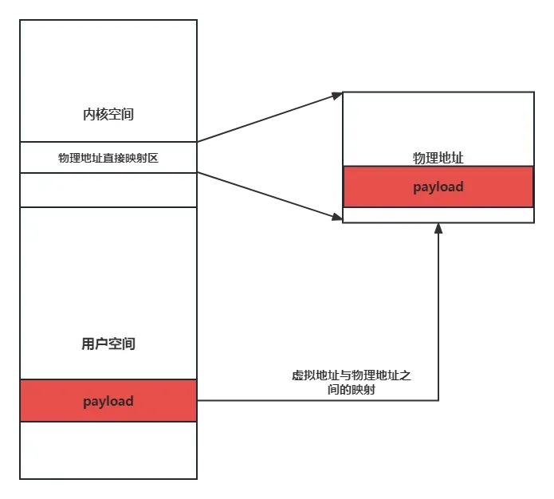
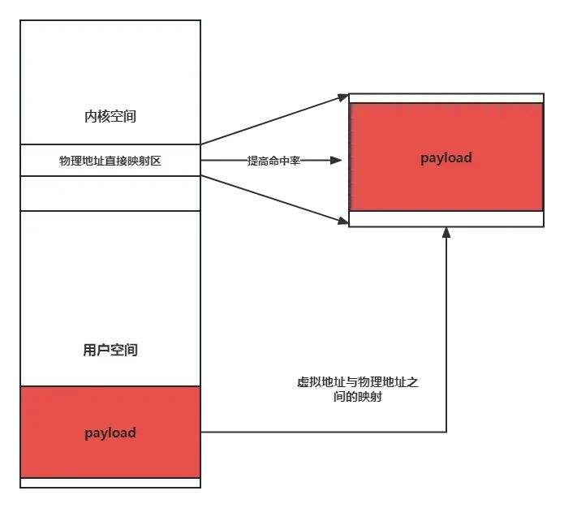
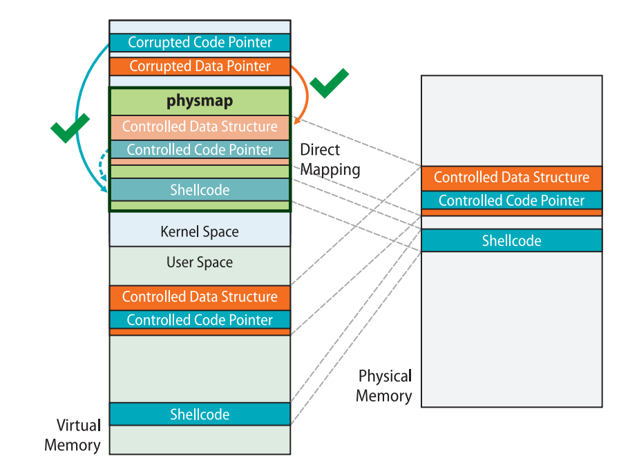

<!-- more -->
# linux kernel

## 一、kernel pwn学习（一）

### 1、常用指令和脚本

#### 解压命令

```bash
mkdir core #创建core文件夹，在其中解压缩和打包
file core.cpio #查看压缩方式
mv core.cpio ./core/core.cpio.gz # gunzip只能解压gz后缀的文件
cd core
gunzip core.cpio.gz # gzip解压
cpio -idmv < core.cpio # cpio命令从命令行接收core.cpio作为参数来解压
cp core.ko ../core.ko
trash-put core.cpio # 不再需要
vim init # 修改init启动脚本，注释掉定时关机命令
```

#### 打包命令

```bash
find . | cpio -o -H newc > ../core.cpio
# 或者：
find . | cpio -o --format=newc > ../rootfs.img
#还原
mv core.cpio ../core.cpio
cd ..
```

#### 编译命令

```bash
gcc exp.c -o exp -masm=intel -static
```

#### gdb调试命令

查看保护信息：

* `cat /proc/cpuinfo`

查找基地址：

* `cat /proc/modules | grep [驱动名]`
* `lsmod`
* `cat /sys/module/[驱动名]/sections/.text`

`add-symbol-file [驱动名] [基地址]` 加载符号表

查找函数地址：

* `cat /proc/kallsyms | grep [函数名]`

`b [function_name] / b entry_SYSCALL_64 if $[寄存器]==[变量]` 下断点

调试脚本：

```bash
gdb -q \
       -ex "target remote:1234" \
       -ex "add-symbol-file ./kgadget.ko 0xffffffffc0002000" \
       -ex "b *0xffffffff81c00010 if \$r15==0xbeefdead"
```

#### extract-vmlinux

`vmlinux` 是静态编译，未经过压缩的 kernel 文件，从中找到一些 gadget

```bash
./extract-vmlinux ./bzImage > vmlinux
```

```bash
#!/bin/sh
# SPDX-License-Identifier: GPL-2.0-only
# ----------------------------------------------------------------------
# extract-vmlinux - Extract uncompressed vmlinux from a kernel image
#
# Inspired from extract-ikconfig
# (c) 2009,2010 Dick Streefland <dick@streefland.net>
#
# (c) 2011      Corentin Chary <corentin.chary@gmail.com>
#
# ----------------------------------------------------------------------

check_vmlinux()
{
	# Use readelf to check if it's a valid ELF
	# TODO: find a better to way to check that it's really vmlinux
	#       and not just an elf
	readelf -h $1 > /dev/null 2>&1 || return 1

	cat $1
	exit 0
}

try_decompress()
{
	# The obscure use of the "tr" filter is to work around older versions of
	# "grep" that report the byte offset of the line instead of the pattern.

	# Try to find the header ($1) and decompress from here
	for	pos in `tr "$1\n$2" "\n$2=" < "$img" | grep -abo "^$2"`
	do
		pos=${pos%%:*}
		tail -c+$pos "$img" | $3 > $tmp 2> /dev/null
		check_vmlinux $tmp
	done
}

# Check invocation:
me=${0##*/}
img=$1
if	[ $# -ne 1 -o ! -s "$img" ]
then
	echo "Usage: $me <kernel-image>" >&2
	exit 2
fi

# Prepare temp files:
tmp=$(mktemp /tmp/vmlinux-XXX)
trap "rm -f $tmp" 0

# That didn't work, so retry after decompression.
try_decompress '\037\213\010' xy    gunzip
try_decompress '\3757zXZ\000' abcde unxz
try_decompress 'BZh'          xy    bunzip2
try_decompress '\135\0\0\0'   xxx   unlzma
try_decompress '\211\114\132' xy    'lzop -d'
try_decompress '\002!L\030'   xxx   'lz4 -d'
try_decompress '(\265/\375'   xxx   unzstd

# Finally check for uncompressed images or objects:
check_vmlinux $img

# Bail out:
echo "$me: Cannot find vmlinux." >&2
```

### 2、kernel rop

通常情况下kernel pwn一类题需要将可执行文件 `exp` 上传到远程服务器上并执行，该可执行文件 `exp` 需要具有提权+get shell两个功能，因为启动内核后的 `shell` 不具备 `root` 权限，无法查看非 `root` 用户才能打开的 `flag` 文件。因此需要在内核态执行 `commit_creds(prepare_kernel_cred(NULL))`（高版本为 `commit_creds(prepare_kernel_cred(&init_task))` 或 `commit_creds(&init_cred)` ）当前线程的 `cred` 结构体便变为 init 进程的 `cred` 的拷贝，也就获得了 `root` 权限。

#### 返回用户态

* `swapgs`指令恢复用户态GS寄存器
* `sysretq`或者 `iretq`恢复到用户空间

`iretq` 会依次从栈中弹出 `RIP`、`CS`、`RFLAGS` 等信息，从而实现从内核态返回到用户态的跳转。

ROP链构造：

```bash
↓   swapgs
    iretq
    user_shell_addr
    user_cs
    user_eflags //64bit user_rflags
    user_sp
    user_ss
```

#### KPTI bypass（内核页表隔离）

KPTI中每个进程有两套页表——内核态页表与用户态页表(两个地址空间)。内核态页表只能在内核态下访问，可以创建到内核和用户的映射（用户空间受SMAP和SMEP保护）。用户态页表只包含用户空间和部分内核地址。KPTI 同时还令内核页表中用户地址空间部分对应的页顶级表项不再拥有执行权限（NX）。

每个进程都有一套指向进程自身的页表，由CR3寄存器指向。因为内核空间的PGD与用户空间的PGD 两张页全局目录表放在一段连续的内存中，只需将CR3 的第 13 位取反便能完成页表切换的操作。



用于完成内核态页表切换回到用户态页表的函数 `swapgs_restore_regs_and_return_to_usermode`，栈空间布局如下：

```bash
#cat /proc/kallsyms| grep swapgs_restore_regs_and_return_to_usermode
↓   swapgs_restore_regs_and_return_to_usermode
    0 // padding
    0 // padding
    user_shell_addr
    user_cs
    user_rflags
    user_sp
    user_ss
```

或者找到类似如下 `gadget`：

```bash
mov  rdi, cr3
or rdi, 0x1000
mov  cr3, rdi
```

#### smep && smap bypass

**SMEP** ：位于Cr4的第20位，作用是让处于内核权限的CPU无法执行用户代码。
**SMAP** ：位于Cr4的第21位，作用是让处于内核权限的CPU无法读写用户代码。



在未开启 `smep/smap`机制时，`cr4`的值一般为 `0x6f0` ，利用 `gadget`将其修改为此值即可绕过保护

#### ret2dir

在内核中存在一块 `direct mapping area`（即线性映射区域），它线性映射了整个物理内存空间。也就是说，用户空间内存都可以在此区域上找到，我们通过这个内核空间地址便能直接访问到用户空间的数据，从而避开了传统的隔绝用户空间与内核空间的防护手段（`smep/smap/kpti`）



 `ret2dir` 攻击的手段有如下：

* 利用 mmap 在用户空间大量喷射内存
* 
* 利用漏洞泄露出内核的“堆”上地址（通过 kmalloc 获取到的地址），这个地址直接来自于线性映射区
* 利用泄露出的内核线性映射区的地址进行内存搜索 ，从而找到我们在用户空间喷射的内存



#### pt_regs结构体

在进行系统调用时，会完成从用户态到内核态的切换，需要保存用户态时的上下文寄存器，而这些寄存器的值都需要保存在 `pt_regs`中

```c
struct pt_regs {
/*
 * C ABI says these regs are callee-preserved. They aren't saved on kernel entry
 * unless syscall needs a complete, fully filled "struct pt_regs".
 */
    unsigned long r15;
    unsigned long r14;
    unsigned long r13;
    unsigned long r12;
    unsigned long rbp;
    unsigned long rbx;
/* These regs are callee-clobbered. Always saved on kernel entry. */
    unsigned long r11;
    unsigned long r10;
    unsigned long r9;
    unsigned long r8;
    unsigned long rax;
    unsigned long rcx;
    unsigned long rdx;
    unsigned long rsi;
    unsigned long rdi;
/*
 * On syscall entry, this is syscall#. On CPU exception, this is error code.
 * On hw interrupt, it's IRQ number:
 */
    unsigned long orig_rax;
/* Return frame for iretq */
    unsigned long rip;
    unsigned long cs;
    unsigned long eflags;
    unsigned long rsp;
    unsigned long ss;
/* top of stack page */
};
```

可以利用如下 `exp`查看 `pt_regs` 结构体和设置某些未被题目 `ioctl`特殊设置的寄存器来实施栈迁移操作。

调试时可以在 `entry_SYSCALL_64`函数处下断点，随后通过系统调用表跳转到对应的函数。

```c
target =  0xffff888000000000 + 0x6000000;
__asm__(
    "mov r15,   0xbeefdead;"
    "mov r14,   0x11111111;"
    "mov r13,   0x22222222;"
    "mov r12,   0x33333333;"
    "mov rbp,   0x44444444;"
    "mov rbx,   0x55555555;"
    "mov r11,   0x66666666;"
    "mov r10,   0x77777777;"
    "mov r9,    0x88888888;"
    "mov r8,    0x99999999;"
    "xor rax,   rax;"
    "mov rcx,   0xaaaaaaaa;"
    "mov rdx,   0x10;" //ioctl
    "mov rsi,   0x1BF52;" //cmd
    "mov rdi,   fd;"  
    "syscall"
);
```
