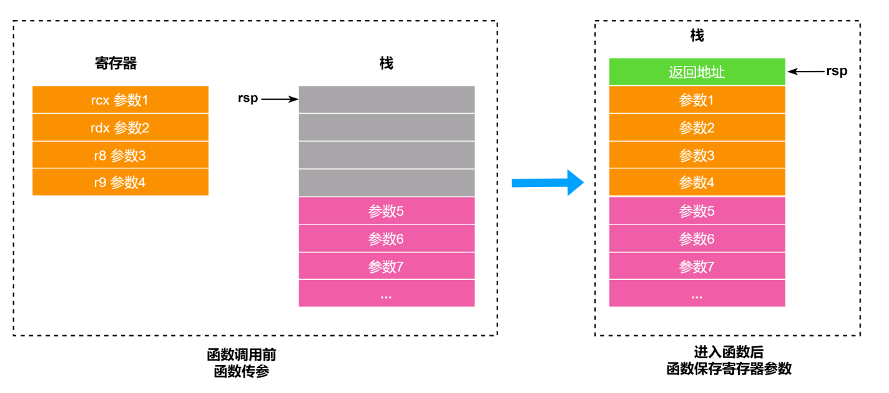
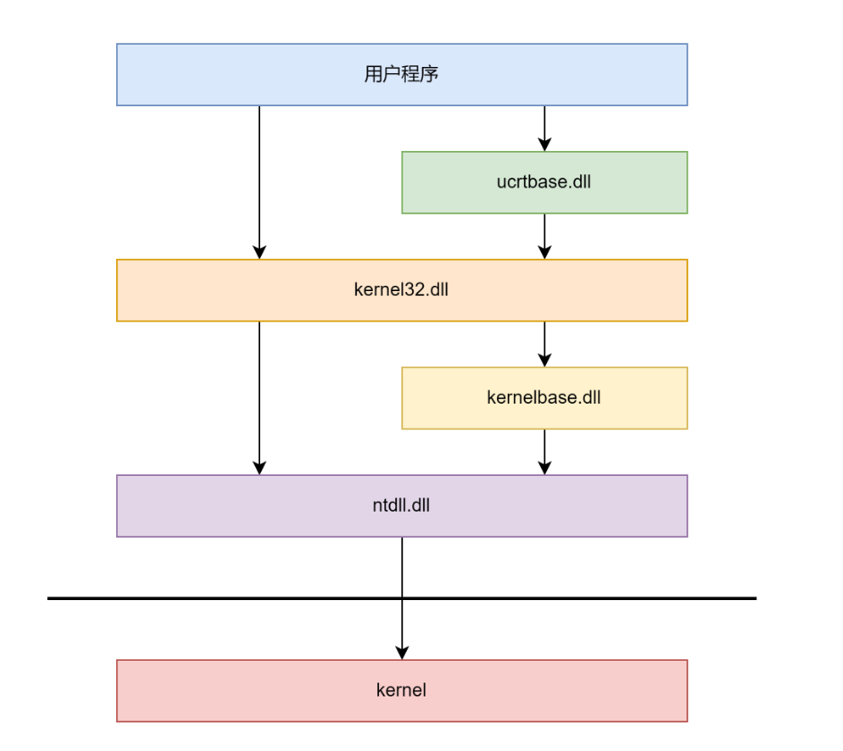
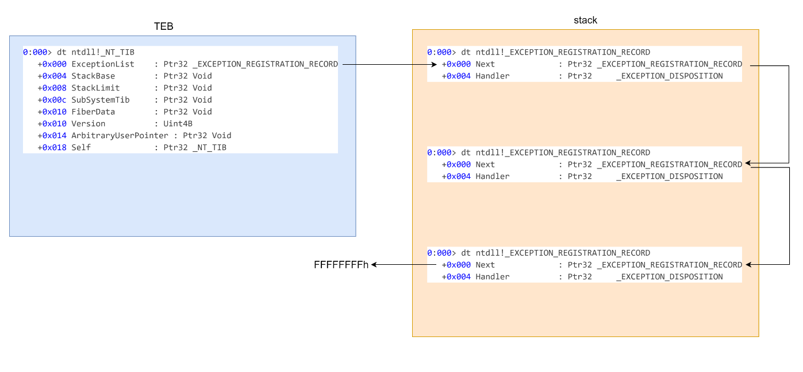
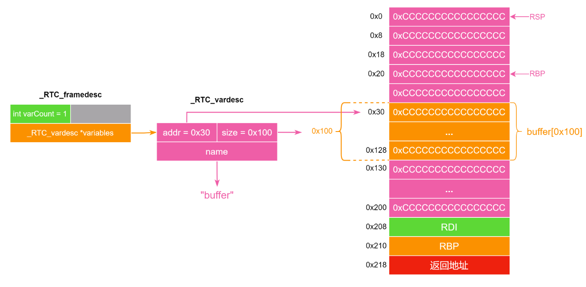

<!-- more -->

# windows

## 函数调用约定

### x86

| 调用约定             | 定义                | 参数传递                                                              | 栈平衡                           | 特点                                                          | 应用场景                            |
| -------------------- | ------------------- | --------------------------------------------------------------------- | -------------------------------- | ------------------------------------------------------------- | ----------------------------------- |
| **__cdecl**    | C语言默认调用约定   | 参数从右向左依次压入栈中                                              | 调用者(caller)负责清理栈空间     | 支持可变参数函数(VARARG)，因为调用者知道传递了多少参数        | C/C++程序中的普通函数默认使用此约定 |
| **__stdcall**  | 标准调用约定        | 参数从右向左依次压入栈中                                              | 被调用函数(callee)负责清理栈空间 | 生成的代码比__cdecl小，因为不需要在每个调用点都包含栈清理代码 | Windows API函数主要使用此约定       |
| **__fastcall** | 快速调用约定        | 前两个DWORD或更小的参数通过寄存器(ECX和EDX)传递，其余参数从右向左压栈 | 被调用函数(callee)负责清理栈空间 | 通过寄存器传递参数提高函数调用速度                            | 需要高性能的函数调用场景            |
| **__thiscall** | C++成员函数调用约定 | this指针通过ECX寄存器传递，其余参数从右向左压栈                       | 被调用函数(callee)负责清理栈空间 | 专为C++类成员函数设计                                         | C++类的非静态成员函数调用           |

* VARARG 表示参数的个数可以是不确定的，如果使用 VARARG 参数类型，就是调用程序平衡栈，否则按照默认方式平衡栈。
* `__fastcall` 传参规则为前两个参数通过 ecx 和 edx 传递，之后的参数通过栈传递。
* `__thiscall` 传参规则为 ecx 传递 this 指针，其余参数按照从右到左顺序入栈。

### x64

* `__thiscall` 传参规则为 rcx 传递 this 指针，前三个参数通过 rdx、r8、r9 传递，剩余参数布置在栈中。
* 其他类型的函数调用传参规则为前四个参数通过 rcx、rdx、r8、r9，剩余参数布置在栈中。
* 栈平衡由调用者完成。

这里需要着重强调一下 windows 64 位函数调用的堆栈。

在函数调用前前 4 个参数放在寄存器中，第 5 个参数开始依次从 `[rsp + 0x20]` 位置处开始存放。进入调用的函数后会将寄存器中的参数存放到返回地址后空缺的位置上。



## 常见 dll

* ntdll.dll

  * **核心作用** ：Windows系统最底层的用户模式接口
  * **包含未公开API** ：

    * 实现了Windows Native API（未完全公开的系统接口）
    * 包含如 `NtCreateFile`、`NtReadFile`、`NtAllocateVirtualMemory`等核心函数
    * 这些API通常以 `Nt`或 `Zw`前缀开头
  * **系统调用入口** ：

    * 是用户模式到内核模式转换的关键桥梁
    * 通过 `syscall`/`sysenter`指令触发实际的系统调用
    * 例如：`NtCreateFile`最终会触发系统调用号，进入内核的 `ntoskrnl.exe`
  * **各版本间不同**
* kernel32.dll

  * **核心作用** ：Windows API的主要封装层
  * **基础功能API** ：

    * 提供堆管理（`HeapAlloc`、`HeapFree`）
    * 虚拟内存操作（`VirtualAlloc`、`VirtualFree`）
    * 文件I/O（`CreateFile`、`ReadFile`、`WriteFile`）
    * 进程/线程管理（`CreateProcess`、`CreateThread`）
  * **ntdll函数的封装** ：

    * 大多数kernel32函数只是简单包装了ntdll中的对应函数
    * 例如：`CreateFileW` → `BasepCreateFile` → `NtCreateFile`
    * API 几乎不会修改
* mscrtxxx.dll / ucrtbase.dll

  * **核心作用** ：C语言运行时库的Windows实现
* **mscrtxxx.dll** ：

  * 旧版Microsoft C运行时库（如msvcr120.dll）
  * 类似于Linux中的glibc（GNU C Library）
* **ucrtbase.dll** ：

  * Windows 10引入的统一C运行时库（Universal CRT）

dll 之间的函数调用关系如下图所示：



## windbg调试命令

下断点：bp 地址

程序运行到断点停止：g

## 常见结构体

### PEB

PEB（Process Environment Block）是 Windows 操作系统中的一个数据结构，它包含了进程的上下文信息。每个进程都有一个唯一的 PEB，它被存储在进程的用户模式地址空间中。在x86系统中位于 `fs:[30h]`，在x64系统中位于 `gs:[60h]`

```c
typedef struct _PEB {
    BYTE Reserved1[2];
    BYTE BeingDebugged;
    BYTE Reserved2[1];
    PVOID Reserved3[2];
    PPEB_LDR_DATA Ldr;
    PRTL_USER_PROCESS_PARAMETERS ProcessParameters;
    BYTE Reserved4[104];
    PVOID Reserved5[52];
    PPS_POST_PROCESS_INIT_ROUTINE PostProcessInitRoutine;
    BYTE Reserved6[128];
    PVOID Reserved7[1];
    ULONG SessionId;
} PEB,*PPEB;
```

PEB 与 TEB 的相对偏移固定，使用 `.process` 或者 `r $peb` 查看进程的 PEB 地址，随后使用 `dt _PEB peb_addr` 查看进程的 PEB 信息。

```
0:000> .process
Implicit process is now 00c37000
0:000> r $peb
$peb=00c37000
0:000> dt _PEB 00c37000
ntdll!_PEB
   +0x000 InheritedAddressSpace : 0 ''
   +0x001 ReadImageFileExecOptions : 0 ''
   +0x002 BeingDebugged    : 0x1 ''
   +0x003 BitField         : 0x4 ''
   +0x003 ImageUsesLargePages : 0y0
   +0x003 IsProtectedProcess : 0y0
   +0x003 IsImageDynamicallyRelocated : 0y1
   +0x003 SkipPatchingUser32Forwarders : 0y0
   +0x003 IsPackagedProcess : 0y0
   +0x003 IsAppContainer   : 0y0
   +0x003 IsProtectedProcessLight : 0y0
   +0x003 IsLongPathAwareProcess : 0y0
   +0x004 Mutant           : 0xffffffff Void
   +0x008 ImageBaseAddress : 0x00540000 Void
   +0x00c Ldr              : 0x775deb20 _PEB_LDR_DATA
   ...
```

`!peb` 查看 PEB 的具体内容，ImageBaseAddress为程序基地址，ProcessHeap为堆地址

```
0:000> !peb
PEB at 00c37000
    InheritedAddressSpace:    No
    ReadImageFileExecOptions: No
    BeingDebugged:            Yes
    ImageBaseAddress:         00540000
    NtGlobalFlag:             70
    NtGlobalFlag2:            0
    Ldr                       775deb20
    Ldr.Initialized:          Yes
    Ldr.InInitializationOrderModuleList: 01075268 . 01075778
    Ldr.InLoadOrderModuleList:           01075370 . 01077610
    Ldr.InMemoryOrderModuleList:         01075378 . 01077618
            Base TimeStamp                     Module
          540000 5eff73f6 Jul 04 02:07:50 2020 C:\1\Download\easyWinHeap\EasyWinHeap.exe
        774b0000 C:\Windows\SYSTEM32\ntdll.dll
        76030000 25e3fa57 Feb 22 22:42:31 1990 C:\Windows\System32\KERNEL32.DLL
        76580000 53a79838 Jun 23 11:00:08 2014 C:\Windows\System32\KERNELBASE.dll
        76b90000 C:\Windows\System32\ucrtbase.dll
        69a10000 5e74ae97 Mar 20 19:52:55 2020 C:\1\Download\easyWinHeap\VCRUNTIME140.dll
    SubSystemData:     00000000
    ProcessHeap:       01070000
    ProcessParameters: 01072c70
    CurrentDirectory:  'C:\Windows\system32\'
    WindowTitle:  'C:\1\Download\easyWinHeap\EasyWinHeap.exe'
    ImageFile:    'C:\1\Download\easyWinHeap\EasyWinHeap.exe'
    CommandLine:  'C:\1\Download\easyWinHeap\EasyWinHeap.exe'
    DllPath:      '< Name not readable >'
    Environment:  01070cf8
```

### TEB

TEB（Thread Environment Block）是 Windows 操作系统中的一个线程私有的数据结构，用于存储线程相关的信息。每个线程都有一个对应的 TEB 。32 位程序 FS 寄存器指向当前线程的 TEB ，64 位程序 GS 寄存器指向当前线程的 TEB 。

使用 `r $teb` 查看进程的 TEB 地址，`!teb` 可以查看 TEB 详细信息。

```
0:000> r $teb
$teb=00c3a000
0:000> !teb
TEB at 00c3a000
    ExceptionList:        00bbf2a0
    StackBase:            00bc0000
    StackLimit:           00bbd000
    SubSystemTib:         00000000
    FiberData:            00001e00
    ArbitraryUserPointer: 00000000
    Self:                 00c3a000
    EnvironmentPointer:   00000000
    ClientId:             00002d78 . 00003c8c
    RpcHandle:            00000000
    Tls Storage:          01075d60
    PEB Address:          00c37000
    LastErrorValue:       0
    LastStatusValue:      0
    Count Owned Locks:    0
    HardErrorMode:        0

```

TEB 的开头是一个 NT_TIB 结构，Thread Infomation Block，线程信息块，具体如下：

```
0:000> dt _nt_tib
ntdll!_NT_TIB
   +0x000 ExceptionList    : Ptr32 _EXCEPTION_REGISTRATION_RECORD
   +0x004 StackBase        : Ptr32 Void  // 线程堆栈顶 
   +0x008 StackLimit       : Ptr32 Void   // 线程堆栈底
   +0x00c SubSystemTib     : Ptr32 Void
   +0x010 FiberData        : Ptr32 Void
   +0x010 Version          : Uint4B
   +0x014 ArbitraryUserPointer : Ptr32 Void
   +0x018 Self             : Ptr32 _NT_TIB   // _NT_TIB结构体的自引用指针
```

可以用于泄露栈地址

### SEH

SEH（Structured Exception Handling，结构化异常处理）是 Windows 操作系统中的一种异常处理机制。

异常处理需要注册异常，即在异常处理链表中添加 `_EXCEPTION_REGISTRATION_RECORD` 节点

`_EXCEPTION_REGISTRATION_RECORD` 中的 `Next` 指向上一个 `_EXCEPTION_REGISTRATION_RECORD` 结构，`Handler` 指向异常处理的代码。



## 常见保护

### DEP

* 类似 Linux 上的 NX 保护，可以理解为内存的可写和可执行不共存。
* 绕过方法
  * ROP
  * 调用 VirtualProtect （类似于 Linux 的 mprotect）

### ASLR

* TEB/PEB/heap/stack 的基址每次运行程序都会改变
* 一些内核相关的 dll 例如 ntdll.dll 和 kernel32.dll 在所有进程中基址相同
* 绕过方法
  * 泄露地址

    * 一些 dll 的加载基址在所有进程都相同，因此可以在另一个进程中泄露基址。
      * 模块加载基址每次重启才会改变，因此只要靶机不重启不必每次运行程序时泄露基址。

### GS

* windows 版的 canary
* 绕过方法
  * 泄露canary值（通过信息泄露漏洞）
  * 覆盖SEH处理程序指针（利用未受GS保护的SEH）

### CheckStackVars

这个保护是在函数返回前调用 `_RTC_CheckStackVars` 函数检查栈中的局部变量的前后 4 字节是否被修改，通常在 Debug 版程序中会出现。

函数在结束时调用了 `CheckStackVars` ，函数原型如下：

```c
void __fastcall RTC_CheckStackVars(void *Esp, _RTC_framedesc *Fd)
```

这个函数遍历 _RTC_vardesc (保存在 `.rdata` 段)描述的所有局部变量，检查变量的前后 4 字节是否被修改（即是否不是 0xCCCCCCCC）。

```c
struct _RTC_vardesc
{
  int addr;
  int size;
  char *name;
};
struct _RTC_framedesc
{
  int varCount;
  _RTC_vardesc *variables;
};
```



### SEHOP

在 `ntdll!RtlDispatchException` 中有对 SEH 链表的检查

```c
      RtlpGetStackLimits(&StackLimit, &StackBase);
      ExceptionList = NtCurrentTeb()->NtTib.ExceptionList;
      ProcessInformation = 0;
      if ( ZwQueryInformationProcess((HANDLE)0xFFFFFFFF, ProcessExecuteFlags, &ProcessInformation, 4u, 0) < 0 )
        ProcessInformation = 0;
      if ( (ProcessInformation & 0x40) != 0 || RtlpIsValidExceptionChain(ExceptionList, StackLimit, StackBase) )// SEHOP
      {
LABEL_11:
        RegistrationPointerForCheck = ExceptionList;
        NestedRegistration = 0;
        while ( RegistrationPointerForCheck != (_EXCEPTION_REGISTRATION_RECORD *)-1 )// -1 表示 SEH 链结束
        {
          if ( (unsigned int)RegistrationPointerForCheck < StackLimit
            || (unsigned int)&RegistrationPointerForCheck[1] > StackBase// SEH 节点不在栈中
            || ((unsigned __int8)RegistrationPointerForCheck & 3) != 0// SEH 节点的位置没有 4 字节对齐
            || (Handler = RegistrationPointerForCheck->Handler, (unsigned int)Handler < StackBase)
            && StackLimit <= (unsigned int)Handler
            || !RtlIsValidHandler(Handler, ProcessInformation, pContext) )// safeSEH
          {
            pExcptRec->ExceptionFlags |= EXCEPTION_STACK_INVALID;// EXCEPTION_STACK_INVALID
            goto DispatchExit;
          }
...
```

其中 RtlpIsValidExceptionChain 内容如下：

```c
char __fastcall RtlpIsValidExceptionChain(
        _EXCEPTION_REGISTRATION_RECORD *ExceptionList,
        unsigned int StackLimit,
        unsigned int StackBase,
        int StackLimita)
{
  unsigned int stackBase; // ebx
  int stackLimit; // eax
  _EXCEPTION_DISPOSITION (__stdcall *Handler)(_EXCEPTION_RECORD *, void *, _CONTEXT *, void *); // edx

  stackBase = StackBase;
  stackLimit = StackLimit;
  while ( ExceptionList != (_EXCEPTION_REGISTRATION_RECORD *)-1 )
  {
    if ( stackLimit > (unsigned int)ExceptionList )
      return 0;
    if ( (unsigned int)ExceptionList >= stackBase - 8 )
      return 0;
    if ( ((unsigned __int8)ExceptionList & 3) != 0 )
      return 0;
    Handler = ExceptionList->Handler;
    if ( (unsigned int)Handler < stackBase && StackLimit <= (unsigned int)Handler )
      return 0;
    if ( ExceptionList->Next == (_EXCEPTION_REGISTRATION_RECORD *)-1 )
    {
      stackBase = StackBase;
      if ( (NtCurrentTeb()->SameTebFlags & 0x200) != 0 && Handler != RtlpFinalExceptionHandler )
        return 0;
    }
    stackLimit = (int)&ExceptionList[1];
    ExceptionList = ExceptionList->Next;
  }
  return 1;
}
```

主要检查 SEH 是否满足如下条件：

* SEH 节点在栈中
* SEH节点指向的 Handler 不在栈中
* SEH 节点地址 4 字节对齐
* SEH 最后一个节点的 Next 为 -1 且 Handler 为 RtlpFinalExceptionHandler
* SEH 节点的 Next 指向的下一个节点的地址一定大于当前节点

只要泄露栈地址就可以伪造 SEH 链表绕过 SEHOP 检查(直接修改栈上的SEH节点为SEH异常处理链的最后一块地址)

### SafeSEH

在 `ntdll!RtlDispatchException` 中调用 `RtlIsValidHandler` 进一步检查 SEH 链表，伪代码如下：

```c
 BOOL RtlIsValidHandler(handler) {
    if (handler image has a SafeSEH table) { //检查异常处理程序所在的模块是否包含SafeSEH表（编译时通过/GS选项生成）
        if (handler found in the table) //处理程序在表中
            return TRUE;
        else
            return FALSE;
    }
    if (ExecuteDispatchEnable|ImageDispatchEnable bit set in the process flags) // 允许在加载模块内存空间外执行
        return TRUE;
    if (handler is on a executeable page) {
        if (handler is in an image) {  //Handler 位于一个模块
            if (image has the IMAGE_DLLCHARACTERISTICS_NO_SEH flag set)  //标志明确表示“本模块不使用 SEH”
                return FALSE;
            if (image is a .NET assembly whith the ILonly flag set) //该模块是一个纯粹的 .NET 程序集，它的代码不是原生机器码，不能直接作为 SEH 处理程序
                return FALSE;
            return TRUE;
        }
        if (handler is not in an image) {
            if (ImageDispatchEnable bit set in the process flags)
                return TRUE;
            else
                return FALSE;
        }
    }
    if (handler is on a non-executable page) { 
        if (ExecuteDispatchEnable bit set in the process flags)
            return TRUE;
        else
            raise ACCESS_VIOLATION;
    }
}
```

将 `Handler` 覆盖指向有 SEH 但没有 SafeSEH 保护的 Image 即可绕过。

### CFG

即 Control Flow Guard ，为函数指针创建白名单，每次调用前都会检查。

windows下的是前向CFI：只考略call，jump的直接跳转和间接跳转，没有计算ret的情况，会在每一个跳转间自动插入一小段检查代码，这段代码会去调用一个核心的验证函数 `__guard_check_icall_fptr`

Windows CFG实现还依赖于bitmap表，bitmap表中的两位与实际地址的16byte一一对应：

* 00：该地址范围没有有效的跳转地址
* 01：地址范围包含导出抑制表目标
* 10：只有16位对其的地址有效（该范围的第一个地址）
* 11：地址范围的所有地址均有效

```c
void __fastcall LdrpValidateUserCallTarget(unsigned __int64 FuncPtr)
{
  __int64 BitMap; // rdx
  unsigned __int64 Offset; // rax

  BitMap = CFGBitMap[FuncPtr >> 9];
  Offset = FuncPtr >> 3;  //& 0x3F;
  if ( (FuncPtr & 0xF) != 0 )
  {
    Offset &= ~1ui64;
    if ( !_bittest64(&BitMap, Offset) )
    {
LABEL_6:
      LdrpHandleInvalidUserCallTarget();
      return;
    }
LABEL_5:
    if ( _bittest64(&BitMap, Offset | 1) )
      return;
    goto LABEL_6;
  }
  if ( !_bittest64(&BitMap, Offset) )
    goto LABEL_5;
}
```

绕过方法：ROP（利用一些在白名单里的跳转gadget）

### PROCESS_MITIGATION_CHILD_PROCESS_POLICY

`PROCESS_MITIGATION_CHILD_PROCESS_POLICY` 是Windows操作系统中的一项安全功能。该功能允许管理员指定如何创建子进程以及它们从其父进程继承哪些安全设置。该功能可用于防止子进程继承某些安全设置，例如创建新进程或访问某些系统资源的能力。

可用于配置 `PROCESS_MITIGATION_CHILD_PROCESS_POLICY` 的几个选项，包括：

* `NoChildProcessCreation`：防止创建子进程。
* `ParentProcess`：允许子进程继承与其父进程相同的安全设置。
* `ChildProcessRestricted`：将子进程的安全设置限制为其父进程安全设置的子集。

可使用如下命令查询 `PROCESS_MITIGATION_CHILD_PROCESS_POLICY` 是否已开启（在管理员权限的 Powershell 中查询）：

```
Get-ProcessMitigation -Name 程序名
```

可以使用如下命令开启 `ChildProcessRestricted` 保护，效果是不能执行 `system("cmd.exe")`，只能 ORW 获取 flag 。

```
Set-ProcessMitigation -Name 程序名 -Enable DisallowChildProcessCreation
```

## windows IO_FILE

Windows 的 `FILE` 结构体定义在 `ucrtbase.dll` 中，其结构体是实际上是 `__crt_stdio_stream_data`，大小为 0x58 。

```c
struct _RTL_CRITICAL_SECTION {
    _RTL_CRITICAL_SECTION_DEBUG *DebugInfo;
    int LockCount;
    int RecursionCount;
    void *OwningThread;
    void *LockSemaphore;
    unsigned __int64 SpinCount;
};

struct __crt_stdio_stream_data {
    union {
        FILE _public_file;
        char* _ptr; // 当前结构指针
    }
    char *_base; // 输入缓冲区基址
    int _cnt; // 没有被读出的缓冲区剩余大小
    int _flags;
    int _file; // 文件描述符
    int _charbuf; // Local buffer
    int _bufsiz; // buffer size
    char *_tmpfname;
    _RTL_CRITICAL_SECTION _lock; // lock
};
```

如果要实现任意地址读，`fwrite`：

* 设置 `_file` 文件描述符为 `stdout` 输出符
* 设置 `_flag` 为 `_IOWRITE | IOBUFFER_USER | _IOUPDATE`
* 设置 `_cnt=0`
* 设置 `_base& _ptr` 指向读取的地址
* 设置 `_bufsize` 为输出的大小

如果要实现任意地址写，`fread`：

* 设置 `_file` 文件描述符为 `stdin` 输出符
* 设置 `_flag` 为 `_IOALLOCATED | _IOBUFFER_USER`
* 设置 `_cnt=0`
* 设置 `_base& _ptr` 指向写入的地址
* 设置 `_bufsize` 为输入的大小

程序在每次执行如下代码时会在进程的**默认堆**中申请一个 0x60 大小的 chunk 并将其填充为 `__crt_stdio_stream_data` 结构体然后将该结构体地址写入 `Stream` 中。

```c
fopen_s(&Stream, "magic.txt", "rb");
```

如果我们能够劫持 `Stream` 指针或者 UAF 修改 `__crt_stdio_stream_data` 结构体就可以在执行下面这段代码时实现任意地址写。

```c
fread_s(buffer, size, 1ui64, size, Stream);
```

具体伪造方式如下，主要操作是把 `_base` 指向要写入数据的地址，`_file` 设为 0 即标准输入。

```
fake_FILE = ''
fake_FILE += p64(0)  # _ptr
fake_FILE += p64(target_addr)  # _base
fake_FILE += p32(0)  # _cnt
fake_FILE += p32(0x2080)  # _flags
fake_FILE += p32(0)  # _file = stdin(0)
fake_FILE += p32(0)  # _charbuf
fake_FILE += p64(0x200)  # _bufsiz
fake_FILE += p64(0)  # _tmpfname
fake_FILE += p64(0xffffffffffffffff)  # DebugInfo
fake_FILE += p32(0xffffffff)  # LockCount
fake_FILE += p32(0)  # RecursionCount
fake_FILE += p64(0)  # OwningThread
fake_FILE += p64(0)  # LockSemaphore
fake_FILE += p64(0)  # SpinCount
```

## windows heap

### windbg上的堆相关命令

`!heap` 打印当前进程所有堆

`!heap -h` 可以查看当前进程所创建的堆空间

`!heap -x address` 打印包含 address 的堆块的相关信息

`!heap -i address` 显示 address 对应堆块的详细信息

`!heap -v address` 检查堆是否损坏，address 为 heap 地址。例如伪造 `FreeList` 链表后可以用这个命令测试是否能通过检查。

### Windows 10下的堆类型

1. NT Heap
   * 默认的内存管理器
2. SegmentHeap
   * win10新增的内存管理器
   * 部分系统程序以及UWP(Universal Windows Platform)使用

### windows用户态进程堆

windows用户态进程的堆空间包含两种类型：

* Process Heap（默认），整个进程共享的堆，它包括两个部分：
  * default heap ，其地址信息会存放于 _PEB 的 ProcessHeap 中，`GetProcessHeap()` 函数返回的就是这个堆的句柄。
  * crtheap(C/C++运行时堆)，当你调用 `malloc`, `new` 等标准C/C++库函数时，你使用的是C/C++运行时库（CRT）管理的堆。**CRT在初始化时会调用 `HeapCreate` 创建一个或多个自己的私有堆**来管理内存，而不是直接使用进程的默认堆。
* Private Heap，通过 HeapCreate 创建的堆。

### 堆管理常见函数

#### HeapCreate

```c
WINBASEAPI HANDLE WINAPI HeapCreate (DWORD flOptions, SIZE_T dwInitialSize, SIZE_T dwMaximumSize);
```

* 作用：创建一个新的堆对象。
* 参数：
  * `flOptions`：堆的选项标志。可以是以下标志的组合：
    * `HEAP_GENERATE_EXCEPTIONS`：在内存不足时引发异常。
    * `HEAP_NO_SERIALIZE`：多线程访问堆时不进行同步。
  * `dwInitialSize`：堆的初始大小（以字节为单位）。如果为 0 ，则系统会选择一个默认的初始大小。
  * `dwMaximumSize`：堆的最大大小（以字节为单位）。如果为 0 ，则堆的大小受系统的限制。
* 返回值：
  * 如果操作成功，返回堆对象的句柄；
  * 如果操作失败，返回 NULL 。

#### HeapAlloc/HeapFree

```c
WINBASEAPI LPVOID WINAPI HeapAlloc (HANDLE hHeap, DWORD dwFlags, SIZE_T dwBytes);
```

* 作用：在指定的堆中分配指定大小的内存块。
* 参数：
  * `hHeap`：要分配内存的堆的句柄。此句柄通常由HeapCreate函数创建。
  * `dwFlags`：内存分配的标志。可以是以下标志的组合：
    * `HEAP_ZERO_MEMORY`：分配的内存块被初始化为零。
    * `HEAP_GENERATE_EXCEPTIONS`：在分配内存时发生错误时生成异常。
    * `HEAP_NO_SERIALIZE`：禁用堆的同步机制，使多线程访问堆时不同步。
  * `dwBytes`：要分配的内存块的大小（以字节为单位）。
* 返回值：
  * 如果分配成功，返回指向分配的内存块的指针；
  * 如果分配失败，返回 NULL 。

```c
WINBASEAPI WINBOOL WINAPI HeapFree(HANDLE hHeap, DWORD dwFlags, LPVOID lpMem)
```

* 返回值：True/False
* 参数：

  * `hHeap`：要释放内存的堆的句柄。
  * `dwFlags`：释放内存的标志。可以是以下标志的组合：
    * `HEAP_NO_SERIALIZE`：禁用堆的同步机制，使多线程访问堆时不同步。
  * `lpMem`：要释放的内存块的指针。

#### **VirtualAlloc / VirtualFree**

```c
WINBASEAPI LPVOID WINAPI VirtualAlloc (LPVOID lpAddress, SIZE_T dwSize, DWORD flAllocationType, DWORD flProtect);
```

* 作用：为进程保留或提交指定大小的虚拟内存区域。
* 参数：

  * `lpAddress`：要保留或提交的虚拟内存区域的首字节地址。可以指定为NULL，表示由系统选择地址。
  * `dwSize`：要保留或提交的虚拟内存区域的大小（以字节为单位）。
  * `flAllocationType`：内存分配的类型标志。可以是以下标志的组合：
    * `MEM_COMMIT`：提交虚拟内存区域。
    * `MEM_RESERVE`：保留虚拟内存区域。
    * `MEM_RESET`：将虚拟内存区域的内容重置为零。
    * `MEM_RESET_UNDO`：撤消对虚拟内存区域的重置操作。
  * `flProtect`：内存保护标志，指定分配的内存区域的访问权限和保护级别。
* 返回值：

  * 如果操作成功，返回分配的虚拟内存区域的首字节地址；
  * 如果操作失败，返回 NULL 。
* `VirtualAlloc` 是在比“堆”更低的层面上操作内存。 **堆管理器（Heap Manager）本身就是构建在 `VirtualAlloc` 之上的** 。当你创建一个堆（`HeapCreate`）或者堆需要更多内存时，堆管理器会在内部调用 `VirtualAlloc` 来向操作系统申请大块的虚拟地址空间（保留或提交），然后再将这些大块内存细分，管理后分配给 `HeapAlloc` 的调用者。
* **关键区别** ：`VirtualAlloc` 操作的是页（Page，通常是4KB）的整数倍，而 `HeapAlloc` 可以分配任意字节大小的内存块。

#### **malloc / free**

* 这是C语言标准库的函数。
* **底层实现** : 在Windows上，`malloc` 和 `free` 是由C/C++运行时库实现的。它们最终会调用Windows的堆API（如 `HeapAlloc`/`HeapFree`）来向操作系统申请和释放内存。它们管理的是CRT自己的 **私有堆** 。
* **不能混用内存分配函数系列：** 例如，由 `malloc` 分配的内存必须由 `free` 释放；由 `HeapAlloc` 分配的内存必须由 `HeapFree` 释放；由 `new` 分配的内存必须由 `delete` 释放。混用会导致堆损坏，引发程序崩溃或难以调试的错误。
