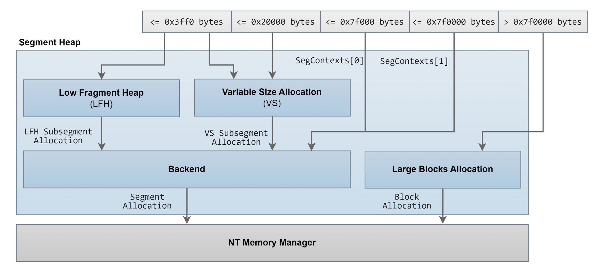
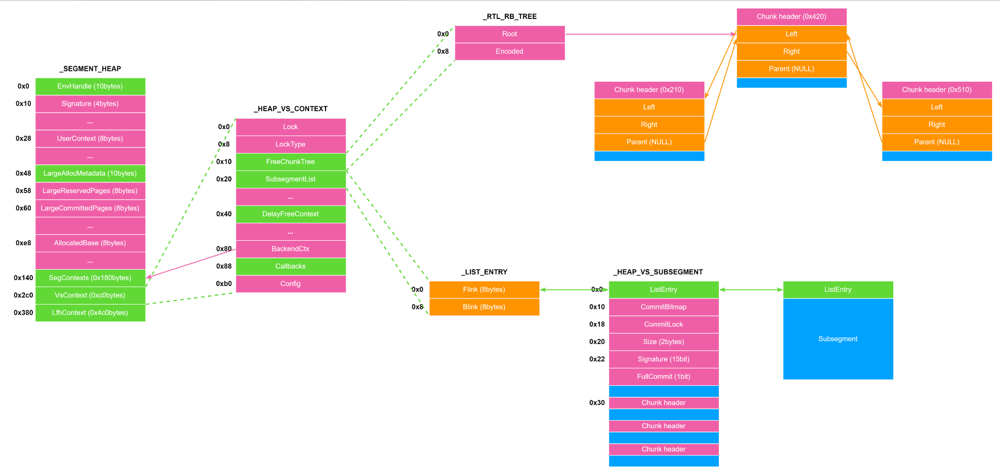
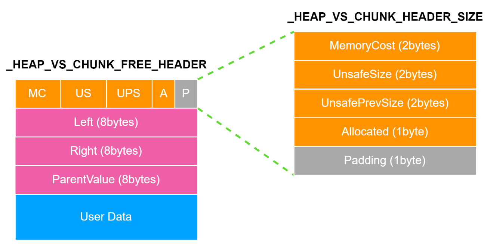
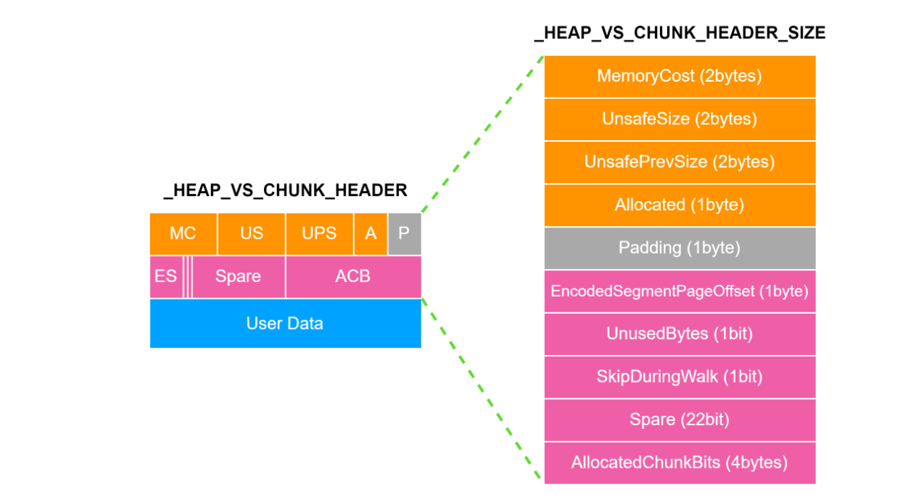
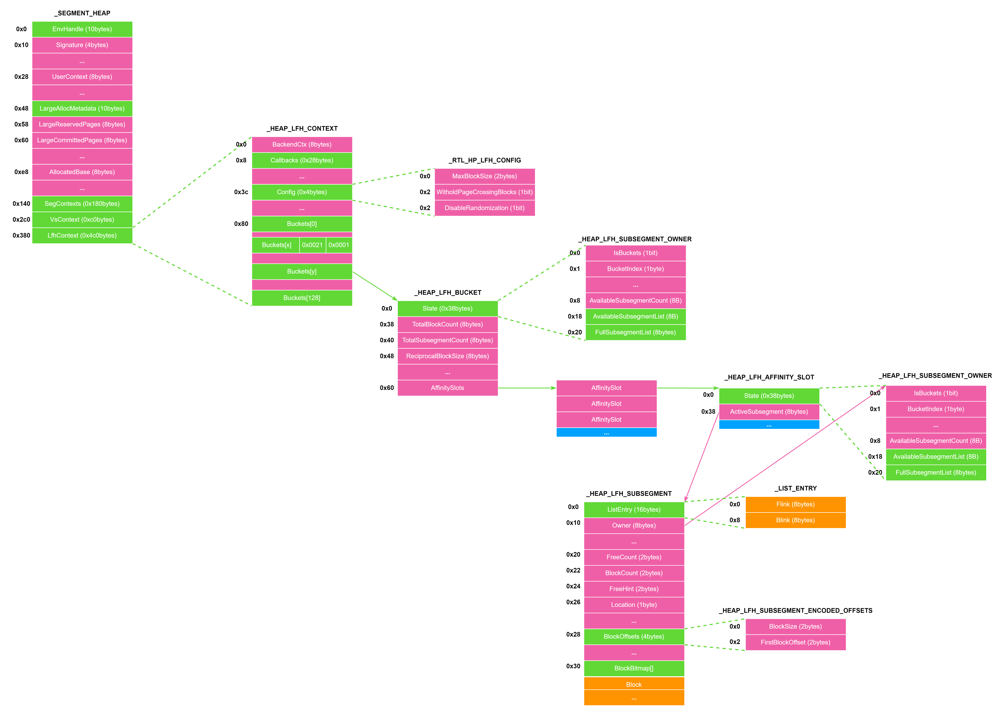
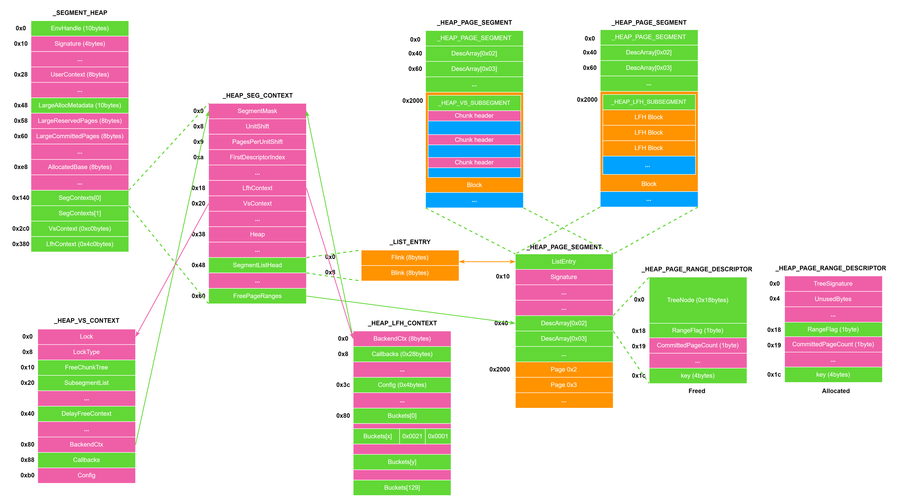
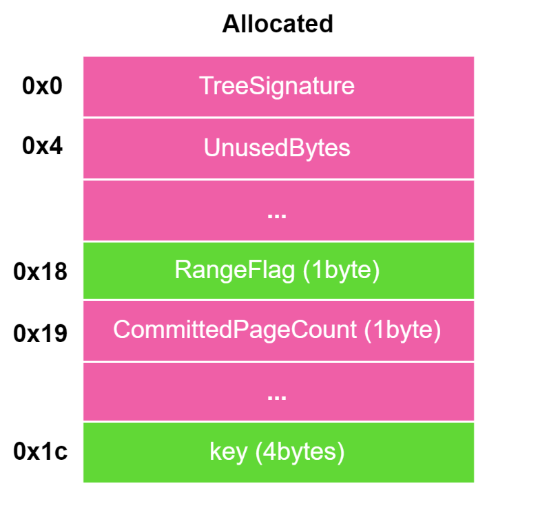
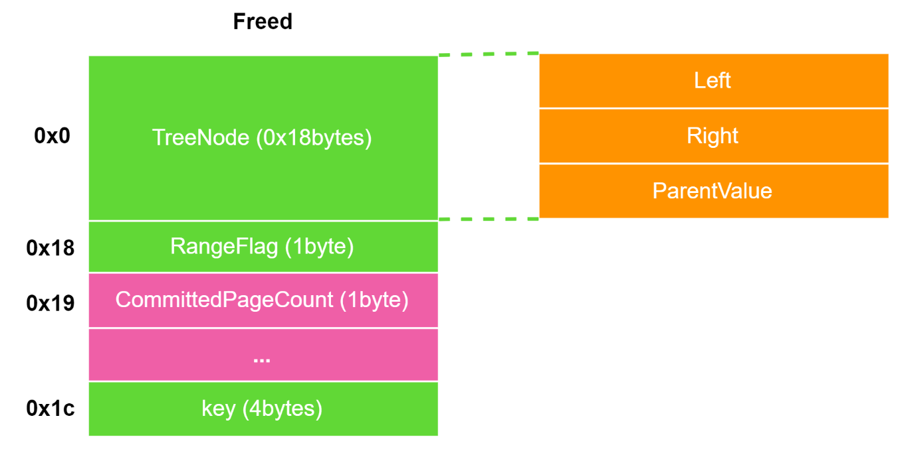

<!-- more -->

# windows

## NT Heap

NT_Heap可以分为两个部分

1. back_end, 后端分配器是主要的堆管理结构, 负责大多数内存管理操作
2. front_end, 前端分配器为了提高小块内存分配的速度, 对高频小内存分配进行优化, Windows 使用 **LFH(Low Fragmentation Heap)** 作为主要的前端分配器


```c
#include <Windows.h>
#include <stdio.h>

int main(void)
{
    void* ptr[30] = { NULL };
    HANDLE hHeap = HeapCreate(0, 0x10000, 0);

    int i;

    for (i = 0; i < 30; i++)
    {
        ptr[i] = HeapAlloc(hHeap, 0, 0xF0);
    }

    for (i = 0; i < 30; i++)
    {
        printf("[+] chunk[%02d] address is: %p\n", i, ptr[i]);
    }

    return 0;
}
```

```
[+] chunk[00] address is: 000002C55E500860
[+] chunk[01] address is: 000002C55E500960
[+] chunk[02] address is: 000002C55E500A60
[+] chunk[03] address is: 000002C55E500B60
[+] chunk[04] address is: 000002C55E500C60
[+] chunk[05] address is: 000002C55E500D60
[+] chunk[06] address is: 000002C55E500E60
[+] chunk[07] address is: 000002C55E500F60
[+] chunk[08] address is: 000002C55E501060
[+] chunk[09] address is: 000002C55E501160
[+] chunk[10] address is: 000002C55E501260
[+] chunk[11] address is: 000002C55E501360
[+] chunk[12] address is: 000002C55E501460
[+] chunk[13] address is: 000002C55E501560
[+] chunk[14] address is: 000002C55E501660
[+] chunk[15] address is: 000002C55E501760
[+] chunk[16] address is: 000002C55E501860
[+] chunk[17] address is: 000002C55E500750
[+] chunk[18] address is: 000002C55E504D70
[+] chunk[19] address is: 000002C55E505970
[+] chunk[20] address is: 000002C55E504570
[+] chunk[21] address is: 000002C55E505870
[+] chunk[22] address is: 000002C55E504A70
[+] chunk[23] address is: 000002C55E504970
[+] chunk[24] address is: 000002C55E505070
[+] chunk[25] address is: 000002C55E504470
[+] chunk[26] address is: 000002C55E504270
[+] chunk[27] address is: 000002C55E505C70
[+] chunk[28] address is: 000002C55E505570
[+] chunk[29] address is: 000002C55E505270
```

可以看到前17个堆块的地址间隔固定，后面的chunk地址开始变得随机，是由Front-End分配的。

但当使用 `HeapAlloc(hHeap, 1, 0xF0);`时chunk地址的间隔固定了，原因是 `HEAP_NO_SERIALIZE`告诉堆管理器**不要**在这次分配时对堆加锁，表明了目前系统是单线程环境，LFH 这种专门用来解决“多线程抢锁问题”的复杂机制就失去了存在的意义。为了节省资源和降低复杂度，Windows 就会直接关闭 LFH。

```c
#include <Windows.h>
#include <stdio.h>

int main(void)
{
    void* ptr[30] = { NULL };
   // HANDLE hHeap = HeapCreate(0, 0x10000, 0);

    int i;

    for (i = 0; i < 30; i++)
    {
        ptr[i] = malloc(0xf0);
    }

    for (i = 0; i < 30; i++)
    {
        printf("[+] chunk[%02d] address is: %p\n", i, ptr[i]);
    }

    return 0;
}
```

如果将HeapAlloc改成malloc的话，堆地址呈现非常混乱，原因是malloc它通常底层调用 `HeapAlloc(GetProcessHeap(), ...)`。**进程默认堆是非常“脏”的** 。在你进入 `main` 函数之前，系统初始化、加载 DLL、CRT 初始化都已经在这个堆上进行了成千上万次分配和释放。

```
[+] chunk[00] address is: 0000021637658B90
[+] chunk[01] address is: 0000021637662860
[+] chunk[02] address is: 0000021637662960
[+] chunk[03] address is: 0000021637662A60
[+] chunk[04] address is: 0000021637662FD0
[+] chunk[05] address is: 00000216376630D0
[+] chunk[06] address is: 00000216376631D0
[+] chunk[07] address is: 00000216376632D0
[+] chunk[08] address is: 00000216376633D0
[+] chunk[09] address is: 00000216376634D0
[+] chunk[10] address is: 00000216376635D0
[+] chunk[11] address is: 00000216376636D0
[+] chunk[12] address is: 00000216376637D0
[+] chunk[13] address is: 0000021637663D20
[+] chunk[14] address is: 0000021637663B20
[+] chunk[15] address is: 0000021637664A20
[+] chunk[16] address is: 0000021637665420
[+] chunk[17] address is: 0000021637665220
[+] chunk[18] address is: 0000021637664D20
[+] chunk[19] address is: 0000021637664920
[+] chunk[20] address is: 0000021637665520
[+] chunk[21] address is: 0000021637665620
[+] chunk[22] address is: 0000021637665320
[+] chunk[23] address is: 0000021637665720
[+] chunk[24] address is: 0000021637663920
[+] chunk[25] address is: 0000021637664720
[+] chunk[26] address is: 0000021637664820
[+] chunk[27] address is: 0000021637663C20
[+] chunk[28] address is: 0000021637663A20
[+] chunk[29] address is: 0000021637664B20
```

### 后端堆

#### 相关结构体

##### _HEAP

```c
//0x2c0 bytes (sizeof)
struct _HEAP
{
    union
    {
        struct _HEAP_SEGMENT Segment;                                       //0x0
        struct
        {
            struct _HEAP_ENTRY Entry;                                       //0x0
            ULONG SegmentSignature;                                         //0x10
            ULONG SegmentFlags;                                             //0x14
            struct _LIST_ENTRY SegmentListEntry;                            //0x18
            struct _HEAP* Heap;                                             //0x28
            VOID* BaseAddress;                                              //0x30
            ULONG NumberOfPages;                                            //0x38
            struct _HEAP_ENTRY* FirstEntry;                                 //0x40
            struct _HEAP_ENTRY* LastValidEntry;                             //0x48
            ULONG NumberOfUnCommittedPages;                                 //0x50
            ULONG NumberOfUnCommittedRanges;                                //0x54
            USHORT SegmentAllocatorBackTraceIndex;                          //0x58
            USHORT Reserved;                                                //0x5a
            struct _LIST_ENTRY UCRSegmentList;                              //0x60
        };
    };
    ULONG Flags;                                                            //0x70
    ULONG ForceFlags;                                                       //0x74
    ULONG CompatibilityFlags;                                               //0x78
    ULONG EncodeFlagMask;                                                   //0x7c
    struct _HEAP_ENTRY Encoding;                                            //0x80
    ULONG Interceptor;                                                      //0x90
    ULONG VirtualMemoryThreshold;                                           //0x94
    ULONG Signature;                                                        //0x98
    ULONGLONG SegmentReserve;                                               //0xa0
    ULONGLONG SegmentCommit;                                                //0xa8
    ULONGLONG DeCommitFreeBlockThreshold;                                   //0xb0
    ULONGLONG DeCommitTotalFreeThreshold;                                   //0xb8
    ULONGLONG TotalFreeSize;                                                //0xc0
    ULONGLONG MaximumAllocationSize;                                        //0xc8
    USHORT ProcessHeapsListIndex;                                           //0xd0
    USHORT HeaderValidateLength;                                            //0xd2
    VOID* HeaderValidateCopy;                                               //0xd8
    USHORT NextAvailableTagIndex;                                           //0xe0
    USHORT MaximumTagIndex;                                                 //0xe2
    struct _HEAP_TAG_ENTRY* TagEntries;                                     //0xe8
    struct _LIST_ENTRY UCRList;                                             //0xf0
    ULONGLONG AlignRound;                                                   //0x100
    ULONGLONG AlignMask;                                                    //0x108
    struct _LIST_ENTRY VirtualAllocdBlocks;                                 //0x110
    struct _LIST_ENTRY SegmentList;                                         //0x120
    USHORT AllocatorBackTraceIndex;                                         //0x130
    ULONG NonDedicatedListLength;                                           //0x134
    VOID* BlocksIndex;                                                      //0x138
    VOID* UCRIndex;                                                         //0x140
    struct _HEAP_PSEUDO_TAG_ENTRY* PseudoTagEntries;                        //0x148
    struct _LIST_ENTRY FreeLists;                                           //0x150
    struct _HEAP_LOCK* LockVariable;                                        //0x160
    LONG (*CommitRoutine)(VOID* arg1, VOID** arg2, ULONGLONG* arg3);        //0x168
    union _RTL_RUN_ONCE StackTraceInitVar;                                  //0x170
    struct _RTL_HEAP_MEMORY_LIMIT_DATA CommitLimitData;                     //0x178
    VOID* FrontEndHeap;                                                     //0x198
    USHORT FrontHeapLockCount;                                              //0x1a0
    UCHAR FrontEndHeapType;                                                 //0x1a2
    UCHAR RequestedFrontEndHeapType;                                        //0x1a3
    WCHAR* FrontEndHeapUsageData;                                           //0x1a8
    USHORT FrontEndHeapMaximumIndex;                                        //0x1b0
    volatile UCHAR FrontEndHeapStatusBitmap[129];                           //0x1b2
    struct _HEAP_COUNTERS Counters;                                         //0x238
    struct _HEAP_TUNING_PARAMETERS TuningParameters;                        //0x2b0
}; 


```

`_HEAP` 是堆管理的最核心结构，和 linux glibc 的 `main_arena` 作用类似。每一个 HEAP 都有一个 `_HEAP` 结构，存在于该 HEAP 的开头。

根据下面的图片理解其中的一部分参数

* `EncodeFlagMask`：Heap 初始化后会设置为 0x100000 ，用于判断是否要加密该 heap 空间中每个堆的 chunk_header 。
* `Encoding`（`_Heap_Entry`）：用于与 chunk_header 做异或的 cookies；所有分配的 chunk 的 chunk_header 都会与 `Encoding` 进行异或，然后在存入内存中。
* `VirtualAllocdBlocks`：一个双向链表的 dummy head ，存放着 `Flink` 和 `Blink` ，将 `VirtualAllocate` 出来的 chunk 链接起来。
* `BlocksIndex`（`_Heap_LIST_LOOKUP`）：Back-End 中用于管理后端管理器中的 chunk 。
* `FreeList`（`_Heap_Entry`）：连接 Back-End 中的所有 free chunk ，类似 unsorted bin 。
* `FrontEndHeap`：指向管理 FrontEnd 的 heap 结构。
* `FrontEndHeapUsageData`：指向一个对应各大小 chunk 的数组，记录各种大小 chunk 的使用次数，到达某个程度时会开启该对应大小 chunk 的 Front-End 分配器。**如果开启 LFH 后对应的 `FrontEndHeapUsageData` 是 `SegmentInfoArrays` 的下标。**
* `FrontEndHeapStatusBitmap`：非常重要。是一个 bitmap 数组，每一项长度为 1 字节，用来记录某个 size 是否开启了 LFH 。判断方式是 `_HEAP.FrontEndHeapStatusBitmap[(size >> 4) >> 3] & (1 << ((size >> 4) & 7))` 是否为 1 ，如果是 1 则说明对应 size 开启了 LFH 。


##### _HEAP_ENTRY

最普通的_HEAP_ENTRY结构体如下：

```c
struct _HEAP_ENTRY{
    void * PreviousBlockPrivateData;
    Uint2B Size;
    Uchar Flags;
    Uchar SmallTagIndex;
    Uint2B PreviousSize;
    Uchar SegmentOffset;
    Uchar Unusedbyte;
    Uchar UserData[];
}
```

与linux类似, 也是头部 + User Data的形式，

Allocated chunk图解：

* `PreviousBlockPrivateData`：8 字节，可为前一块 chunk 的 data ，因为 chunk 必须对齐。
* `Size`: chunk 的大小，为实际大小右移 4bit 后的值。比如大小为 0x80 的 chunk 的 `Size` 值为 0x8 。
* `Flags`: 表示该chunk的状态：

  * `HEAP_ENTRY_BUSY(01)` 堆块处于占用状态
  * `HEAP_ENTRY_EXTRA_PRESENT(02)` 该块存在额外的描述 `_HEAP_ENTRY_EXTRA`
  * `HEAP_ENTRY_FILE_PATTERN(03)` 使用固定模式填充堆块
    * `HEAP_ENTRY_VIRTUAL_ALLOC(08)` 通过 virtual allocation 虚拟分配的堆块
  * `HEAP_ENTRY_LAST_ENTRY(10)` 表示是该段的最后一个堆块
* `SmallTagIndex`: 前 3 个字节异或后的值，用于验证。
* `PreviousSize`: 前⼀个 chunk 的大小，为实际大小右移 4bit 后的值。
* `SegmentOffset`: 在某种情况下用来寻找 Heap 的。
* `Unusedbytes`：整个 chunk 的大小减去用户 malloc 的大小，因为如果 chunk 是在使用状态 `Unusedbytes` 一定不为 0 ，因此可以判断 chunk 是否空闲（&0x3F 是否为 0）。另外这个值还有一个 0x80 的标志位也可以用来判断 chunk 的状态是前端堆还是后端堆。

  * 在freed的时候, 恒为0


chunk_header在内存中是加密的，解密需要和 `_HEAP->Encoding`进行异或

Freed chunk图解：

多了一个 `_LIST_ENTRY` 结构

* `Flags` 为 0 表示 freed
* `UnusedBytes` （&0x3f）始终为 0


##### _HEAP_LIST_LOOKUP

(BlocksIndex)_HEAP_LIST_LOOKUP用来管理各种不同大小的 freed chunk ，能快速的找到合适的 chunk

```c
//0x38 bytes (sizeof)
struct _HEAP_LIST_LOOKUP
{
    struct _HEAP_LIST_LOOKUP* ExtendedLookup;                               //0x0
    ULONG ArraySize;                                                        //0x8
    ULONG ExtraItem;                                                        //0xc
    ULONG ItemCount;                                                        //0x10
    ULONG OutOfRangeItems;                                                  //0x14
    ULONG BaseIndex;                                                        //0x18
    struct _LIST_ENTRY* ListHead;                                           //0x20
    ULONG* ListsInUseUlong;                                                 //0x28
    struct _LIST_ENTRY** ListHints;                                         //0x30
}; 
```

* `ExtendedLookup (Ptr64 _HEAP_LIST_LOOKUP)`：指向下一个 `BlocksIndex`，通常下一个 `BlocksIndex`会管理更大的 chunk 。
* `ArraySize`：该结构会管理最大 chunk 的大小 + 0x10 。上面例子中 `ArraySize` 为 0x80 但由于右移实际是 0x800 。
* `ItemCount`：4 字节，目前该结构所管理的 chunk 数。
* `OutofRangeItems`：超出该结构所管理大小的 chunk 的数量。
* `BaseIndex`：该结构所管理的 chunk 的起始 index ，将 `(Aligned(size) >> 4) - BaseIndex` 作为 `ListHint` 中查找的下标。通常下一个 `BlocksIndex` 将上一个 `BlocksIndex` 的 `ArraySize` 作为 `BaseIndex` 。
* `ListHead`：指向 `_HEAP` 的 `FreeList` 。
* `ListsInUseUlong`：用在判断 `ListHint` 中是否有适合大小的 chunk ，是一个 bitmap 。
* `ListHint`：十分重要，用来指向对应大小的 chunk array ，其目的就在于更快速找到适合大小的 chunk ，0x10 大小为一个间隔。可以类比linux ptmalloc的tcache bin, 只不过chunk的组织仍然通过双向链表维护

#### 分配机制(RtlAllocateHeap)

根据分配大小主要有三种：

* **case1** : `size <= 0x4000`
* **case2** : `0x4000 < size <= 0xff000`
* **case3** : `size > 0xff000`

case1：

还是需要这个图进行理解


* 检查是否有该 `Size` 对应的 `FrontEndHeapStatusBitmap`，判断是否启动了LFH
* 遍历 `BlocksIndex` 链表，找到第一个 `ArraySize` 大于 `Size` 的 `BlocksIndex` ，然后找到对应的 `ListHint` ，即 `BlocksIndex->ListHints[Size - BlocksIndex->BaseIndex]` 。调用 `RtlpAllocateHeap` 函数分配内存。
* 查看对应的 `ListHint` 中是否有值（也就是ListHint数组里否有对应 size 的 freed chunk）：
  * 如果刚好有值，就检查该 chunk 的 `Flink` （下一个freed chunk）是否是同样 size 的 chunk ：

    * 若是则将 `Flink` 写到对应的 `ListHint` 中。
    * 若否则清空对应 `ListHint` 。

    最后将该 chunk 从 `Freelist` 中 unlink 出来（同时header也会恢复正常）。
  * 如果对应的 `ListHint` 中本身就没有值，就从比较大的 `ListHint` 中找：

    * 如果找到了，就以上述同样的方式处理该 `ListHint` ，并 unlink 该 chunk ，之后对其进行切割，剩下的重新放入 `FreeList` ，如果可以放进 `ListHint` 就会放进去，再 encode header 。
    * 如果没较大的 `ListHint` 也都是空的，那么尝试 `ExtendedHeap` 加大堆空间，再从 extend 出来的 chunk 拿，接着一样切割，放回 `ListHIint` ，encode header 。

case2：没有LFH检查，其他和case1一样

case3：直接调用 `ZwAllocateVirtualMemroy` 进行分配，类似于 linux 下的 `mmap` 直接给一大块地址，并且插入 `_HEAP->VirtualAllocdBlocks` 中。

#### Free (RtlFreeHeap)

* 调用 `RtlpValidateHeapEntry` 对要释放的 chunk 进行一系列的检查：
  * 释放的 `_HEAP_ENTRY` 是否为 NULL
  * 释放的 `_HEAP_ENTRY` 地址是否关于 0x10 对齐
  * 通过 `UnusedBytes & 0x3F` 是否为 0 判断 `_HEAP_ENTRY` 是否已被释放过，相当于判断Double Free
  * 检查校验位 `SmallTagIndex` （先当于checksum）
  * 如果 `UnusedBytes` 为 4 即通过 `ZwAllocateVirtualMemroy` 分配的内存，则判断整个 `_HEAP_VIRTUAL_ALLOC_ENTRY` 是否关于 0x1000 对齐
  * 如果 `UnusedBytes` 不为 4 则通过 `SegmentOffset` 找到 `_HEAP` 然后判断 `_HEAP_ENTRY` 是否在 `[Heap->Segment.FirstEntry, Heap->Segment.LastValidEntry)` 范围内
* 调用 `RtlFreeHeap` ，进而调用 `RtlpFreeHeapInternal` ，通过 `Heap->Segment.SegmentSignature` 判断是否为 Segment Heap ，如果是则单独处理，否则继续执行。
* 判断地址是否关于 0x10 对齐以及通过 `UnusedBytes & 0x3F` 是否为 0 判断 `_HEAP_ENTRY` 是否已被释放过。（重复？）
* 根据 `UnusedBytes` 是否小于 0 （0x80 是否置位）判断是否是 LFH 堆，如果不是则调用后端堆释放的核心函数 `RtlpFreeHeap` 。
* 解密 `_HEAP_ENTRY` 并校验 `SmallTagIndex` ，根据 chunk 大小找到对应的 `BlocksIndex` 。
* 根据 `UnusedBytes` 是否为 4 判断是否是通过 `ZwAllocateVirtualMemroy` 分配的内存。如果是则检查该 chunk 的 `_HEAP_ENTRY->Flink->Blink == _HEAP_ENTRY->Blink->Flink == &_HEAP_ENTRY` 并从 `_HEAP->VirtualAllocdBlocks` 中移除，接着使用 `RtlpSecMemFreeVirtualMemory` 将 chunk 整个 munmap 掉。（类似于unlink检查）
* 如果 chunk 大小在 LFH 堆的范围内（`_HEAP_ENTRY->Size < _HEAP->FrontEndHeapMaximumIndex`），会将对应的 `FrontEndHeapUsageData -= 1`（并不是0x21）。
* 接着判断前后的 chunk 是否是 freed 的状态（根据 `_HEAP_ENTRY.Flags` 的 1 是否置位判断），如果是的话就检查前后的 freed chunk （校验 `SmallTagIndex` 以及 `_HEAP_ENTRY->Flink->Blink == _HEAP_ENTRY->Blink->Flink == &_HEAP_ENTRY`）然后将前后的 freed chunk 从 `FreeList` 中 unlink 下来（与上面的方式一样更新 `ListHint`），再进行合并。
* 合并完之后更新 `Size` 和 `PreviousSize` ，判断一下 `Size` 较大的情况，然后把合并好的 chunk 插入到 `ListHint` 中；插入时也会对 `FreeList` 进行检查（但是此检查不会触发 abort ，原因在于没有做 unlink 写入）。

### LFH堆

当同一个大小的堆块分配次数过多的时候，除了从后端堆分配所需堆块外，还会额外分配一块很大的内存供前端堆使用，之后再次分配该大小的堆块的时候会从前端堆分配。

#### 相关结构体

##### FrontEndHeap（_LFH_HEAP）

通过 `_HEAP` 的 `FrontEndHeap` 成员指针访问

```
ntdll!_LFH_HEAP
   +0x000 Lock             : _RTL_SRWLOCK
   +0x008 SubSegmentZones  : _LIST_ENTRY
   +0x018 Heap             : Ptr64 Void
   +0x020 NextSegmentInfoArrayAddress : Ptr64 Void
   +0x028 FirstUncommittedAddress : Ptr64 Void
   +0x030 ReservedAddressLimit : Ptr64 Void
   +0x038 SegmentCreate    : Uint4B
   +0x03c SegmentDelete    : Uint4B
   +0x040 MinimumCacheDepth : Uint4B
   +0x044 CacheShiftThreshold : Uint4B
   +0x048 SizeInCache      : Uint8B
   +0x050 RunInfo          : _HEAP_BUCKET_RUN_INFO
   +0x060 UserBlockCache   : [12] _USER_MEMORY_CACHE_ENTRY
   +0x2a0 MemoryPolicies   : _HEAP_LFH_MEM_POLICIES
   +0x2a4 Buckets          : [129] _HEAP_BUCKET
   +0x4a8 SegmentInfoArrays : [129] Ptr64 _HEAP_LOCAL_SEGMENT_INFO
   +0x8b0 AffinitizedInfoArrays : [129] Ptr64 _HEAP_LOCAL_SEGMENT_INFO
   +0xcb8 SegmentAllocator : Ptr64 _SEGMENT_HEAP
   +0xcc0 LocalData        : [1] _HEAP_LOCAL_DATA
```

* `Heap`, 指向其对应的 `_HEAP`结构体
* `Buckets`, 一个存放129个 `_HEAP_BUCKET`结构体的数组, 用来寻找配置大小对应到Block大小的阵列结构
* `SegmentInfoArrays`, 一个存放129个 `_HEAP_LOCAL_SEGMENT_INFO`结构体指针的数组, 不同大小对应到不同的 `_HEAP_LOCAL_SEGMENT_INFO`结构体, 主要管理对应到的 `_HEAP_SUBSEGMENT`的信息
* `LocalData`, 一个 `_HEAP_LOCAL_DATA`结构体


##### Buckets（_HEAP_BUCKET）

```
ntdll!_HEAP_BUCKET
   +0x000 BlockUnits       : Uint2B
   +0x002 SizeIndex        : UChar
   +0x003 UseAffinity      : Pos 0, 1 Bit
   +0x003 DebugFlags       : Pos 1, 2 Bits
   +0x003 Flags            : UChar
```

* `BlockUnits`, 要分配出去的一个block的大小, 存放 `size >> 4`，对应SegmentInfoArray中_HEAP_SUBSEGMENT结构体中的BlockSize
* `SizeIndex`, bucket下标 ，`SegmentInfoArrays` 对应位置的 `BucketIndex`

##### UserBlocks（_HEAP_USERDATA_HEADER）

```
0:017> dx -r1 ((ntdll!_HEAP_USERDATA_HEADER *)0x20793447a10)
((ntdll!_HEAP_USERDATA_HEADER *)0x20793447a10)                 : 0x20793447a10 [Type: _HEAP_USERDATA_HEADER *]
    [+0x000] SFreeListEntry   [Type: _SINGLE_LIST_ENTRY]
    [+0x000] SubSegment       : 0x2079341f200 [Type: _HEAP_SUBSEGMENT *]
    [+0x008] Reserved         : 0x20793406330 [Type: void *]
    [+0x010] SizeIndexAndPadding : 0xc [Type: unsigned long]
    [+0x010] SizeIndex        : 0xc [Type: unsigned char]
    [+0x011] GuardPagePresent : 0x0 [Type: unsigned char]
    [+0x012] PaddingBytes     : 0x0 [Type: unsigned short]
    [+0x014] Signature        : 0xf0e0d0c0 [Type: unsigned long]
    [+0x018] EncodedOffsets   [Type: _HEAP_USERDATA_OFFSETS]
    [+0x020] BusyBitmap       [Type: _RTL_BITMAP_EX]
    [+0x030] BitmapData       [Type: unsigned __int64 [1]]
```

* `SubSegment (_HEAP_SUBSEGMENT)`：指回对应的 `SubSegment`
* `EncodedOffsets`：用来验证 chunk header 是否被修改过，由下面 4 个值异或：

  * `RtlpLFHKey`：进程创建时初始化的一个 8 字节随机数
  * `UserBlock` 的地址
  * `UserBlock` 对应的 `LowFragHeap` 的地址
  * `sizeof(UserBlocks) | ((0x10 * BlockIndex) << 16)`

  在释放一个 LFH chunk 时，NT Heap 会通过 `UserBlock ^ RtlpLFHKey ^ _SegmentInfoArray->EncodedOffsets ^ LowFragHeap` 计算出 `sizeof(UserBlocks) | ((0x10 * BlockIndex) << 16)` 的值，进而计算出 chunk 的地址与要释放的 chunk 的地址进行比较，从而验证 chunk header 是否被修改过。
* `BusyBitmap`：记录 `UserBlock` 中在使用的 chunk 的 bitmap
* `Block`：LFH 返回给使用者的 chunk

##### _HEAP_ENTRY

```c
struct _HEAP_ENTRY{

    void * PreviousBlockPrivateData;
    Uint4B SubSegmentCode;
    Uint2B PreviousSize;
    Uchar SegmentOffset;
    Uchar Unusedbyte;
    Uchar UserData[];
}
```

`size`, `Flags`和 `SmallTagIndex`变成了 `SubSegmentCode`


* `SubSegmentCode`：用来计算 `UserBlock` 的地址，是下面 4 个值的异或(所有 `UserBlocks`里的chunk header在初始化的时候都会经过xor)：

  * chunk 对应的 `_HEAP` 地址的低 4 字节
  * `RtlpLFHKey` 的低 4 字节
  * chunk 地址右移 4 bit
  * chunk 与其所在的 `UserBlock` 的距离左移 12 bit `((chunk address) - (UserBLocks address)) << 12`
* `PreviousSize`：该 chunk 在 `UserBlock` 中的 index 左移 8 bit
* `SegmentOffset`：通常为 0 ，没有用。
* `UnusedBytes`：在空闲 chunk 中为 0x80，在使用的chunk 中为 `UnusedBytes >= 0x3F ? 0xBF : (UnusedBytes | 0x80)`

#### 初始化

在 `FrontEndHeapUsageData[x] & 0x1F > 0x10`时, 置位 `_HEAP->CompatibilityFlag |= 0x20000000`, 下一次allocate(也就是第18次)就会启用LFH并初始化

分配机制还是有些复杂了，交给AI简化一下

第 18 次 malloc：

* `_HEAP->BlocksIndex` 是一个管理不同尺寸范围的 `_HEAP_LIST_LOOKUP` 结构体链表。默认只管理小尺寸 chunk (e.g., `< 0x800`)。为了支持 LFH，系统会 **扩展此链表** ，追加新的节点以管理更大的尺寸范围（e.g., `0x800` 到 `0x4000`）。
* 针对当前被激活的尺寸 `x`，系统会初始化其对应的 Bucket。具体动作是在 `_LFH_HEAP->SegmentInfoArrays` 数组中，填入一个指向 `_HEAP_LOCAL_SEGMENT_INFO` 结构体的指针。这个结构体是该特定尺寸的“分配管理器”。

  ```
   0:000> dt _LFH_HEAP 0x2bacb070000
  ntdll!_LFH_HEAP
     +0x000 Lock             : _RTL_SRWLOCK
     +0x008 SubSegmentZones  : _LIST_ENTRY [ 0x000002ba`cb105e30 - 0x000002ba`cb105e30 ]
     +0x018 Heap             : 0x000002ba`cb100000 Void
     +0x020 NextSegmentInfoArrayAddress : 0x000002ba`cb071080 Void
     +0x028 FirstUncommittedAddress : 0x000002ba`cb072000 Void
     +0x030 ReservedAddressLimit : 0x000002ba`cb0d2000 Void
     +0x038 SegmentCreate    : 3
     +0x03c SegmentDelete    : 0
     +0x040 MinimumCacheDepth : 0
     +0x044 CacheShiftThreshold : 0
     +0x048 SizeInCache      : 0
     +0x050 RunInfo          : _HEAP_BUCKET_RUN_INFO
     +0x060 UserBlockCache   : [12] _USER_MEMORY_CACHE_ENTRY
     +0x2a0 MemoryPolicies   : _HEAP_LFH_MEM_POLICIES
     +0x2a4 Buckets          : [129] _HEAP_BUCKET
     +0x4a8 SegmentInfoArrays : [129] (null) 
     +0x8b0 AffinitizedInfoArrays : [129] (null) 
     +0xcb8 SegmentAllocator : (null) 
     +0xcc0 LocalData        : [1] _HEAP_LOCAL_DATA
  0:000> dx -r1 (*((ntdll!_HEAP_LOCAL_SEGMENT_INFO * (*)[129])0x2bacb0704a8))
  (*((ntdll!_HEAP_LOCAL_SEGMENT_INFO * (*)[129])0x2bacb0704a8))                 [Type: _HEAP_LOCAL_SEGMENT_INFO * [129]]
      ....
      [15]             : 0x2bacb070fc0 [Type: _HEAP_LOCAL_SEGMENT_INFO *]   0xF <--0xF0（不包含头部）大小的堆块
      ....
  ```
* `RtlpActivateLowFragmentationHeap`调用 `RtlpCreateLowFragHeap` 创建一个 `_LFH_HEAP` 结构，并将其地址存入 `_heap->FrontEndHeap`只用NT heap的话这个地方是不存在的
* 调用 `RtlpExtend...` 系列函数
* **由于前面创建结构会申请一些堆块，所以造成了第 18 次开始 chunk 申请不连续的假象。**

第 19 次 malloc开始分配

#### 分配 (Allocation)


分配的核心逻辑在 `RtlpLowFragHeapAllocFromContext` 函数中，分为**寻找可用 Subsegment** 和**从中获取 chunk** 两步。

1. **寻找可用的 Subsegment (内存池)**
   * 首先，检查当前尺寸的“首选”内存池 `_HEAP_LOCAL_SEGMENT_INFO->ActiveSubsegment` 中是否还有空闲块。通过检查 `ActiveSubsegment->AggregateExchg.Depth`（空闲块数量）来判断。 -->reuse attack可以通过这里查看需要堆喷射多少堆块

     ```
     0:000> dx -r1 ((ntdll!_HEAP_LOCAL_SEGMENT_INFO *)0x2bacb070fc0)
     ((ntdll!_HEAP_LOCAL_SEGMENT_INFO *)0x2bacb070fc0)                 : 0x2bacb070fc0 [Type: _HEAP_LOCAL_SEGMENT_INFO *]
         [+0x000] LocalData        : 0x2bacb070cc0 [Type: _HEAP_LOCAL_DATA *]
         [+0x008] ActiveSubsegment : 0x2bacb105ed0 [Type: _HEAP_SUBSEGMENT *]
         [+0x010] CachedItems      [Type: _HEAP_SUBSEGMENT * [16]]
         [+0x090] SListHeader      [Type: _SLIST_HEADER]
         [+0x0a0] Counters         [Type: _HEAP_BUCKET_COUNTERS]
         [+0x0a8] LastOpSequence   : 0x3 [Type: unsigned long]
         [+0x0ac] BucketIndex      : 0xf [Type: unsigned short]
         [+0x0ae] LastUsed         : 0x0 [Type: unsigned short]
         [+0x0b0] NoThrashCount    : 0x2 [Type: unsigned short]
     0:000> dx -r1 ((ntdll!_HEAP_SUBSEGMENT *)0x2bacb105ed0)
     ((ntdll!_HEAP_SUBSEGMENT *)0x2bacb105ed0)                 : 0x2bacb105ed0 [Type: _HEAP_SUBSEGMENT *]
         [+0x000] LocalInfo        : 0x2bacb070fc0 [Type: _HEAP_LOCAL_SEGMENT_INFO *]
         [+0x008] UserBlocks       : 0x2bacb10a240 [Type: _HEAP_USERDATA_HEADER *]
         [+0x010] DelayFreeList    [Type: _SLIST_HEADER]
         [+0x020] AggregateExchg   [Type: _INTERLOCK_SEQ]
         [+0x024] BlockSize        : 0x10 [Type: unsigned short]
         [+0x026] Flags            : 0x0 [Type: unsigned short]
         [+0x028] BlockCount       : 0x3f [Type: unsigned short]
         [+0x02a] SizeIndex        : 0xf [Type: unsigned char]
         [+0x02b] AffinityIndex    : 0x0 [Type: unsigned char]
         [+0x024] Alignment        [Type: unsigned long [2]]
         [+0x02c] Lock             : 0x7 [Type: unsigned long]
         [+0x030] SFreeListEntry   [Type: _SINGLE_LIST_ENTRY]
     0:000> dx -r1 (*((ntdll!_HEAP_SUBSEGMENT *)0x2bacb105ed0)).AggregateExchg
     (*((ntdll!_HEAP_SUBSEGMENT *)0x2bacb105ed0)).AggregateExchg                 [Type: _INTERLOCK_SEQ]
         [+0x000] Depth            : 0x5 [Type: unsigned short]  
         [+0x002 (14: 0)] Hint             : 0x3 [Type: unsigned short]
         [+0x002 (15:15)] Lock             : 0x0 [Type: unsigned short]
         [+0x002] Hint16           : 0x3 [Type: unsigned short]
         [+0x000] Exchg            : 196613 [Type: long]
     ```
   * 如果 `ActiveSubsegment` 已满，则去“备用池” `CachedItems` 列表里寻找其他有空闲块的 `Subsegment`。如果找到，就将其设置为新的 `ActiveSubsegment`。
   * 如果所有现有 `Subsegment` 都满了，则会 **分配并初始化一个新的 `UserBlocks`** （即 `_HEAP_SUBSEGMENT`），并将其设置为 `ActiveSubsegment`。
2. **从 Subsegment 中获取 Chunk**
   * **获取随机数** : 从一个全局的 256 元素随机数数组 `RtlpLowFragHeapRandomData` 中循环取值。这个随机数（范围 0x0 ~ 0x7F）用于增加分配地址的不可预测性。
   * **计算随机起始索引** : 使用公式 `index = (random_value * max_index) >> 7` 计算出一个在 `UserBlocks` 内的随机起始搜索点。
   * **查找空闲块 (位图操作)** : 从计算出的 `index` 开始，扫描 `UserBlocks->BusyBitmap`。
   * 如果 `index` 对应的位是 `0`（空闲），则直接选中。
   * 如果该位是 `1`（占用，即发生碰撞/collision），则向后线性搜索，直到找到第一个为 `0` 的位。
   * **更新元数据** :
   * 将 `BusyBitmap` 中找到的位设置为 `1`。
   * 更新 `ActiveSubsegment->AggregateExchg.Depth` 等统计信息。
   * 在返回的 chunk 头部进行设置：
     * `chunk->PreviousSize` 被用来存储这个 chunk 在 `UserBlocks` 中的索引，便于释放时快速定位。
     * `chunk->UnusedBytes` 的最高位被设置为 `1`（`|= 0x80`），标记这是一个由 LFH 分配的、处于“占用”状态的 chunk。
   * **返回地址** : 最后，将 chunk 的用户数据区地址返回给调用者。

#### 释放 (Free)

* 在 `RtlpFreeHeapInternal` 函数中首先会检查释放的内存地址是否对齐 0x10 。
* 通过 `_HEAP_ENTRY->UnpackedEntry.UnusedBytes & 0x3F` 是否为 0 判断 chunk 是否已被释放。
* 通过 `_HEAP_ENTRY->UnpackedEntry.SubSegmentCode` 找到对应的 `UserBlock` 进而找到 `HeapSubsegment` 。
* 通过 `UserBlock->EncodedOffsets` 再尝试找回 `_HEAP_ENTRY` 从而校验有无恶意修改。
* 将 `_HEAP_ENTRY.UnusedBytes` 设置为 0x80 。
* 将 `UserBlocks->BusyBitmap.Buffer` 中释放的 chunk 对应的位复位。

## Segment Heap

segment heap分配规则：



在常规的应用进程中，Windows使用Nt Heap，而在特定进程，例如lsass.exe,svchost.exe等系统进程中，Windows采用Segment Heap

Windows在系统进程中使用Segment Heap，部分应用也使用了Segment heap，比如Edge。对于特定的进程开启Segment Heap，需要在注册表里修改：

```powershell
reg add "HKLM\SOFTWARE\Microsoft\Windows NT\CurrentVersion\Image File Execution Options\TestSegmentHeap.exe" /v FrontEndHeapDebugOptions /t REG_DWORD /d 0x8 /f
```

### VS 堆



#### 相关结构体

##### _Segment_Heap

`Signature`：区分堆类型的签名，对于 Segment Heap 总是 0xDDEEDDEE 。

`SegContexts (_HEAP_SEG_CONTEXT)`：与 Segment 有关的管理结构体。

`VsContext (_HEAP_VS_CONTEXT)`：Variable Size Allocation 的核心结构体，跟踪 variable size allocation 分配状态。

`LfhContext ( _HEAP_LFH_CONTEXT)`：Low Fragmentation Heap 的核心结构体，跟踪 LFH 分配状态。

##### _HEAP_VS_CONTEXT

`FreeChunkTree (_RTL_RB_TREE)`：以红黑树管理空闲 chunk ，以chunk 大小维护，较大的 chunk 在右，较小的 chunk 在左。

`Root`：指向红黑树的根节点。

* `Encoded`：根据最低比特是否为 1 决定红黑树的指针是否加密（默认不加密）。加密方法是当前节点的指针异或当前节点的地址，对于 `Root` 为 `EncodedRoot = Root ^ FreeChunkTree`

`SubsegmentList`：所有的 VS Subsegment 链表，实际存储的是 `SubsegmentList` 地址异或指向的 VS Subsegment 的地址。

`DelayFreeContext (_HEAP_VS_DELAY_FREE_CONTEXT)`：`VsContext->Config` 决定是否开启（用户态默认不开启，内核态默认开启），当开启时释放的 chunk 会先放到 `DelayFreeContext` 这个单向链表中，当链表中的 chunk 达到一定数量的时候才会集中释放。

`BackendCtx`：指向  `_SEGMENT_HEAP.SegContexts` 。这个指针异或了 `_HEAP_VS_CONTEXT` 的地址。

`Callbacks`：用于管理 VS SubSegments 函数指针集合，函数指针都经过加密 `RtlpHpHeapGlobals.HeapKey ^ VsContext_addr ^ func_ptr` 。

* `Allocate`：`RtlpHpSegVsAllocate`
* `Free`：`RtlpHpSegLfhVsFree`
* `Commit`：`RtlpHpSegLfhVsCommit`
* `Decommit`：`RtlpHpSegLfhVsDecommit`

##### RtlpHpHeapGlobals（_RTLP_HP_HEAP_GLOBALS）

在 Segment Heap 中，许多数据和指针都被加密了。`RtlpHpHeapGlobals` 用于存放加密用的一些 key 和其他信息。地址可以在windbg中使用 `dx ntdll!RtlpHpHeapGlobals`直接查找，该地址在 `ntdll.dll`中

```
0:000> dt _RTLP_HP_HEAP_GLOBALS 0x7fffa3936f40
ntdll!_RTLP_HP_HEAP_GLOBALS
   +0x000 HeapKey          : 0x08a75e35`7d23470b
   +0x008 LfhKey           : 0x2107b942`fbbdfd6a
   +0x010 FailureInfo      : 0x00007fff`a39338b0 _HEAP_FAILURE_INFORMATION
   +0x018 CommitLimitData  : _RTL_HEAP_MEMORY_LIMIT_DATA
   +0x038 Flags            : 3
   +0x038 FlagsBits        : <unnamed-tag>
```

* `HeapKey`：8 字节随机数，用于 VS Allocator 和 Segment Allocator 中的数据加密。
* `LfhKey`：8 字节随机数，用于 LowFragmentationHeap 中的数据加密。

##### Allocated / Freed Chunk

**空闲堆块**： `FreeChunkTree` 中的chunk，头部占八字节，这 8 字节是用 **XOR** 编码的（_HEAP_VS_CHUNK_FREE_HEADER）

$$
\text{DecodedHeader} = \text{EncodedHeader} \oplus \text{Address} \oplus \text{HeapKey}
$$



`MemoryCost`：表示 chunk 被申请的时候会有多少 page 被提交

`UnsafeSize`：堆块 `Size` ，右移 4 位

`UnsafePrevSize`：前一个堆块 `Size` ，右移 4 位。

`Allocated`：表示堆块是否空闲，已分配恒为 0x1

**已分配的堆块**：HEAP_VS__SUBSEGMENT 中的chunk，头部占16字节（_HEAP_VS_CHUNK_HEADER）



`EncodedSegmentPageOffset`：让堆管理器能够从任意一个 VS 堆块（Chunk）快速反向定位到管理这片内存区域的元数据头部（_HEAP_VS_SUBSEGMENT）。加密： `EncodedSegmentPageOffset = SegmentPageOffset ^ (int8)chunk address ^ (int8)RtlpHpHeapGlobals.HeapKey`

#### 分配

1. 大小 `<= 0x4000 - 16`，尝试走 LFH 机制。
   * 如果 LFH 桶已激活，直接分配。
   * 如果未激活，增加热度计数器，达到阈值才激活，然后依照VS分配。
2. 如果大小 `> 0x20000`，直接走大块分配接口。
3. VS分配：通过 `((Size + 0xf) >> 4) + 1` 计算出 `ChunkIndex` 。红黑树 `VSContext->FreeChunkTree` 中搜索大于 `ChunkIndex` 的最小的 chunk 。
4. 找到后调会用 `RtlpHpVsChunkSplit` 将 chunk 从红黑树中取出并切掉多余的 chunk ，然后将多余的 chunk 插入到 `VSContext->FreeChunkTree`
   * 切割前会验证所属的 `VSSubsegment`的 `(VSSubsegment->Signature ^ VSSubsegment->Size ^ 0x2BED) & 0x7FFF == 0`
5. 如果找不到合适的 chunk 会调用 `RtlpHpVsSubsegmentCreate` 函数使用 Segment Allocation 分配一个新的 `VSSubsegment`
   * 检查 `VSContext->SubsegmentList.Blink.Flink = VSContext->SubsegmentList` ，如果检查通过则将新创建的 `VSSubsegment` 从 `SubsegmentList.Blink` 插入到 `SubsegmentList` 链表中
   * 将新申请的 `VSSubsegment` 中的 chunk 插入到 `VSContext->FreeChunkTree` 中然后重新在红黑树中搜索合适的 chunk

#### 释放

对于当前block的校验

1. 如果 `BlockPtr` 最低 16 比特（0xFFFF）为 0 则判定为 Large Block 堆分配。（因为Large Block通常是按 64KB 对齐的）
2. 通过 `ChunkHeader.Allocated` 判断 chunk 是否已被释放来防止 double free
3. 解密 `ChunkHeader.EncodedSegmentPageOffset`，通过 `SegmentPageOffset` 找到 `VSSubsegment` 并校验这个 `VSSubsegment` 的 `Signature`（VSSubsegment->Signature ^ VSSubsegment->Size ^ 0x2BED) & 0x7FFF ==0）
4. 调用 `RtlpHpVsChunkCoalesce` 函数来合并
   1. 更新 chunk 的 `Allocated` 为 0
   2. 通过 `UnsafePrevSize` 判断是否有前一个空闲 chunk，然后判断其allocate位是否为0；同样判断后一个相邻 chunk
5. 如果在 LFH 范围且未开启 LFH （即对应 `Buckets` 为初始化）则将对应 `LfhContext->Bucket` 减 1 （与 Nt Heap 相同）。

其他检查后续补充

### LFH堆

LFH 堆分配的 chunk 没有 chunk header



#### 相关结构体

##### _HEAP_LFH_CONTEXT

```
0:000> dx -r1 (*((ntdll!_HEAP_LFH_CONTEXT *)0x17025b50380))
(*((ntdll!_HEAP_LFH_CONTEXT *)0x17025b50380))                 [Type: _HEAP_LFH_CONTEXT]
    [+0x000] BackendCtx       : 0x17025b50140 [Type: void *]
    [+0x008] Callbacks        [Type: _HEAP_SUBALLOCATOR_CALLBACKS]
    [+0x030] AffinityModArray : 0x7fffa38e83db : 0x1 [Type: unsigned char *]
    [+0x038] MaxAffinity      : 0x10 [Type: unsigned char]
    [+0x039] LockType         : 0x0 [Type: unsigned char]
    [+0x03a] MemStatsOffset   : -768 [Type: short]
    [+0x03c] Config           [Type: _RTL_HP_LFH_CONFIG]
    [+0x040] BucketStats      [Type: _HEAP_LFH_SUBSEGMENT_STATS]
    [+0x048] SubsegmentCreationLock : 0x0 [Type: unsigned __int64]
    [+0x080] Buckets          [Type: _HEAP_LFH_BUCKET * [129]]
```

`BackendCtx`：指向 LFH 堆的后端堆分配器，即 `_SEGMENT_HEAP.SegContexts (_HEAP_SEG_CONTEXT)`指针未加密

`Callbacks`：函数指针集合，`RtlpHpHeapGlobals.HeapKey ^ LFHContext_addr ^ func_ptr`

* `Allocate`：`RtlpHpSegLfhAllocate`
* `Free`：`RtlpHpSegLfhVsFree`
* `Commit`：`RtlpHpSegLfhVsCommit`
* `Decommit`：`RtlpHpSegLfhVsDecommit`

`Config (_RTL_HP_LFH_CONFIG)`：用于表示 LFH 管理堆块的属性。

* `MaxBlockSize`：决定多大的堆块适用于 LFH 分配。
* `WitholdPageCrossingBlocks`：是否有跨页块。
* `DisableRandomization`：是否关闭 LFH 分配随机化。

`Buckets (_HEAP_LFH_BUCKET )`：`Buckets` 指针数组，通过最低位区分为 `_HEAP_LFH_BUCKET` 结构体和单纯的计数作用。

* 如果 LFH 启动，每个 `Bucket` 存储了对应 `Size` 的 `_HEAP_LFH_BUCKET` 结构体地址。
* 如果 LFH 未启动，每个 `Bucket` 低 2 字节恒为 0x0001 ，高 2 字节存储了当前 `Size` 堆块的分配次数，每分配一次加 0x21，每释放一次减 1 。

##### _HEAP_LFH_BUCKET

```
0:000> dt _HEAP_LFH_BUCKET
ntdll!_HEAP_LFH_BUCKET
   +0x000 State            : _HEAP_LFH_SUBSEGMENT_OWNER
   +0x038 TotalBlockCount  : Uint8B
   +0x040 TotalSubsegmentCount : Uint8B
   +0x048 ReciprocalBlockSize : Uint4B
   +0x04c Shift            : UChar
   +0x04d ContentionCount  : UChar
   +0x050 AffinityMappingLock : Uint8B
   +0x058 ProcAffinityMapping : Ptr64 UChar
   +0x060 AffinitySlots    : Ptr64 Ptr64 _HEAP_LFH_AFFINITY_SLOT

```

`State (_HEAP_LFH_SUBSEGMENT_OWNER)`：用于记录 `Buckets` 的状态。

`AffinitySlots (_HEAP_LFH_AFFINITY_SLOT)`： 存储了当前 `Bucket` 的 subsegment 管理信息。默认只有一个。

##### _HEAP_LFH_SUBSEGMENT_OWNER

```
0:000> dt _HEAP_LFH_SUBSEGMENT_OWNER
ntdll!_HEAP_LFH_SUBSEGMENT_OWNER
   +0x000 IsBucket         : Pos 0, 1 Bit
   +0x000 Spare0           : Pos 1, 7 Bits
   +0x001 BucketIndex      : UChar
   +0x002 SlotCount        : UChar
   +0x002 SlotIndex        : UChar
   +0x003 Spare1           : UChar
   +0x008 AvailableSubsegmentCount : Uint8B
   +0x010 Lock             : Uint8B
   +0x018 AvailableSubsegmentList : _LIST_ENTRY
   +0x028 FullSubsegmentList : _LIST_ENTRY
```

`IsBucket`：区分是在 `Bucket` 上还是在 `AffinitySlots` 上， `Bucket` 中的 `State` 为1 。

`BucketIndex`：当前 `Bucket` 的编号，通常可以利用这个值查找全局数组 `RtlpBucketBlockSizes` 来获取 `BlockSize`：`RtlpBucketBlockSizes[State.BucketIndex]`

`AvailableSubsegmentCount`：目前可用于分配的的 LFH Subsegments 数量。

`AvailableSubsegmentList`：指向下一个可用的 LFH subsegment 。

`FullSubsegmentList`：指向下一个全被使用的 LFH subsegment 。

##### _HEAP_LFH_SUBSEGMENT

通过 `Buckets->AffinitySlots` 管理

```
0:000> dt _HEAP_LFH_SUBSEGMENT
ntdll!_HEAP_LFH_SUBSEGMENT
   +0x000 ListEntry        : _LIST_ENTRY
   +0x010 Owner            : Ptr64 _HEAP_LFH_SUBSEGMENT_OWNER
   +0x010 DelayFree        : _HEAP_LFH_SUBSEGMENT_DELAY_FREE
   +0x018 CommitLock       : Uint8B
   +0x020 FreeCount        : Uint2B
   +0x022 BlockCount       : Uint2B
   +0x020 InterlockedShort : Int2B
   +0x020 InterlockedLong  : Int4B
   +0x024 FreeHint         : Uint2B
   +0x026 Location         : UChar
   +0x027 WitheldBlockCount : UChar
   +0x028 BlockOffsets     : _HEAP_LFH_SUBSEGMENT_ENCODED_OFFSETS
   +0x02c CommitUnitShift  : UChar
   +0x02d CommitUnitCount  : UChar
   +0x02e CommitStateOffset : Uint2B
   +0x030 BlockBitmap      : [1] Uint8B
```

`ListEntry`：指向前（后）一个 LFH Subsegment

`FreeCount`：LFH Subsegment 中空闲 `Block` 的数量。

`BlockCount`：LFH Subsegment 中 `Block` 的数量。

`FreeHint`：释放的 `Block` 中的最小下标。

`Location`：标记该 LFH Subsegment 所在的位置。

* 0：`AvailableSubsegmentList`
* 1：`FullSubsegmentList`
* 2：表示 FLH Subsegment 不在链表中

`BlockOffsets (_HEAP_LFH_SUBSEGMENT_ENCODED_OFFSETS)`：被加密为 `EncodedData = RtlpHpHeapGlobals.LfhKey ^ BlockOffsets ^ (Subsegment >> 12)` 。

`BlockBitmap`：每个 LFH 块的状态由该块位图中的 2 个比特表示。

* bit 0：is busy bit
* bit 1：unused bytes

`Block`：分配器返回给用户的内存。对于已分配的 `Block` 如果 `UnusedBytes` 不为 0 会把 `Block` 在最后 2 字节作为 `UnusedBytes` ，如果 `UnusedBytes` 为 1则将最后 2 字节置为 0x8000

#### 分配

aaa

#### 释放

aaa

### 后端堆

#### 相关数据结构



##### _HEAP_SEG_CONTEXT

`SegmentMask`：用于从 `BlockPtr` 找到 `PageSegment` ： `PageSegment = BlockPtr & SegmentMask` 。

`UnitShift`：一个 `PageDescriptor` 维护的内存的大小关于 2 取对数，用于计算 `BlockPtr` 所在 `Page` 对应的 `PageDescriptor` 的下标：`Index = BlockPtr >> UnitShift` 。

`PagePerUnitShift`：一个 `PageDescriptor` 维护的内存的的内存页数（即大小除以 0x1000）关于 2 取对数。

`FirstDescriptorIndex`：第一个 `PageDescriptor` 在 `SegContext` 中的下标。

`LfhContext`：指向 Segment Heap 的 `LfhContext` 。

`VsContext`：指向 Segment Heap 的 `VsContext` 。

`Heap`：指向所属的 Segment Heap 。

`SegmentListHead`：指向 `PageSegment` 的双向链表。

`SegmentCount`：`PageSegment` 的数量。

`FreePageRanges`：维护空闲的 Subsegment 的红黑树，树的节点为 `PageSegment.DescArray` 中的元素。与 VS 堆的 `FreeChunkTree` 相似。

`FreeSegmentList`：存放空闲的 `PageSegment` 。

##### _HEAP_PAGE_SEGMENT

`ListEntry`：连接链表中的前后 `PageSegment` 。

`Signature`：用来检验 `PageSegment` 是否有效，通过 `PageSegment ^ SegContext ^ RtlpHpHeapGlobals.HeapKey ^ 0xA2E64EADA2E64EAD` 计算。

`DescArray (_HEAP_PAGE_RANGE_DESCRIPTOR)`：数组中的每个元素对应描述 `PageSegment` 中一个内存页的状态。

##### _HEAP_PAGE_RANGE_DESCRIPTOR

页面描述符指示页面段中每个页面的状态（已分配或已释放）和信息（页面是否为块的开始、块的大小等）。它可以被划分为已分配和释放。



`TreeSignature`：`PageRangeDescriptor` 的签名，值为恒为 0xCCDDCCDD 。只在 `Block` 的开头对应的 `PageRangeDescriptor` 才有。`UnusedBytes`：申请的块未使用的部分的大小。

`RangeFlag`：表示页的状态。

* Bit 1：allocted bit
* Bit 2：block header bit
* Bit 3：Commited
  * LFH：`RangeFlag & 0xc = 8`
  * VS：`RangeFlag & 0xc = 0xc`
* `CommitedPageCount`：表示相应页面中提交的页数。
* `key (_HEAP_DESCRIPTOR_KEY)`：存储与 `PageRangeDescriptor` 对应的页面的一些相关信息。



`TreeNode (_RTL_BALANCED_NODE)`：

* `Left`：指向大小小于当前 `PageRangeDescriptor` 对应 `Block` 的 `Block` 对应的 `PageRangeDescriptor` 。
* `Right`：指向大小大于当前 `PageRangeDescriptor` 对应 `Block` 的 `Block` 对应的 `PageRangeDescriptor` 。
* `ParentValue`：指向父节点，指针最低 1 比特表示是否加密。

#### 分配

#### 释放
