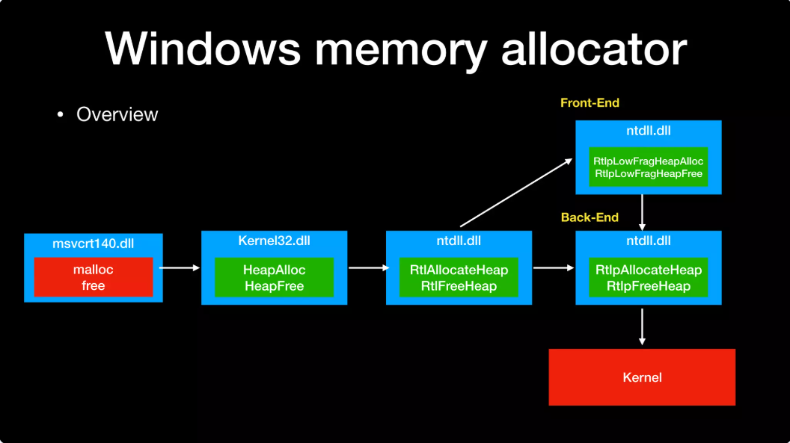
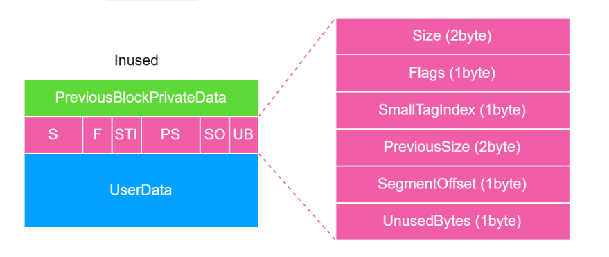
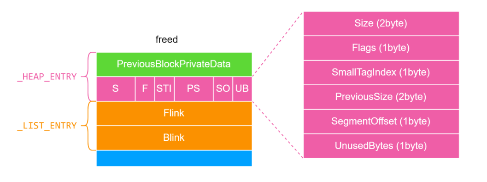
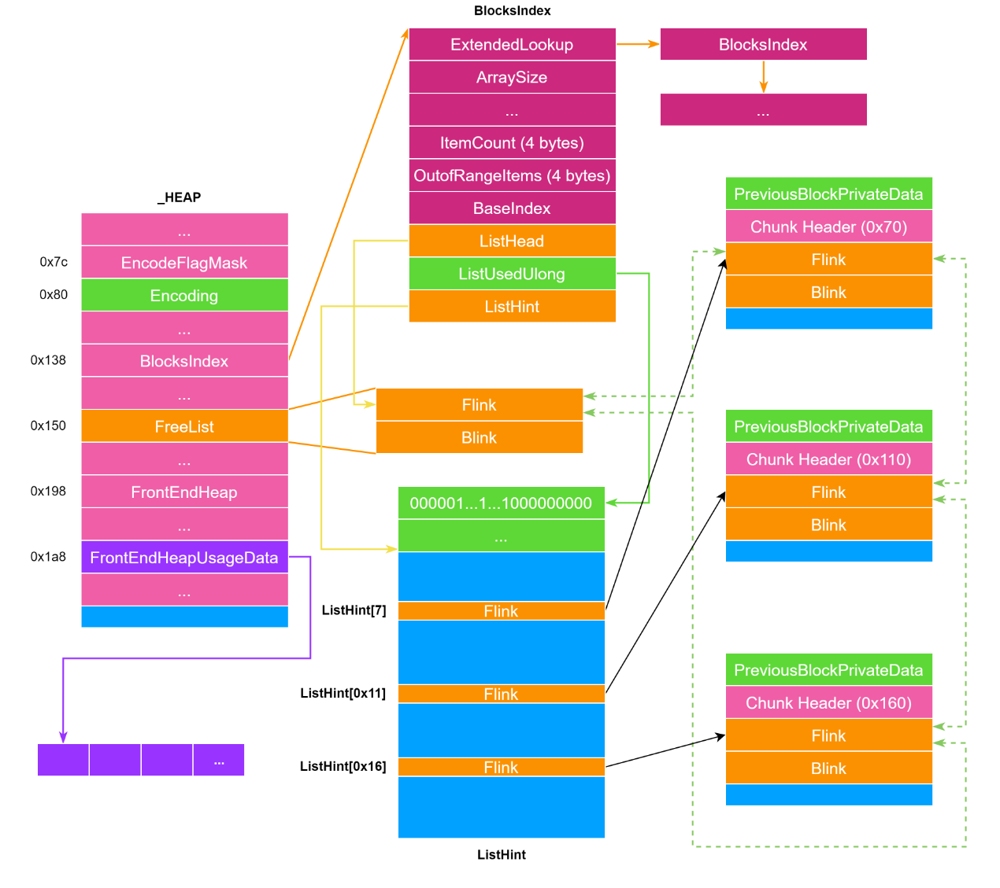
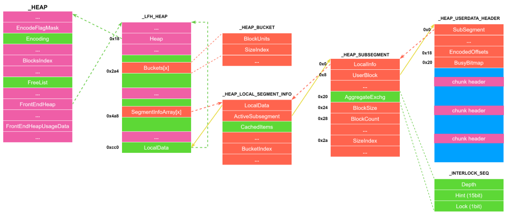
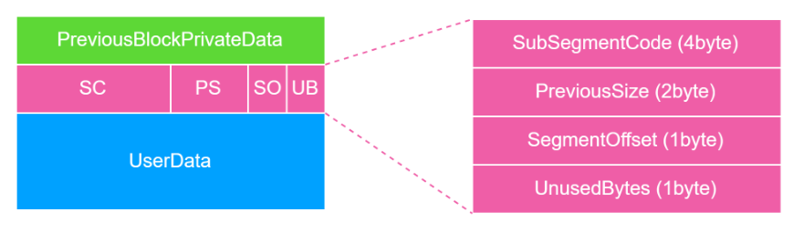

<!-- more -->

# windows

## NT Heap

NT_Heap可以分为两个部分

1. back_end, 后端分配器是主要的堆管理结构, 负责大多数内存管理操作
2. front_end, 前端分配器为了提高小块内存分配的速度, 对高频小内存分配进行优化, Windows 使用 **LFH(Low Fragmentation Heap)** 作为主要的前端分配器



### 后端堆

#### 相关结构体

##### _HEAP

```c
//0x2c0 bytes (sizeof)
struct _HEAP
{
    union
    {
        struct _HEAP_SEGMENT Segment;                                       //0x0
        struct
        {
            struct _HEAP_ENTRY Entry;                                       //0x0
            ULONG SegmentSignature;                                         //0x10
            ULONG SegmentFlags;                                             //0x14
            struct _LIST_ENTRY SegmentListEntry;                            //0x18
            struct _HEAP* Heap;                                             //0x28
            VOID* BaseAddress;                                              //0x30
            ULONG NumberOfPages;                                            //0x38
            struct _HEAP_ENTRY* FirstEntry;                                 //0x40
            struct _HEAP_ENTRY* LastValidEntry;                             //0x48
            ULONG NumberOfUnCommittedPages;                                 //0x50
            ULONG NumberOfUnCommittedRanges;                                //0x54
            USHORT SegmentAllocatorBackTraceIndex;                          //0x58
            USHORT Reserved;                                                //0x5a
            struct _LIST_ENTRY UCRSegmentList;                              //0x60
        };
    };
    ULONG Flags;                                                            //0x70
    ULONG ForceFlags;                                                       //0x74
    ULONG CompatibilityFlags;                                               //0x78
    ULONG EncodeFlagMask;                                                   //0x7c
    struct _HEAP_ENTRY Encoding;                                            //0x80
    ULONG Interceptor;                                                      //0x90
    ULONG VirtualMemoryThreshold;                                           //0x94
    ULONG Signature;                                                        //0x98
    ULONGLONG SegmentReserve;                                               //0xa0
    ULONGLONG SegmentCommit;                                                //0xa8
    ULONGLONG DeCommitFreeBlockThreshold;                                   //0xb0
    ULONGLONG DeCommitTotalFreeThreshold;                                   //0xb8
    ULONGLONG TotalFreeSize;                                                //0xc0
    ULONGLONG MaximumAllocationSize;                                        //0xc8
    USHORT ProcessHeapsListIndex;                                           //0xd0
    USHORT HeaderValidateLength;                                            //0xd2
    VOID* HeaderValidateCopy;                                               //0xd8
    USHORT NextAvailableTagIndex;                                           //0xe0
    USHORT MaximumTagIndex;                                                 //0xe2
    struct _HEAP_TAG_ENTRY* TagEntries;                                     //0xe8
    struct _LIST_ENTRY UCRList;                                             //0xf0
    ULONGLONG AlignRound;                                                   //0x100
    ULONGLONG AlignMask;                                                    //0x108
    struct _LIST_ENTRY VirtualAllocdBlocks;                                 //0x110
    struct _LIST_ENTRY SegmentList;                                         //0x120
    USHORT AllocatorBackTraceIndex;                                         //0x130
    ULONG NonDedicatedListLength;                                           //0x134
    VOID* BlocksIndex;                                                      //0x138
    VOID* UCRIndex;                                                         //0x140
    struct _HEAP_PSEUDO_TAG_ENTRY* PseudoTagEntries;                        //0x148
    struct _LIST_ENTRY FreeLists;                                           //0x150
    struct _HEAP_LOCK* LockVariable;                                        //0x160
    LONG (*CommitRoutine)(VOID* arg1, VOID** arg2, ULONGLONG* arg3);        //0x168
    union _RTL_RUN_ONCE StackTraceInitVar;                                  //0x170
    struct _RTL_HEAP_MEMORY_LIMIT_DATA CommitLimitData;                     //0x178
    VOID* FrontEndHeap;                                                     //0x198
    USHORT FrontHeapLockCount;                                              //0x1a0
    UCHAR FrontEndHeapType;                                                 //0x1a2
    UCHAR RequestedFrontEndHeapType;                                        //0x1a3
    WCHAR* FrontEndHeapUsageData;                                           //0x1a8
    USHORT FrontEndHeapMaximumIndex;                                        //0x1b0
    volatile UCHAR FrontEndHeapStatusBitmap[129];                           //0x1b2
    struct _HEAP_COUNTERS Counters;                                         //0x238
    struct _HEAP_TUNING_PARAMETERS TuningParameters;                        //0x2b0
}; 


```

`_HEAP` 是堆管理的最核心结构，和 linux glibc 的 `main_arena` 作用类似。每一个 HEAP 都有一个 `_HEAP` 结构，存在于该 HEAP 的开头。

根据下面的图片理解其中的一部分参数

* `EncodeFlagMask`：Heap 初始化后会设置为 0x100000 ，用于判断是否要加密该 heap 空间中每个堆的 chunk_header 。
* `Encoding`（`_Heap_Entry`）：用于与 chunk_header 做异或的 cookies；所有分配的 chunk 的 chunk_header 都会与 `Encoding` 进行异或，然后在存入内存中。
* `VirtualAllocdBlocks`：一个双向链表的 dummy head ，存放着 `Flink` 和 `Blink` ，将 `VirtualAllocate` 出来的 chunk 链接起来。
* `BlocksIndex`（`_Heap_LIST_LOOKUP`）：Back-End 中用于管理后端管理器中的 chunk 。
* `FreeList`（`_Heap_Entry`）：连接 Back-End 中的所有 free chunk ，类似 unsorted bin 。
* `FrontEndHeap`：指向管理 FrontEnd 的 heap 结构。
* `FrontEndHeapUsageData`：指向一个对应各大小 chunk 的数组，记录各种大小 chunk 的使用次数，到达某个程度时会开启该对应大小 chunk 的 Front-End 分配器。**如果开启 LFH 后对应的 `FrontEndHeapUsageData` 是 `SegmentInfoArrays` 的下标。**
* `FrontEndHeapStatusBitmap`：非常重要。是一个 bitmap 数组，每一项长度为 1 字节，用来记录某个 size 是否开启了 LFH 。判断方式是 `_HEAP.FrontEndHeapStatusBitmap[(size >> 4) >> 3] & (1 << ((size >> 4) & 7))` 是否为 1 ，如果是 1 则说明对应 size 开启了 LFH 。


##### _HEAP_ENTRY

最普通的_HEAP_ENTRY结构体如下：

```c
struct _HEAP_ENTRY{
    void * PreviousBlockPrivateData;
    Uint2B Size;
    Uchar Flags;
    Uchar SmallTagIndex;
    Uint2B PreviousSize;
    Uchar SegmentOffset;
    Uchar Unusedbyte;
    Uchar UserData[];
}
```

与linux类似, 也是头部 + User Data的形式，

Allocated chunk图解：

* `PreviousBlockPrivateData`：8 字节，可为前一块 chunk 的 data ，因为 chunk 必须对齐。
* `Size`: chunk 的大小，为实际大小右移 4bit 后的值。比如大小为 0x80 的 chunk 的 `Size` 值为 0x8 。
* `Flags`: 表示该chunk的状态：

  * `HEAP_ENTRY_BUSY(01)` 堆块处于占用状态
  * `HEAP_ENTRY_EXTRA_PRESENT(02)` 该块存在额外的描述 `_HEAP_ENTRY_EXTRA`
  * `HEAP_ENTRY_FILE_PATTERN(03)` 使用固定模式填充堆块
    * `HEAP_ENTRY_VIRTUAL_ALLOC(08)` 通过 virtual allocation 虚拟分配的堆块
  * `HEAP_ENTRY_LAST_ENTRY(10)` 表示是该段的最后一个堆块
* `SmallTagIndex`: 前 3 个字节异或后的值，用于验证。
* `PreviousSize`: 前⼀个 chunk 的大小，为实际大小右移 4bit 后的值。
* `SegmentOffset`: 在某种情况下用来寻找 Heap 的。
* `Unusedbytes`：整个 chunk 的大小减去用户 malloc 的大小，因为如果 chunk 是在使用状态 `Unusedbytes` 一定不为 0 ，因此可以判断 chunk 是否空闲（&0x3F 是否为 0）。另外这个值还有一个 0x80 的标志位也可以用来判断 chunk 的状态是前端堆还是后端堆。

  * 在freed的时候, 恒为0



chunk_header在内存中是加密的，解密需要和 `_HEAP->Encoding`进行异或

Freed chunk图解：

多了一个 `_LIST_ENTRY` 结构

* `Flags` 为 0 表示 freed
* `UnusedBytes` （&0x3f）始终为 0



##### _HEAP_LIST_LOOKUP

(BlocksIndex)_HEAP_LIST_LOOKUP用来管理各种不同大小的 freed chunk ，能快速的找到合适的 chunk

```c
//0x38 bytes (sizeof)
struct _HEAP_LIST_LOOKUP
{
    struct _HEAP_LIST_LOOKUP* ExtendedLookup;                               //0x0
    ULONG ArraySize;                                                        //0x8
    ULONG ExtraItem;                                                        //0xc
    ULONG ItemCount;                                                        //0x10
    ULONG OutOfRangeItems;                                                  //0x14
    ULONG BaseIndex;                                                        //0x18
    struct _LIST_ENTRY* ListHead;                                           //0x20
    ULONG* ListsInUseUlong;                                                 //0x28
    struct _LIST_ENTRY** ListHints;                                         //0x30
}; 
```

* `ExtendedLookup (Ptr64 _HEAP_LIST_LOOKUP)`：指向下一个 `BlocksIndex`，通常下一个 `BlocksIndex`会管理更大的 chunk 。
* `ArraySize`：该结构会管理最大 chunk 的大小 + 0x10 。上面例子中 `ArraySize` 为 0x80 但由于右移实际是 0x800 。
* `ItemCount`：4 字节，目前该结构所管理的 chunk 数。
* `OutofRangeItems`：超出该结构所管理大小的 chunk 的数量。
* `BaseIndex`：该结构所管理的 chunk 的起始 index ，将 `(Aligned(size) >> 4) - BaseIndex` 作为 `ListHint` 中查找的下标。通常下一个 `BlocksIndex` 将上一个 `BlocksIndex` 的 `ArraySize` 作为 `BaseIndex` 。
* `ListHead`：指向 `_HEAP` 的 `FreeList` 。
* `ListsInUseUlong`：用在判断 `ListHint` 中是否有适合大小的 chunk ，是一个 bitmap 。
* `ListHint`：十分重要，用来指向对应大小的 chunk array ，其目的就在于更快速找到适合大小的 chunk ，0x10 大小为一个间隔。可以类比linux ptmalloc的tcache bin, 只不过chunk的组织仍然通过双向链表维护

#### 分配机制(RtlAllocateHeap)

根据分配大小主要有三种：

* **case1** : `size <= 0x4000`
* **case2** : `0x4000 < size <= 0xff000`
* **case3** : `size > 0xff000`

case1：

还是需要这个图进行理解



* 检查是否有该 `Size` 对应的 `FrontEndHeapStatusBitmap`，判断是否启动了LFH
* 遍历 `BlocksIndex` 链表，找到第一个 `ArraySize` 大于 `Size` 的 `BlocksIndex` ，然后找到对应的 `ListHint` ，即 `BlocksIndex->ListHints[Size - BlocksIndex->BaseIndex]` 。调用 `RtlpAllocateHeap` 函数分配内存。
* 查看对应的 `ListHint` 中是否有值（也就是ListHint数组里否有对应 size 的 freed chunk）：
  * 如果刚好有值，就检查该 chunk 的 `Flink` （下一个freed chunk）是否是同样 size 的 chunk ：

    * 若是则将 `Flink` 写到对应的 `ListHint` 中。
    * 若否则清空对应 `ListHint` 。

    最后将该 chunk 从 `Freelist` 中 unlink 出来（同时header也会恢复正常）。
  * 如果对应的 `ListHint` 中本身就没有值，就从比较大的 `ListHint` 中找：

    * 如果找到了，就以上述同样的方式处理该 `ListHint` ，并 unlink 该 chunk ，之后对其进行切割，剩下的重新放入 `FreeList` ，如果可以放进 `ListHint` 就会放进去，再 encode header 。
    * 如果没较大的 `ListHint` 也都是空的，那么尝试 `ExtendedHeap` 加大堆空间，再从 extend 出来的 chunk 拿，接着一样切割，放回 `ListHIint` ，encode header 。

case2：没有LFH检查，其他和case1一样

case3：直接调用 `ZwAllocateVirtualMemroy` 进行分配，类似于 linux 下的 `mmap` 直接给一大块地址，并且插入 `_HEAP->VirtualAllocdBlocks` 中。

#### Free (RtlFreeHeap)

* 调用 `RtlpValidateHeapEntry` 对要释放的 chunk 进行一系列的检查：
  * 释放的 `_HEAP_ENTRY` 是否为 NULL
  * 释放的 `_HEAP_ENTRY` 地址是否关于 0x10 对齐
  * 通过 `UnusedBytes & 0x3F` 是否为 0 判断 `_HEAP_ENTRY` 是否已被释放过，相当于判断Double Free
  * 检查校验位 `SmallTagIndex` （先当于checksum）
  * 如果 `UnusedBytes` 为 4 即通过 `ZwAllocateVirtualMemroy` 分配的内存，则判断整个 `_HEAP_VIRTUAL_ALLOC_ENTRY` 是否关于 0x1000 对齐
  * 如果 `UnusedBytes` 不为 4 则通过 `SegmentOffset` 找到 `_HEAP` 然后判断 `_HEAP_ENTRY` 是否在 `[Heap->Segment.FirstEntry, Heap->Segment.LastValidEntry)` 范围内
* 调用 `RtlFreeHeap` ，进而调用 `RtlpFreeHeapInternal` ，通过 `Heap->Segment.SegmentSignature` 判断是否为 Segment Heap ，如果是则单独处理，否则继续执行。
* 判断地址是否关于 0x10 对齐以及通过 `UnusedBytes & 0x3F` 是否为 0 判断 `_HEAP_ENTRY` 是否已被释放过。（重复？）
* 根据 `UnusedBytes` 是否小于 0 （0x80 是否置位）判断是否是 LFH 堆，如果不是则调用后端堆释放的核心函数 `RtlpFreeHeap` 。
* 解密 `_HEAP_ENTRY` 并校验 `SmallTagIndex` ，根据 chunk 大小找到对应的 `BlocksIndex` 。
* 根据 `UnusedBytes` 是否为 4 判断是否是通过 `ZwAllocateVirtualMemroy` 分配的内存。如果是则检查该 chunk 的 `_HEAP_ENTRY->Flink->Blink == _HEAP_ENTRY->Blink->Flink == &_HEAP_ENTRY` 并从 `_HEAP->VirtualAllocdBlocks` 中移除，接着使用 `RtlpSecMemFreeVirtualMemory` 将 chunk 整个 munmap 掉。（类似于unlink检查）
* 如果 chunk 大小在 LFH 堆的范围内（`_HEAP_ENTRY->Size < _HEAP->FrontEndHeapMaximumIndex`），会将对应的 `FrontEndHeapUsageData -= 1`（并不是0x21）。
* 接着判断前后的 chunk 是否是 freed 的状态（根据 `_HEAP_ENTRY.Flags` 的 1 是否置位判断），如果是的话就检查前后的 freed chunk （校验 `SmallTagIndex` 以及 `_HEAP_ENTRY->Flink->Blink == _HEAP_ENTRY->Blink->Flink == &_HEAP_ENTRY`）然后将前后的 freed chunk 从 `FreeList` 中 unlink 下来（与上面的方式一样更新 `ListHint`），再进行合并。
* 合并完之后更新 `Size` 和 `PreviousSize` ，判断一下 `Size` 较大的情况，然后把合并好的 chunk 插入到 `ListHint` 中；插入时也会对 `FreeList` 进行检查（但是此检查不会触发 abort ，原因在于没有做 unlink 写入）。

### LFH堆

当同一个大小的堆块分配次数过多的时候，除了从后端堆分配所需堆块外，还会额外分配一块很大的内存供前端堆使用，之后再次分配该大小的堆块的时候会从前端堆分配。

#### 相关结构体

##### FrontEndHeap（_LFH_HEAP）

通过 `_HEAP` 的 `FrontEndHeap` 成员指针访问

```
ntdll!_LFH_HEAP
   +0x000 Lock             : _RTL_SRWLOCK
   +0x008 SubSegmentZones  : _LIST_ENTRY
   +0x018 Heap             : Ptr64 Void
   +0x020 NextSegmentInfoArrayAddress : Ptr64 Void
   +0x028 FirstUncommittedAddress : Ptr64 Void
   +0x030 ReservedAddressLimit : Ptr64 Void
   +0x038 SegmentCreate    : Uint4B
   +0x03c SegmentDelete    : Uint4B
   +0x040 MinimumCacheDepth : Uint4B
   +0x044 CacheShiftThreshold : Uint4B
   +0x048 SizeInCache      : Uint8B
   +0x050 RunInfo          : _HEAP_BUCKET_RUN_INFO
   +0x060 UserBlockCache   : [12] _USER_MEMORY_CACHE_ENTRY
   +0x2a0 MemoryPolicies   : _HEAP_LFH_MEM_POLICIES
   +0x2a4 Buckets          : [129] _HEAP_BUCKET
   +0x4a8 SegmentInfoArrays : [129] Ptr64 _HEAP_LOCAL_SEGMENT_INFO
   +0x8b0 AffinitizedInfoArrays : [129] Ptr64 _HEAP_LOCAL_SEGMENT_INFO
   +0xcb8 SegmentAllocator : Ptr64 _SEGMENT_HEAP
   +0xcc0 LocalData        : [1] _HEAP_LOCAL_DATA
```

* `Heap`, 指向其对应的 `_HEAP`结构体
* `Buckets`, 一个存放129个 `_HEAP_BUCKET`结构体的数组, 用来寻找配置大小对应到Block大小的阵列结构
* `SegmentInfoArrays`, 一个存放129个 `_HEAP_LOCAL_SEGMENT_INFO`结构体指针的数组, 不同大小对应到不同的 `_HEAP_LOCAL_SEGMENT_INFO`结构体, 主要管理对应到的 `_HEAP_SUBSEGMENT`的信息
* `LocalData`, 一个 `_HEAP_LOCAL_DATA`结构体



##### Buckets（_HEAP_BUCKET）

```
ntdll!_HEAP_BUCKET
   +0x000 BlockUnits       : Uint2B
   +0x002 SizeIndex        : UChar
   +0x003 UseAffinity      : Pos 0, 1 Bit
   +0x003 DebugFlags       : Pos 1, 2 Bits
   +0x003 Flags            : UChar
```

* `BlockUnits`, 要分配出去的一个block的大小, 存放 `size >> 4`，对应SegmentInfoArray中_HEAP_SUBSEGMENT结构体中的BlockSize
* `SizeIndex`, bucket下标 ，`SegmentInfoArrays` 对应位置的 `BucketIndex`

##### _HEAP_ENTRY

```c
struct _HEAP_ENTRY{

    void * PreviousBlockPrivateData;
    Uint4B SubSegmentCode;
    Uint2B PreviousSize;
    Uchar SegmentOffset;
    Uchar Unusedbyte;
    Uchar UserData[];
}
```

`size`, `Flags`和 `SmallTagIndex`变成了 `SubSegmentCode`



* `SubSegmentCode`：用来计算 `UserBlock` 的地址，是下面 4 个值的异或(所有 `UserBlocks`里的chunk header在初始化的时候都会经过xor)：

  * chunk 对应的 `_HEAP` 地址的低 4 字节
  * `RtlpLFHKey` 的低 4 字节
  * chunk 地址右移 4 bit
  * chunk 与其所在的 `UserBlock` 的距离左移 12 bit `((chunk address) - (UserBLocks address)) << 12`
* `PreviousSize`：该 chunk 在 `UserBlock` 中的 index 左移 8 bit
* `SegmentOffset`：通常为 0 ，没有用。
* `UnusedBytes`：在空闲 chunk 中为 0x80，在使用的chunk 中为 `UnusedBytes >= 0x3F ? 0xBF : (UnusedBytes | 0x80)`

#### 初始化

在 `FrontEndHeapUsageData[x] & 0x1F > 0x10`时, 置位 `_HEAP->CompatibilityFlag |= 0x20000000`, 下一次allocate(也就是第18次)就会启用LFH并初始化

分配机制还是有些复杂了，交给AI简化一下

第 18 次 malloc：

* `_HEAP->BlocksIndex` 是一个管理不同尺寸范围的 `_HEAP_LIST_LOOKUP` 结构体链表。默认只管理小尺寸 chunk (e.g., `< 0x800`)。为了支持 LFH，系统会 **扩展此链表** ，追加新的节点以管理更大的尺寸范围（e.g., `0x800` 到 `0x4000`）。
* 针对当前被激活的尺寸 `x`，系统会初始化其对应的 Bucket。具体动作是在 `_LFH_HEAP->SegmentInfoArrays` 数组中，填入一个指向 `_HEAP_LOCAL_SEGMENT_INFO` 结构体的指针。这个结构体是该特定尺寸的“分配管理器”。
* `RtlpActivateLowFragmentationHeap`调用 `RtlpCreateLowFragHeap` 创建一个 `_LFH_HEAP` 结构，并将其地址存入 `_heap->FrontEndHeap`
* 调用 `RtlpExtend...` 系列函数
* **由于前面创建结构会申请一些堆块，所以造成了第 18 次开始 chunk 申请不连续的假象。**

第 19 次 malloc开始分配

#### 分配 (Allocation)


分配的核心逻辑在 `RtlpLowFragHeapAllocFromContext` 函数中，分为**寻找可用 Subsegment** 和**从中获取 chunk** 两步。

1. **寻找可用的 Subsegment (内存池)**
   * 首先，检查当前尺寸的“首选”内存池 `_HEAP_LOCAL_SEGMENT_INFO->ActiveSubsegment` 中是否还有空闲块。通过检查 `ActiveSubsegment->AggregateExchg.Depth`（空闲块数量）来判断。
   * 如果 `ActiveSubsegment` 已满，则去“备用池” `CachedItems` 列表里寻找其他有空闲块的 `Subsegment`。如果找到，就将其设置为新的 `ActiveSubsegment`。
   * 如果所有现有 `Subsegment` 都满了，则会 **分配并初始化一个新的 `UserBlocks`** （即 `_HEAP_SUBSEGMENT`），并将其设置为 `ActiveSubsegment`。
2. **从 Subsegment 中获取 Chunk**
   * **获取随机数** : 从一个全局的 256 元素随机数数组 `RtlpLowFragHeapRandomData` 中循环取值。这个随机数（范围 0x0 ~ 0x7F）用于增加分配地址的不可预测性。
   * **计算随机起始索引** : 使用公式 `index = (random_value * max_index) >> 7` 计算出一个在 `UserBlocks` 内的随机起始搜索点。
   * **查找空闲块 (位图操作)** : 从计算出的 `index` 开始，扫描 `UserBlocks->BusyBitmap`。
   * 如果 `index` 对应的位是 `0`（空闲），则直接选中。
   * 如果该位是 `1`（占用，即发生碰撞/collision），则向后线性搜索，直到找到第一个为 `0` 的位。
   * **更新元数据** :
   * 将 `BusyBitmap` 中找到的位设置为 `1`。
   * 更新 `ActiveSubsegment->AggregateExchg.Depth` 等统计信息。
   * 在返回的 chunk 头部进行设置：
     * `chunk->PreviousSize` 被用来存储这个 chunk 在 `UserBlocks` 中的索引，便于释放时快速定位。
     * `chunk->UnusedBytes` 的最高位被设置为 `1`（`|= 0x80`），标记这是一个由 LFH 分配的、处于“占用”状态的 chunk。
   * **返回地址** : 最后，将 chunk 的用户数据区地址返回给调用者。

#### 释放 (Free)

* 在 `RtlpFreeHeapInternal` 函数中首先会检查释放的内存地址是否对齐 0x10 。
* 通过 `_HEAP_ENTRY->UnpackedEntry.UnusedBytes & 0x3F` 是否为 0 判断 chunk 是否已被释放。
* 通过 `_HEAP_ENTRY->UnpackedEntry.SubSegmentCode` 找到对应的 `UserBlock` 进而找到 `HeapSubsegment` 。
* 通过 `UserBlock->EncodedOffsets` 再尝试找回 `_HEAP_ENTRY` 从而校验有无恶意修改。
* 将 `_HEAP_ENTRY.UnusedBytes` 设置为 0x80 。
* 将 `UserBlocks->BusyBitmap.Buffer` 中释放的 chunk 对应的位复位。
