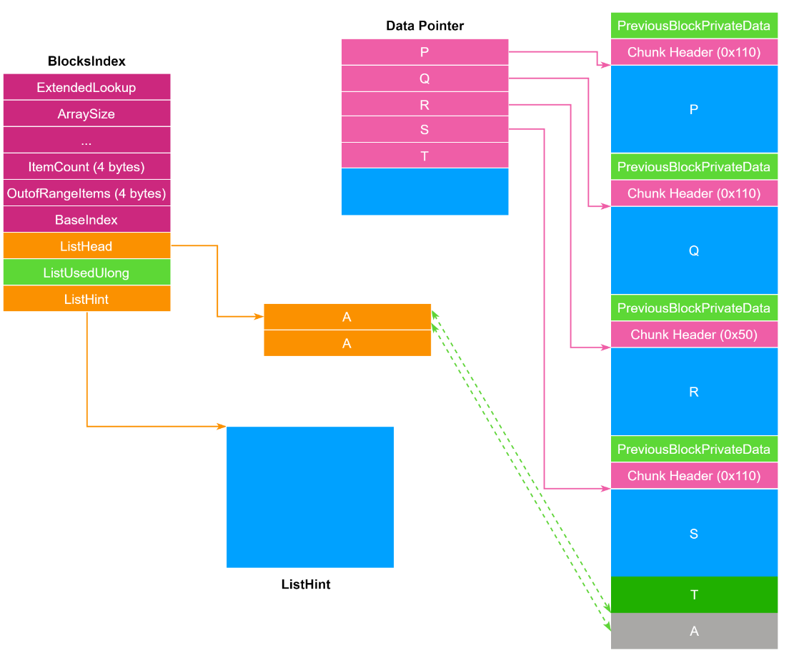
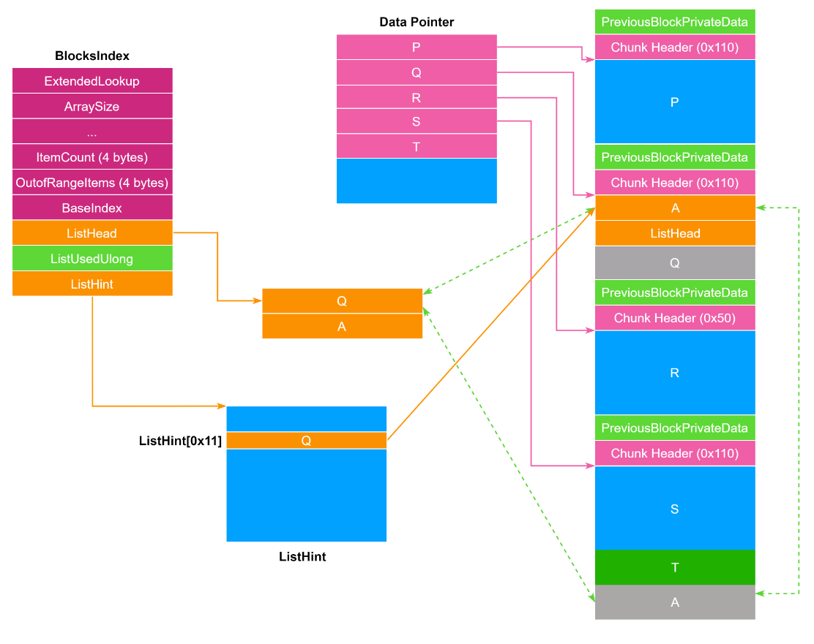
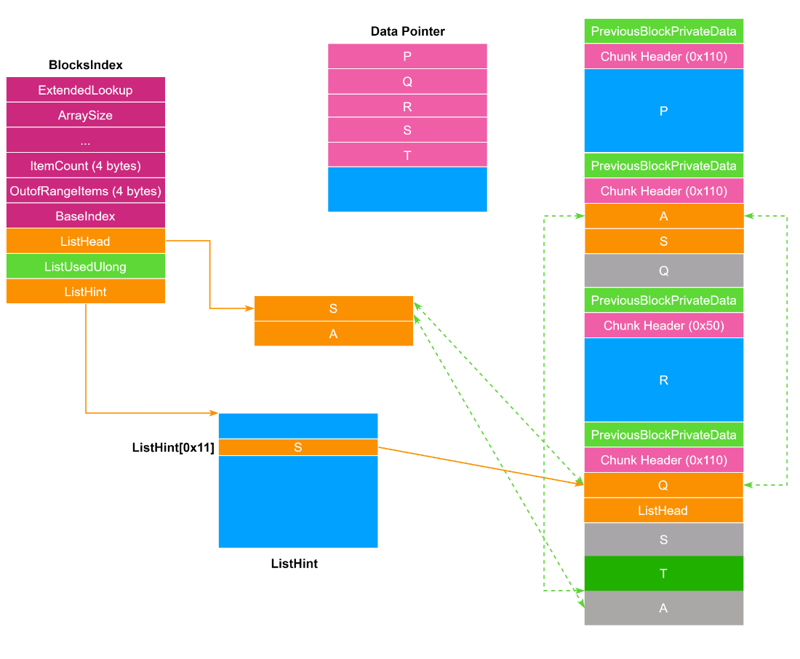
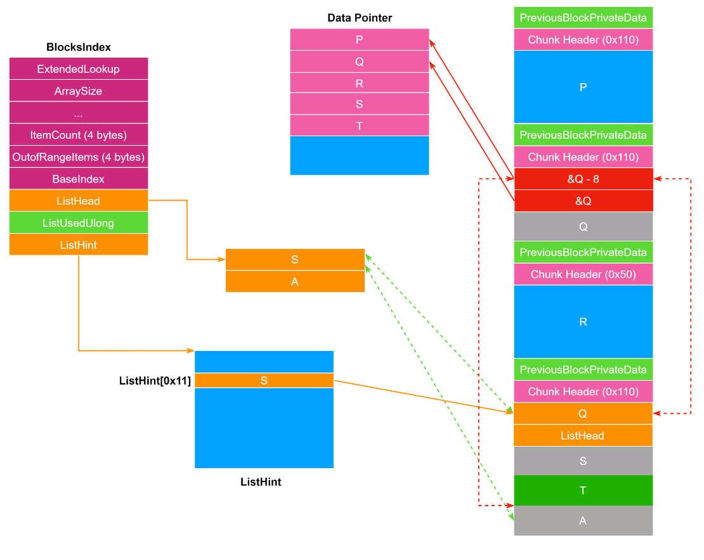
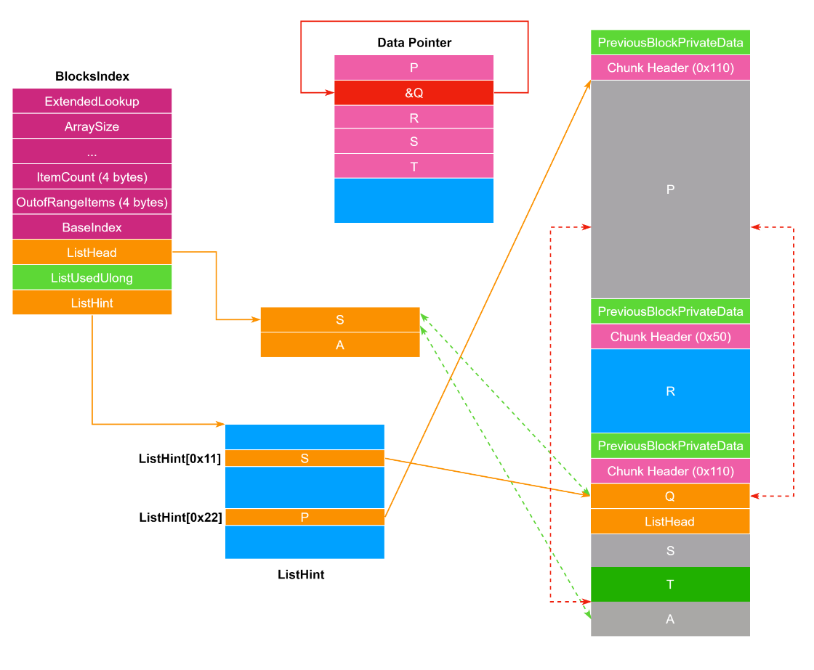
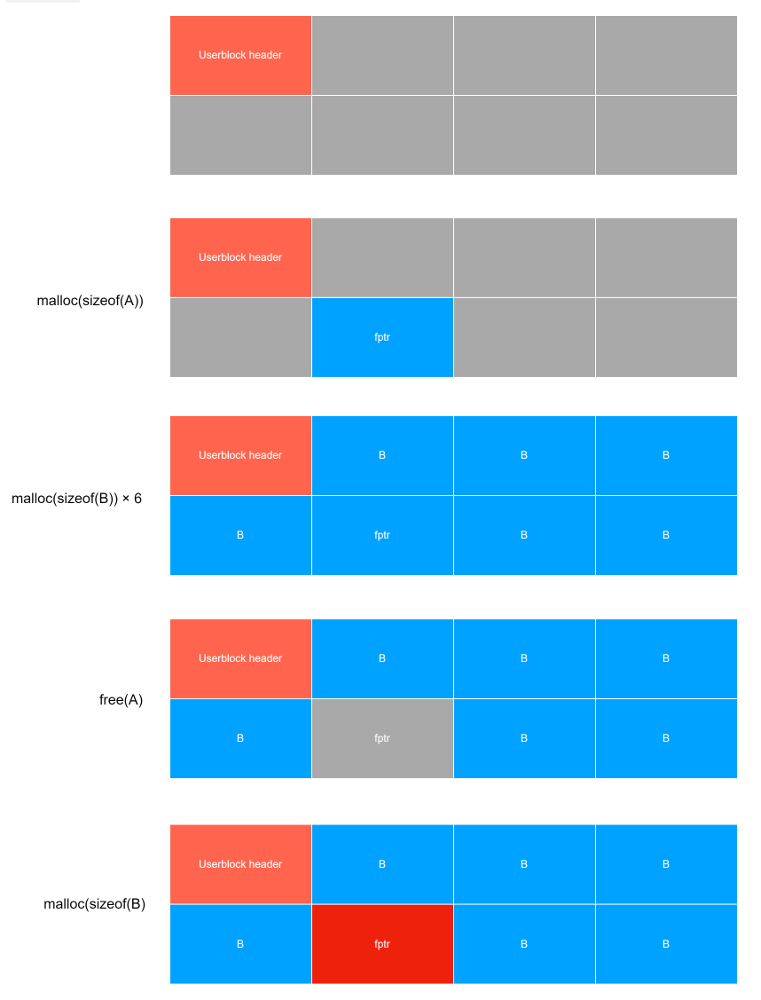

<!-- more -->

# windows

查看ntdll的版本号:`lm v m ntdll`

```
    Information from resource tables:
        CompanyName:      Microsoft Corporation
        ProductName:      Microsoft® Windows® Operating System
        InternalName:     ntdll.dll
        OriginalFilename: ntdll.dll
        ProductVersion:   10.0.22621.4541
        FileVersion:      10.0.22621.4541 (WinBuild.160101.0800)
        FileDescription:  NT Layer DLL
        LegalCopyright:   © Microsoft Corporation. All rights reserved.
```

## NT heap下free合并堆块时的unlink

函数调用链

```
用户 / API / CRT
    ↓
HeapFree / LocalFree / GlobalFree / free / new/delete 等
    ↓
RtlFreeHeap（ntdll）
    ↓
RtlpFreeHeapInternal
    ↓
具体堆后端（传统 NT Heap / 段式堆 / LFH / VS 等）
```

初始HEAP状态假设如下：



释放 `Q` -> `ListHint` 指向 `Q`。



释放 `S` -> `ListHint` 指向 `S`，`S->Flink` 指向 `Q`。利用 NT Heap 的 LIFO 特性，将 `Q` 从链表头部（Head）挤到第二个位置（Internal Node）。



利用溢出或 UAF 修改 `Q` 的 `_LIST_ENTRY`。

* `Q->Flink = TargetAddr - Offset`
* `Q->Blink = TargetAddr`
* TargetAddr上必须有Q的地址



触发合并 (Trigger Coalesce)

* 操作 ：释放堆块 `P`（位于 `Q` 之前的相邻块）。
* 逻辑 ：堆管理器发现 `P` 释放，且后向相邻块 `Q` 也是空闲的，决定将 `Q` 从 FreeList 中移除（Unlink）并与 `P` 合并。
* 调用函数 ：`RtlpHeapRemoveListEntry(Q)`

在 `RtlpHeapRemoveListEntry` 函数内部，会按顺序进行以下检查：

检查 A：Bucket 头部节点检查 (Head Check)

* 逻辑 ：检查 `slot == Node`，即当前要移除的 `Q` 是否是 Bucket 的头部节点（ListHint 指向的节点）。
* 情况 ：
* 如果 `Q` 是头部：系统会尝试将 `Q->Flink`（我们伪造的攻击地址）作为新的 Bucket 头部写入堆元数据。这通常会导致堆元数据损坏或崩溃。
* 当前情况 ：由于我们在第一步多释放了 `S`，`Q` 此时不是头部节点。
* 结果 ： 绕过此检查 ，进入常规双向链表移除逻辑。

检查 B：Safe Unlink 完整性检查

* 逻辑 ：检查双向链表的一致性。
* 验证 `Q->Flink->Blink == Q`
* 验证 `Q->Blink->Flink == Q`
* 当前情况 ：
* `Q->Flink` 指向 `Target - Offset`，其 `Blink` 字段正好指向 `Q`。
* `Q->Blink` 指向 `Target`，其 `Flink` 字段正好指向 `Q`。
* 结果 ：堆管理器认为这是一个合法的链表节点。
* 检查通过后，执行链表移除操作：

  * `Q->Blink->Flink = Q->Flink`  =>  `*Target = Target - Offset`
  * `Q->Flink->Blink = Q->Blink`  =>  `*(Target - Offset + 8) = Target`



善后与软性失败 (Soft Fail)

* 操作 ：`P` 与 `Q` 合并成 `NewBlock`，系统尝试将其插入 FreeList。
* 调用函数 ：`RtlpInsertFreeBlock(NewBlock)`

检查 ：插入时的一致性检查

* 逻辑 ：在将 `NewBlock` 插入到相邻节点（例如 `A`）之前，检查 `A` 的反向指针是否正确。
* 验证 `A->Blink->Flink == A`。
* 当前情况 ：
* `A->Blink` 依然指向旧的 `Q` 地址。
* 但是 `Q` 的内容已经被我们在 Unlink 阶段修改了（或者 Q 现在已经是 NewBlock 的一部分，数据变了）。
* `Q->Flink` 不再指向 `A`。
* 结果 ： 检查失败 。

后果：触发软性失败

* 在 传统 NT Heap 中，这种检查失败调用的是 `RtlpLogHeapFailure`。
* 它会记录错误，并 中断当前的插入操作 。
* 但是，它不会终止进程 （Abort），这就是所谓的  Soft Fail 。

## reuse attack（Nt Heap LFH 堆）

假设有一个 Use after free 的漏洞，但因为 LFH 的随机性，导致无法预测下一个 chunk 会在哪，使得很难进行堆布局。这时可以采用填充 `Userblock` 的方式，即先分配完所有的 LFH 堆块再 free 掉其中一块，那么下次分配的堆块一定与漏洞堆块是同一个堆块。



PoC

```c
#include <Windows.h>
#include <stdio.h>

// 定义分配次数，足够大以正好填满 LFH 的 UserBlock 并激活 LFH
#define ALLOC_COUNT 175 
#define CHUNK_SIZE 0xF0 // 0xF0 + 0x10 (Header) = 0x100 (256 bytes) Bucket

int main(void)
{
    // 1. 创建一个私有堆，模拟干净的环境
    HANDLE hHeap = HeapCreate(0, 0, 0);
    if (!hHeap) return 1;

    void* chunks[ALLOC_COUNT] = { NULL };
    int i;

    printf("[*] Phase 1: Spraying chunks to activate LFH and fill UserBlocks...\n");

    // 2. 堆喷射 (Heap Spraying) / 填充
    // 前 ~18 次分配会激活 LFH，后续分配会填充 UserBlock
    for (i = 0; i < ALLOC_COUNT; i++)
    {
        chunks[i] = HeapAlloc(hHeap, 0, CHUNK_SIZE);
        //printf("    Allocated chunks[%d]: %p\n", i, chunks[i]);
    }

    printf("[+] Allocated %d chunks. LFH should be active and Blocks filled.\n", ALLOC_COUNT);
    printf("----------------------------------------------------------------\n");

    int victim_index = 30;
    void* victim_addr = chunks[victim_index];

    printf("[*] Phase 2: Freeing one specific chunk (Index %d) at %p\n", victim_index, victim_addr);

    HeapFree(hHeap, 0, victim_addr);

    printf("[*] Phase 3: Allocating a new chunk of size 0x%X...\n", CHUNK_SIZE);

    void* attacker_chunk = HeapAlloc(hHeap, 0, CHUNK_SIZE);

    printf("[+] Attacker chunk address: %p\n", attacker_chunk);
    HeapDestroy(hHeap);
    return 0;
}
```

效果：

```
[*] Phase 1: Spraying chunks to activate LFH and fill UserBlocks...
[+] Allocated 175 chunks. LFH should be active and Blocks filled.
----------------------------------------------------------------
[*] Phase 2: Freeing one specific chunk (Index 30) at 000001C4BAAB4570
[*] Phase 3: Allocating a new chunk of size 0xF0...
[+] Attacker chunk address: 000001C4BAAB4570
```
