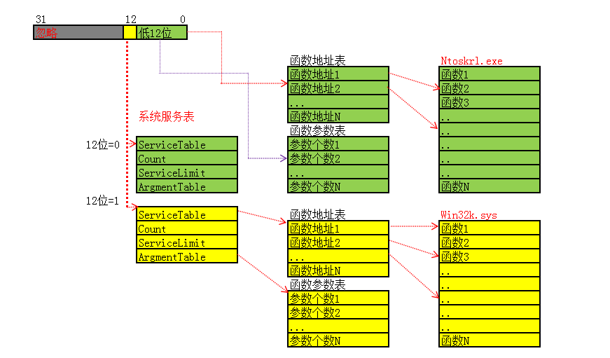
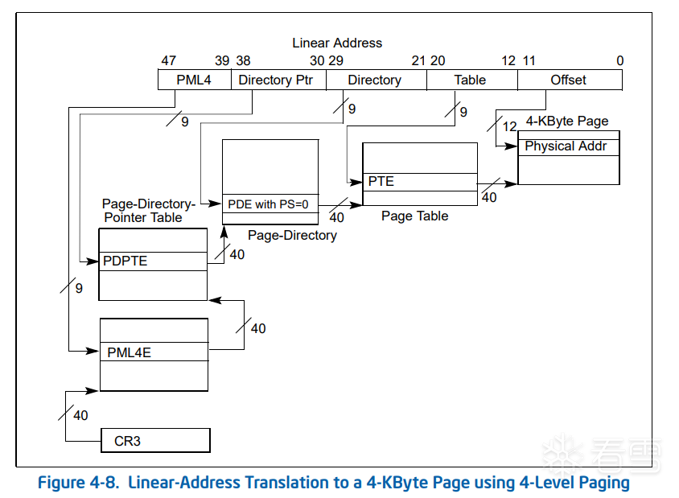
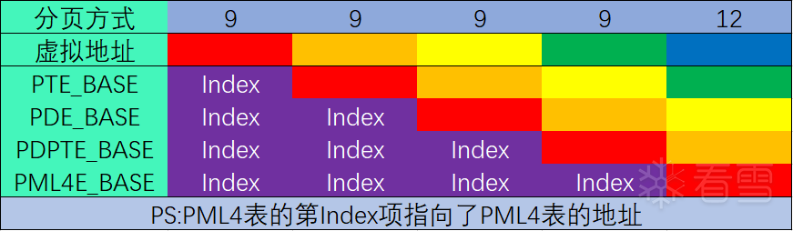

<!-- more -->

# windows

## basic knowledge

### x86下R3->R0

#### int 2e

CPU获取 IDT 的基地址，计算目标描述符地址：`IDT Base + (0x2e * 8)`

进行特权级检查：CPL <= DPL

* CPL (Current Privilege Level) ：当前代码段（CS）的特权级（Ring 3）。
* DPL (Descriptor Privilege Level) ：IDT 描述符中规定的特权级（必须是 3，否则用户态无权调用）

从 IDT 描述符中提取段选择子 Segment Selector 。CPU 使用该 Selector 去查询 GDT

用户线程栈切换成内核线程栈，保存上下文 (Push Context，会压入一些寄存器)，从IDT（Interrupt Descriptor Table）中寻找0x2e对应的异常处理函数（KiSystemService）进入内核代码空间

#### sysenter / sysreturn

sysenter指令执行时会跳转到MSR[176]指向的函数地址（该函数实际是KiFastCallEntry），CS、SS、EIP、ESP均来自MSR寄存器，因此速度上比int 2e块（不需要压参数、读内存）

CS <== `IA32_SYSENTER_CS` (MSR 0x174)。

EIP <== `IA32_SYSENTER_EIP` (MSR 0x176)。

ESP <== `IA32_SYSENTER_ESP` (MSR 0x175)。

##### KiFastCallEntry的函数流程

 `push 30h` / `pop fs` FS 寄存器从用户态的  TEB 切换到内核态的 KPCR

0x30的二进制 ：`0000 0000 0011 0000`

x86 段选择子的结构：

* RPL (最后2位) : `00` -> Ring 0 (特权级 0，即内核态)。
* TI (第3位) : `0` -> GDT (全局描述符表)。
* Index (高13位) : `0000000000110` -> 6 (十进制)。

###### GDT索引表：全局描述表（Global Description Table）

在 x86 保护模式 (Protected Mode) 下，内存不再是直接通过物理地址访问，而是通过 “分段 (Segmentation)” 机制访问。

1. 不直接给地址 ：当程序执行 `mov eax, [0x12345678]` 时，CPU 并不是直接去物理内存的 `0x12345678` 拿数据。
2. 段选择子 (Selector) ：CPU 会先看当前段寄存器（如 `DS`、`CS`、`SS`）里存的  “索引号” （即选择子）。
3. 查表 (Lookup) ：CPU 根据这个索引号，去 GDT 表里找到对应的  “段描述符 (Descriptor)” 。
4. 鉴权与定位 ：描述符里记录了这段内存的  基地址 (Base) 、大小 (Limit) 和  权限 (Access Rights) 。只有检查通过，CPU 才会把 基地址 + 偏移量 算出线性地址。

| 索引 (Index) | 选择子 (Selector) | 名称         | DPL (特权级) | 用途与特征                                                                            |
| ------------ | ----------------- | ------------ | ------------ | ------------------------------------------------------------------------------------- |
| 0            | 0x00              | NULL         | -            | 空描述符 。硬件规定，不可使用。                                                       |
| 1            | 0x08              | KGDT_R0_CODE | 0 (内核)     | 内核代码段 。Base=0, Limit=4GB。内核执行代码时 CS=0x08。                              |
| 2            | 0x10              | KGDT_R0_DATA | 0 (内核)     | 内核数据段 。Base=0, Limit=4GB。内核读写数据时 DS/ES/SS=0x10。                        |
| 3            | 0x1B              | KGDT_R3_CODE | 3 (用户)     | 用户代码段 。Base=0, Limit=4GB。用户程序运行时 CS=0x1B (0x18                          |
| 4            | 0x23              | KGDT_R3_DATA | 3 (用户)     | 用户数据段 。Base=0, Limit=4GB。用户程序运行时 DS/ES/SS=0x23 (0x20                    |
| 5            | 0x28              | KGDT_TSS     | 0 (内核)     | TSS (任务状态段) 。用于保存硬件上下文和栈切换信息 (ESP0)。                            |
| 6            | 0x30              | KGDT_R0_PCR  | 0 (内核)     | 内核 KPCR 指针 。 这是唯一的非平坦段 。Base=KPCR地址。内核通过 FS 访问 CPU 专属数据。 |
| 7            | 0x3B              | KGDT_R3_TEB  | 3 (用户)     | 用户 TEB 指针 。Base=当前线程TEB地址。用户通过 FS 访问线程局部存储。                  |
| ...          | ...               | ...          | ...          | (其他保留项，如 LDT, VDM 等)                                                          |

LDT：局部描述表（Local Description Table），与GDT功能一致，但不能单独存在，只能嵌套在GDT中。

###### 段寄存器

CS (Code Segment) —— 必须指向代码

CPU 的取指单元（Instruction Fetch Unit）永远只从 `CS:EIP`（或 `CS:RIP`）指向的地址读取指令。CS 寄存器的低 2 位（CPL）代表了当前 CPU 的特权级（Ring 0 - Ring 3）。CS 指向 Ring 0 代码段 (0x08) 或 Ring 3 代码段 (0x1B)。

SS (Stack Segment) —— 必须指向堆栈

所有的隐式堆栈操作（如 `push`, `pop`, `call`, `ret`, `enter`, `leave`）以及基于 `ESP`/`EBP` 的内存访问，默认使用 SS 段。SS 指向内核栈段 (0x10) 或用户栈段 (0x23)。

DS (Data Segment) & ES (Extra Segment)

DS 是数据访问的默认段（例如 `mov eax, [ebx]` 默认就是 `ds:[ebx]`）。ES 是字符串指令（如 `movs`, `stos`）的目标段默认值。

FS & GS (F-Segment / G-Segment)

| 架构       | FS 寄存器用途              | GS 寄存器用途             | 为什么不同？                                          |
| ---------- | -------------------------- | ------------------------- | ----------------------------------------------------- |
| x86 (32位) | 指向 TEB (R3) / KPCR (R0)  | 未大量使用 (通常为0)      | x86下 FS 选择子很早就被分配给了 TEB/PCR。             |
| x64 (64位) | (兼容性保留，指向 32位TEB) | 指向 TEB (R3) / KPCR (R0) | x64下 CPU 允许 `swapgs`快速切换 GS，所以主要用 GS。 |

fs:[0]：在3环时，该处指向的是TEB结构，0环下指向_KPCR结构

```c
struct _KPCR
{
    union
    {
        struct _NT_TIB NtTib;                                               //0x0
        struct
        {
            struct _EXCEPTION_REGISTRATION_RECORD* Used_ExceptionList;      //0x0
            VOID* Used_StackBase;                                           //0x4
            VOID* Spare2;                                                   //0x8
            VOID* TssCopy;                                                  //0xc
            ULONG ContextSwitches;                                          //0x10
            ULONG SetMemberCopy;                                            //0x14
            VOID* Used_Self;                                                //0x18
        };
    };
    struct _KPCR* SelfPcr;                                                  //0x1c
    struct _KPRCB* Prcb;                                                    //0x20
    UCHAR Irql;                                                             //0x24
    ULONG IRR;                                                              //0x28
    ULONG IrrActive;                                                        //0x2c
    ULONG IDR;                                                              //0x30
    VOID* KdVersionBlock;                                                   //0x34
    struct _KIDTENTRY* IDT;                                                 //0x38
    struct _KGDTENTRY* GDT;                                                 //0x3c
    struct _KTSS* TSS;                                                      //0x40
    USHORT MajorVersion;                                                    //0x44
    USHORT MinorVersion;                                                    //0x46
    ULONG SetMember;                                                        //0x48
    ULONG StallScaleFactor;                                                 //0x4c
    UCHAR SpareUnused;                                                      //0x50
    UCHAR Number;                                                           //0x51
    UCHAR Spare0;                                                           //0x52
    UCHAR SecondLevelCacheAssociativity;                                    //0x53
    ULONG VdmAlert;                                                         //0x54
    ULONG KernelReserved[14];                                               //0x58
    ULONG SecondLevelCacheSize;                                             //0x90
    ULONG HalReserved[16];                                                  //0x94
    ULONG InterruptMode;                                                    //0xd4
    UCHAR Spare1;                                                           //0xd8
    ULONG KernelReserved2[17];                                              //0xdc
    struct _KPRCB PrcbData;                                                 //0x120
}; 
```

 `mov ecx, fs:_KPCR.TSS`：通过 FS (KPCR) 获取当前任务状态段 (TSS)。

`mov esp, [ecx+_KTSS.Esp0]`：栈指针切换到该线程真正的内核栈顶

后续是根据 `KTrap_Frame`的结构构建完整 `Trap Frame` 与异常链表，需要注意的是用户态的 `esp`是通过 `push edx`来压入的，因为 `sysenter`被封装成了 `KiFastSystemCall`函数，会先进行 `mov edx,esp;`然后再 `sysenter`，eip则是 `_KUSER_SHARED_DATA`中的 `SystemCallReturn` 地址

`mov ebx, large fs:KPCR.SelfPcr`：获取 PCR 指针，`push dword ptr [ebx]`：保存当前的异常处理链表头 (`PCR.ExceptionList`) 到栈

最后保存到_KTHREAD.TrapFrame中

KTrap_Frame：栈帧，用来保存R3切换到R0的环境

```c
//0x8c bytes (sizeof)
struct _KTRAP_FRAME
{
    ULONG DbgEbp;                                                           //0x0
    ULONG DbgEip;                                                           //0x4
    ULONG DbgArgMark;                                                       //0x8
    ULONG DbgArgPointer;                                                    //0xc
    USHORT TempSegCs;                                                       //0x10
    UCHAR Logging;                                                          //0x12
    UCHAR Reserved;                                                         //0x13
    ULONG TempEsp;                                                          //0x14
    ULONG Dr0;                                                              //0x18
    ULONG Dr1;                                                              //0x1c
    ULONG Dr2;                                                              //0x20
    ULONG Dr3;                                                              //0x24
    ULONG Dr6;                                                              //0x28
    ULONG Dr7;                                                              //0x2c
    ULONG SegGs;                                                            //0x30
    ULONG SegEs;                                                            //0x34
    ULONG SegDs;                                                            //0x38
    ULONG Edx;                                                              //0x3c
    ULONG Ecx;                                                              //0x40
    ULONG Eax;                                                              //0x44
    ULONG PreviousPreviousMode;                                             //0x48-----R0用
    struct _EXCEPTION_REGISTRATION_RECORD* ExceptionList;                   //0x4c
    ULONG SegFs;                                                            //0x50
    ULONG Edi;                                                              //0x54
    ULONG Esi;                                                              //0x58
    ULONG Ebx;                                                              //0x5c
    ULONG Ebp;                                                              //0x60
    ULONG ErrCode;                                                          //0x64
    ULONG Eip;                                                              //0x68
    ULONG SegCs;                                                            //0x6c 
    ULONG EFlags;                                                           //0x70-----R3用
    ULONG HardwareEsp;                                                      //0x74 
    ULONG HardwareSegSs;                                                    //0x78
    ULONG V86Es;                                                            //0x7c	虚拟8086模式下，保护模式下不用
    ULONG V86Ds;                                                            //0x80
    ULONG V86Fs;                                                            //0x84
    ULONG V86Gs;                                                            //0x88
}; 
```

确定系统服务表（SSDT vs Shadow SSDT）

`mov edi, eax` / `shr edi, 8` / `and edi, 10h`

Windows 系统调用号第 12 位（bit 12）用于区分表。

* 如果 ID < 0x1000，`edi` 结果为 0 -> 使用 KeServiceDescriptorTable (核心内核函数)。
* 如果 ID >= 0x1000 (如 0x1xxx)，`edi` 结果为 0x10 -> 使用 KeServiceDescriptorTableShadow (win32k.sys 图形/窗口函数)。

`add edi, [esi+_KTHREAD.ServiceTable]` _KTHREAD中有服务表的基址，现在edi指向了正确的 Service Descriptor Table 结构体

获取 SSDT 参数表 (Argument Table) 的基址，获取 SSDT 函数地址表 (Service Table) 的基址。

从参数表中读取该系统调用需要的参数字节数 ，从函数表中读取目标内核函数地址 ----计算公式：表基址 + (调用号 * 4)。

通过 `rep movsd`从用户态堆栈完整拷贝到内核态堆栈（此时ECX--参数个数；ESI--由EDX赋予，EDX在sysenter前就指向old esp；   EDI--内核栈地址），最后 `call ebx`调用内核函数

```c
typedef struct _KSERVICE_TABLKSERVICE_TABLE_DESCRIPTORE_DESCRIPTOR
{
    PULONG_PTR FuncPoint;	//指向函数表
    PULONG Count;			//调用的次数
    PULONG Limit;			//函数个数
    PUCHAR ArgsPoint;		//参数列表
}KSERVICE_TABLE_DESCRIPTOR, *PKSERVICE_TABLE_DESCRIPTOR;
 
#define NUMBER_SERVICE_TABLES 2
 
KSERVICE_TABLE_DESCRIPTOR KeServiceDescriptorTable[NUMBER_SERVICE_TABLES]
KSERVICE_TABLE_DESCRIPTOR KeServiceDescriptorTableShadow[NUMBER_SERVICE_TABLES]
```



x64下 `syscall`似乎和x86下的 `sysenter`差不多，跳转的内核函数是 `KiSystemCall64`

### x86下R0->R3

处理APC：代码读取 `KPCR->CurrentThread` (`fs:124h`)

检查 `Thread->ApcState.UserApcPending`，如果有用户态的 APC（比如某些 I/O 完成回调、线程挂起请求）， 需要先处理掉（APC注入的发生点）`call _KiDeliverApc`直到所有挂起的 APC都执行完毕。

恢复异常链表及调试寄存器（如果为调试模式的话）：从 TrapFrame 中取出用户态的 `ExceptionList`，写回 `fs:[0]` (KPCR的第一个成员指向TEB )，

检查 `TrapFrame->Dr7`。如果用户态程序下了硬件断点（Hardware Breakpoint），这里需要恢复调试寄存器 `DR0`-`DR7`。

恢复通用寄存器与栈调整，将ESP移动到TrapFrame->SegFs，`pop fs`恢复3环FS，再移动esp恢复各个通用寄存器，执行iret返回用户态自动从栈上弹出 EIP, CS, EFLAGS, ESP, SS

### x64页表自映射

x64 使用 4 级页表（PML4, PDPT, PDE, PTE）

当内核需要修改某个虚拟地址（比如 `0x12345678`）对应的 PTE（页表项）属性时，它不能直接去写物理内存。它必须先把存放这个 PTE 的物理页映射到一个虚拟地址上，才能通过 CPU指令（如 `mov`）去修改它。

如果没有自映射，内核每次修改页表都需要临时分配虚拟地址、映射物理页、修改、解除映射，这非常繁琐且低效。



使用windbg命令 `!pte`查看 `0`地址数据

对pml4、pdpt、pde、pte四项的页表基址进行拆分得到如下（去除 `页内偏移`和 `高16位`）：

```
pte_base：   111010111 000000000 000000000 000000000（FEB8000000）
pde_base：   111010111 111010111 000000000 000000000（FEBF5C0000）
pdpte_base： 111010111 111010111 111010111 000000000（FEBF5FAE00）
pml4_base：  111010111 111010111 111010111 111010111（FEBF5FAFD7）
```



CPU是如何找到一个虚拟地址的物理地址的：

CPU先从CR3寄存器读取到PML4表的物理地址，从cr3+虚拟地址的最高9位 * 8处获得PDPT的物理地址，然后这个地址+虚拟地址的次高9位 * 8获得的地址是PDE的物理地址，以此类推从PTE上获取物理页帧号，物理地址= `(PFN << 12) + Offset(0x000)` 最后去内存条里找到数据

但如果是查找PTE表的物理地址呢？这里就和虚表自映射有关了，在cr3+PTE表虚拟地址最高9位*8处获得的地址其实是PML4的地址

在windbg上通过!pte命令获得的地址，实际上CPU从这些虚拟地址访问到的物理地址就是他们本身，这也解释了这些虚拟地址为什么要这样设计。

PTE表：在 x64 下，一个 PTE 是 64位（8字节）的，它里面存了物理地址和属性

```
1: kd> dt nt!_MMPTE_HARDWARE
   +0x000 Valid            : Pos 0, 1 Bit
   +0x000 Dirty1           : Pos 1, 1 Bit
   +0x000 Owner            : Pos 2, 1 Bit
   +0x000 WriteThrough     : Pos 3, 1 Bit
   +0x000 CacheDisable     : Pos 4, 1 Bit
   +0x000 Accessed         : Pos 5, 1 Bit
   +0x000 Dirty            : Pos 6, 1 Bit
   +0x000 LargePage        : Pos 7, 1 Bit
   +0x000 Global           : Pos 8, 1 Bit
   +0x000 CopyOnWrite      : Pos 9, 1 Bit
   +0x000 Unused           : Pos 10, 1 Bit
   +0x000 Write            : Pos 11, 1 Bit
   +0x000 PageFrameNumber  : Pos 12, 36 Bits
   +0x000 ReservedForHardware : Pos 48, 4 Bits
   +0x000 ReservedForSoftware : Pos 52, 4 Bits
   +0x000 WsleAge          : Pos 56, 4 Bits
   +0x000 WsleProtection   : Pos 60, 3 Bits
   +0x000 NoExecute        : Pos 63, 1 Bit
```

| 位 (Bit)   | 名称                  | 说明                      |
| ---------- | --------------------- | ------------------------- |
| 63(最高位) | NX (No-Execute)       | 1=禁止执行 , 0=允许执行   |
| 12-62      | PFN                   | 物理页帧号 (实际物理地址) |
| 2          | U/S (User/Supervisor) | 0=内核页, 1=用户页        |
| 1          | R/W (Read/Write)      | 1=可写, 0=只读            |
| 0          | P (Present)           | 1=页面有效 , 0=无效       |
