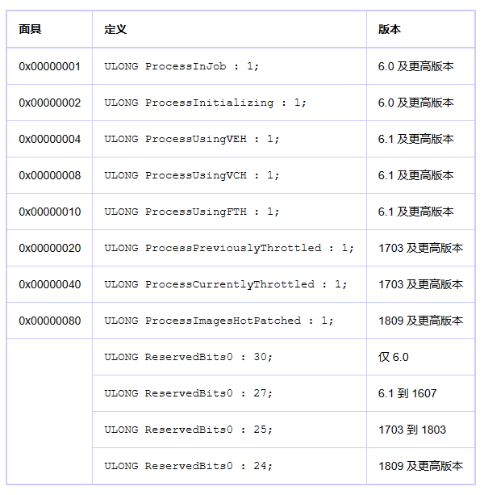

<!-- more -->

# windows

## 反调试

### PEB标志位检测

```bash
kd> dt _PEB
ntdll!_PEB
   +0x000 InheritedAddressSpace : UChar
   +0x001 ReadImageFileExecOptions : UChar
   +0x002 BeingDebugged    : UChar
   +0x003 BitField         : UChar
   +0x003 ImageUsesLargePages : Pos 0, 1 Bit
   +0x003 IsProtectedProcess : Pos 1, 1 Bit
   +0x003 IsLegacyProcess  : Pos 2, 1 Bit
   +0x003 IsImageDynamicallyRelocated : Pos 3, 1 Bit
   +0x003 SkipPatchingUser32Forwarders : Pos 4, 1 Bit
   +0x003 SpareBits        : Pos 5, 3 Bits
   +0x004 Mutant           : Ptr32 Void
   +0x008 ImageBaseAddress : Ptr32 Void
   +0x00c Ldr              : Ptr32 _PEB_LDR_DATA
   +0x010 ProcessParameters : Ptr32 _RTL_USER_PROCESS_PARAMETERS
   +0x014 SubSystemData    : Ptr32 Void
   +0x018 ProcessHeap      : Ptr32 Void
   +0x01c FastPebLock      : Ptr32 _RTL_CRITICAL_SECTION
   +0x020 AtlThunkSListPtr : Ptr32 Void
   +0x024 IFEOKey          : Ptr32 Void
   +0x028 CrossProcessFlags : Uint4B
   +0x028 ProcessInJob     : Pos 0, 1 Bit
   +0x028 ProcessInitializing : Pos 1, 1 Bit
   +0x028 ProcessUsingVEH  : Pos 2, 1 Bit
   +0x028 ProcessUsingVCH  : Pos 3, 1 Bit
   +0x028 ProcessUsingFTH  : Pos 4, 1 Bit
   +0x028 ReservedBits0    : Pos 5, 27 Bits
   +0x02c KernelCallbackTable : Ptr32 Void
   +0x02c UserSharedInfoPtr : Ptr32 Void
   +0x030 SystemReserved   : [1] Uint4B
   +0x034 AtlThunkSListPtr32 : Uint4B
   +0x038 ApiSetMap        : Ptr32 Void
   +0x03c TlsExpansionCounter : Uint4B
   +0x040 TlsBitmap        : Ptr32 Void
   +0x044 TlsBitmapBits    : [2] Uint4B
   +0x04c ReadOnlySharedMemoryBase : Ptr32 Void
   +0x050 HotpatchInformation : Ptr32 Void
   +0x054 ReadOnlyStaticServerData : Ptr32 Ptr32 Void
   +0x058 AnsiCodePageData : Ptr32 Void
   +0x05c OemCodePageData  : Ptr32 Void
   +0x060 UnicodeCaseTableData : Ptr32 Void
   +0x064 NumberOfProcessors : Uint4B
   +0x068 NtGlobalFlag     : Uint4B
   +0x070 CriticalSectionTimeout : _LARGE_INTEGER
   +0x078 HeapSegmentReserve : Uint4B
   +0x07c HeapSegmentCommit : Uint4B
   +0x080 HeapDeCommitTotalFreeThreshold : Uint4B
   +0x084 HeapDeCommitFreeBlockThreshold : Uint4B
   +0x088 NumberOfHeaps    : Uint4B
   +0x08c MaximumNumberOfHeaps : Uint4B
   +0x090 ProcessHeaps     : Ptr32 Ptr32 Void
   +0x094 GdiSharedHandleTable : Ptr32 Void
   +0x098 ProcessStarterHelper : Ptr32 Void
   +0x09c GdiDCAttributeList : Uint4B
   +0x0a0 LoaderLock       : Ptr32 _RTL_CRITICAL_SECTION
   +0x0a4 OSMajorVersion   : Uint4B
   +0x0a8 OSMinorVersion   : Uint4B
   +0x0ac OSBuildNumber    : Uint2B
   +0x0ae OSCSDVersion     : Uint2B
   +0x0b0 OSPlatformId     : Uint4B
   +0x0b4 ImageSubsystem   : Uint4B
   +0x0b8 ImageSubsystemMajorVersion : Uint4B
   +0x0bc ImageSubsystemMinorVersion : Uint4B
   +0x0c0 ActiveProcessAffinityMask : Uint4B
   +0x0c4 GdiHandleBuffer  : [34] Uint4B
   +0x14c PostProcessInitRoutine : Ptr32     void 
   +0x150 TlsExpansionBitmap : Ptr32 Void
   +0x154 TlsExpansionBitmapBits : [32] Uint4B
   +0x1d4 SessionId        : Uint4B
   +0x1d8 AppCompatFlags   : _ULARGE_INTEGER
   +0x1e0 AppCompatFlagsUser : _ULARGE_INTEGER
   +0x1e8 pShimData        : Ptr32 Void
   +0x1ec AppCompatInfo    : Ptr32 Void
   +0x1f0 CSDVersion       : _UNICODE_STRING
   +0x1f8 ActivationContextData : Ptr32 _ACTIVATION_CONTEXT_DATA
   +0x1fc ProcessAssemblyStorageMap : Ptr32 _ASSEMBLY_STORAGE_MAP
   +0x200 SystemDefaultActivationContextData : Ptr32 _ACTIVATION_CONTEXT_DATA
   +0x204 SystemAssemblyStorageMap : Ptr32 _ASSEMBLY_STORAGE_MAP
   +0x208 MinimumStackCommit : Uint4B
   +0x20c FlsCallback      : Ptr32 _FLS_CALLBACK_INFO
   +0x210 FlsListHead      : _LIST_ENTRY
   +0x218 FlsBitmap        : Ptr32 Void
   +0x21c FlsBitmapBits    : [4] Uint4B
   +0x22c FlsHighIndex     : Uint4B
   +0x230 WerRegistrationData : Ptr32 Void
   +0x234 WerShipAssertPtr : Ptr32 Void
   +0x238 pContextData     : Ptr32 Void
   +0x23c pImageHeaderHash : Ptr32 Void
   +0x240 TracingFlags     : Uint4B
   +0x240 HeapTracingEnabled : Pos 0, 1 Bit
   +0x240 CritSecTracingEnabled : Pos 1, 1 Bit
   +0x240 SpareTracingBits : Pos 2, 30 Bits
```

#### BeingDebugged

可以使用IsDebuggerPresent()也可以直接检查peb->BeingDebugged

#### NtGlobalFlag

peb->NtGlobalFlag（x86为 `+0x068`, x64为 `+0x0BC`）

在启动时，NtGlobalFlag全局系统变量将使用系统注册表项中的值进行初始化：`[HKEY_LOCAL_MACHINE\SYSTEM\CurrentControlSet\Control\Session Manager\GlobalFlag]`

FLG_HEAP_ENABLE_TAIL_CHECK(0x10)
FLG_HEAP_ENABLE_FREE_CHECK(0x20)
FLG_HEAP_VALIDATE_PARAMETERS(0x40)

当进程由调试器启动时，Windows 内存管理器会默认启用一些特殊的堆（Heap）调试选项，以便帮助开发者发现内存泄漏或越界。这些选项包括“堆尾检查”、“堆释放检查”等，通常被调试时，该值为 0x70，即 `FLG_HEAP_ENABLE_TAIL_CHECK | FLG_HEAP_ENABLE_FREE_CHECK | FLG_HEAP_VALIDATE_PARAMETERS`。

#### Heap Flags & ForceFlags

通过 PEB 找到 `ProcessHeap` 指针，进而访问堆结构 。

* ProcessHeap->Flags：在正常进程中，堆应该包含 `HEAP_GROWABLE` (0x00000002) 标志。如果被调试，这个标志可能会丢失或被修改 。
* ProcessHeap->ForceFlags：用于强制某些堆行为。正常情况下通常为 0，但如果被调试，它会包含非零值（依赖于操作系统版本，如 XP 下是特定值）。

堆尾部填充 (Heap Tail)检查

* 字段/特征: 检查堆块分配后的尾部填充字节。
* 检测逻辑 : 调试堆通常会使用特定的填充模式：
* `0xABABABAB`: 表示启用了 `HEAP_TAIL_CHECKING_ENABLED`。
* `0xFEEEFEEE`: 表示启用了 `HEAP_FREE_CHECKING_ENABLED`（释放后填充）

#### CrossProcessFlags

第四位为ProcessUsingVEH，可用来检测是否使用了VEH



### 内核中的进程信息检测

```bash
2: kd> dt _EPROCESS
ntdll!_EPROCESS
  +0x000 Pcb              : _KPROCESS		// 子结构体
  +0x0b0 ProcessLock      : _EX_PUSH_LOCK
  +0x0b4 UniqueProcessId  : Ptr32 Void		// 进程的编号（任务管理器中的PID）
  +0x0b8 ActiveProcessLinks : _LIST_ENTRY			// 双向链表，所有的活动进程都链接在一起，构成了一个链表
  +0x0c0 RundownProtect   : _EX_RUNDOWN_REF
  +0x0c4 VdmObjects       : Ptr32 Void
  +0x0c8 Flags2           : Uint4B
  +0x0c8 JobNotReallyActive : Pos 0, 1 Bit
  +0x0c8 AccountingFolded : Pos 1, 1 Bit
  +0x0c8 NewProcessReported : Pos 2, 1 Bit
  +0x0c8 ExitProcessReported : Pos 3, 1 Bit
  +0x0c8 ReportCommitChanges : Pos 4, 1 Bit
  +0x0c8 LastReportMemory : Pos 5, 1 Bit
  +0x0c8 ForceWakeCharge  : Pos 6, 1 Bit
  +0x0c8 CrossSessionCreate : Pos 7, 1 Bit
  +0x0c8 NeedsHandleRundown : Pos 8, 1 Bit
  +0x0c8 RefTraceEnabled  : Pos 9, 1 Bit
  +0x0c8 PicoCreated      : Pos 10, 1 Bit
  +0x0c8 EmptyJobEvaluated : Pos 11, 1 Bit
  +0x0c8 DefaultPagePriority : Pos 12, 3 Bits
  +0x0c8 PrimaryTokenFrozen : Pos 15, 1 Bit
  +0x0c8 ProcessVerifierTarget : Pos 16, 1 Bit
  +0x0c8 RestrictSetThreadContext : Pos 17, 1 Bit
  +0x0c8 AffinityPermanent : Pos 18, 1 Bit
  +0x0c8 AffinityUpdateEnable : Pos 19, 1 Bit
  +0x0c8 PropagateNode    : Pos 20, 1 Bit
  +0x0c8 ExplicitAffinity : Pos 21, 1 Bit
  +0x0c8 ProcessExecutionState : Pos 22, 2 Bits
  +0x0c8 EnableReadVmLogging : Pos 24, 1 Bit
  +0x0c8 EnableWriteVmLogging : Pos 25, 1 Bit
  +0x0c8 FatalAccessTerminationRequested : Pos 26, 1 Bit
  +0x0c8 DisableSystemAllowedCpuSet : Pos 27, 1 Bit
  +0x0c8 ProcessStateChangeRequest : Pos 28, 2 Bits
  +0x0c8 ProcessStateChangeInProgress : Pos 30, 1 Bit
  +0x0c8 InPrivate        : Pos 31, 1 Bit
  +0x0cc Flags            : Uint4B
  +0x0cc CreateReported   : Pos 0, 1 Bit
  +0x0cc NoDebugInherit   : Pos 1, 1 Bit
  +0x0cc ProcessExiting   : Pos 2, 1 Bit
  +0x0cc ProcessDelete    : Pos 3, 1 Bit
  +0x0cc ManageExecutableMemoryWrites : Pos 4, 1 Bit
  +0x0cc VmDeleted        : Pos 5, 1 Bit
  +0x0cc OutswapEnabled   : Pos 6, 1 Bit
  +0x0cc Outswapped       : Pos 7, 1 Bit
  +0x0cc FailFastOnCommitFail : Pos 8, 1 Bit
  +0x0cc Wow64VaSpace4Gb  : Pos 9, 1 Bit
  +0x0cc AddressSpaceInitialized : Pos 10, 2 Bits
  +0x0cc SetTimerResolution : Pos 12, 1 Bit
  +0x0cc BreakOnTermination : Pos 13, 1 Bit
  +0x0cc DeprioritizeViews : Pos 14, 1 Bit
  +0x0cc WriteWatch       : Pos 15, 1 Bit
  +0x0cc ProcessInSession : Pos 16, 1 Bit
  +0x0cc OverrideAddressSpace : Pos 17, 1 Bit
  +0x0cc HasAddressSpace  : Pos 18, 1 Bit
  +0x0cc LaunchPrefetched : Pos 19, 1 Bit
  +0x0cc Background       : Pos 20, 1 Bit
  +0x0cc VmTopDown        : Pos 21, 1 Bit
  +0x0cc ImageNotifyDone  : Pos 22, 1 Bit
  +0x0cc PdeUpdateNeeded  : Pos 23, 1 Bit
  +0x0cc VdmAllowed       : Pos 24, 1 Bit
  +0x0cc ProcessRundown   : Pos 25, 1 Bit
  +0x0cc ProcessInserted  : Pos 26, 1 Bit
  +0x0cc DefaultIoPriority : Pos 27, 3 Bits
  +0x0cc ProcessSelfDelete : Pos 30, 1 Bit
  +0x0cc SetTimerResolutionLink : Pos 31, 1 Bit
  +0x0d0 CreateTime       : _LARGE_INTEGER		// 进程的创建时间
  +0x0d8 ProcessQuotaUsage : [2] Uint4B				// 物理页相关的统计信息
  +0x0e0 ProcessQuotaPeak : [2] Uint4B					// 物理页相关的统计信息
  +0x0e8 PeakVirtualSize  : Uint4B							// 虚拟内存的相关统计信息
  +0x0ec VirtualSize      : Uint4B								// 虚拟内存的相关统计信息
  +0x0f0 SessionProcessLinks : _LIST_ENTRY
  +0x0f8 ExceptionPortData : Ptr32 Void					// 调试相关
  +0x0f8 ExceptionPortValue : Uint4B
  +0x0f8 ExceptionPortState : Pos 0, 3 Bits
  +0x0fc Token            : _EX_FAST_REF
  +0x100 MmReserved       : Uint4B
  +0x104 AddressCreationLock : _EX_PUSH_LOCK
  +0x108 PageTableCommitmentLock : _EX_PUSH_LOCK
  +0x10c RotateInProgress : Ptr32 _ETHREAD
  +0x110 ForkInProgress   : Ptr32 _ETHREAD
  +0x114 CommitChargeJob  : Ptr32 _EJOB
  +0x118 CloneRoot        : _RTL_AVL_TREE
  +0x11c NumberOfPrivatePages : Uint4B
  +0x120 NumberOfLockedPages : Uint4B
  +0x124 Win32Process     : Ptr32 Void
  +0x128 Job              : Ptr32 _EJOB
  +0x12c SectionObject    : Ptr32 Void
  +0x130 SectionBaseAddress : Ptr32 Void
  +0x134 Cookie           : Uint4B
  +0x138 WorkingSetWatch  : Ptr32 _PAGEFAULT_HISTORY
  +0x13c Win32WindowStation : Ptr32 Void
  +0x140 InheritedFromUniqueProcessId : Ptr32 Void
  +0x144 LdtInformation   : Ptr32 Void
  +0x148 OwnerProcessId   : Uint4B
  +0x14c Peb              : Ptr32 _PEB				// 进程环境块（进程在3环的一个结构体，里面包含了一些进程的相关信息）
  +0x150 Session          : Ptr32 _MM_SESSION_SPACE
  +0x154 Spare1           : Ptr32 Void
  +0x158 QuotaBlock       : Ptr32 _EPROCESS_QUOTA_BLOCK
  +0x15c ObjectTable      : Ptr32 _HANDLE_TABLE		// 句柄表
  +0x160 DebugPort        : Ptr32 Void						// 调试相关
  +0x164 PaeTop           : Ptr32 Void
  +0x168 DeviceMap        : Ptr32 Void
  +0x16c EtwDataSource    : Ptr32 Void
  +0x170 PageDirectoryPte : Uint8B
  +0x178 ImageFilePointer : Ptr32 _FILE_OBJECT
  +0x17c ImageFileName    : [15] UChar			// 进程镜像文件名
  +0x18b PriorityClass    : UChar
  +0x18c SecurityPort     : Ptr32 Void
  +0x190 SeAuditProcessCreationInfo : _SE_AUDIT_PROCESS_CREATION_INFO
  +0x194 JobLinks         : _LIST_ENTRY
  +0x19c HighestUserAddress : Ptr32 Void
  +0x1a0 ThreadListHead   : _LIST_ENTRY
  +0x1a8 ActiveThreads    : Uint4B				// 活动线程的数量
  +0x1ac ImagePathHash    : Uint4B
  +0x1b0 DefaultHardErrorProcessing : Uint4B
  +0x1b4 LastThreadExitStatus : Int4B
  +0x1b8 PrefetchTrace    : _EX_FAST_REF
  +0x1bc LockedPagesList  : Ptr32 Void
  +0x1c0 ReadOperationCount : _LARGE_INTEGER
  +0x1c8 WriteOperationCount : _LARGE_INTEGER
  +0x1d0 OtherOperationCount : _LARGE_INTEGER
  +0x1d8 ReadTransferCount : _LARGE_INTEGER
  +0x1e0 WriteTransferCount : _LARGE_INTEGER
  +0x1e8 OtherTransferCount : _LARGE_INTEGER
  +0x1f0 CommitChargeLimit : Uint4B
  +0x1f4 CommitCharge     : Uint4B						// 虚拟内存的相关统计信息
  +0x1f8 CommitChargePeak : Uint4B
  +0x200 Vm               : _MMSUPPORT_FULL
  +0x300 MmProcessLinks   : _LIST_ENTRY
  +0x308 ModifiedPageCount : Uint4B
  +0x30c ExitStatus       : Int4B
  +0x310 VadRoot          : _RTL_AVL_TREE			// 标识哪些0-2地址没占用了
  +0x314 VadHint          : Ptr32 Void
  +0x318 VadCount         : Uint4B
  +0x31c VadPhysicalPages : Uint4B
  +0x320 VadPhysicalPagesLimit : Uint4B
  +0x324 AlpcContext      : _ALPC_PROCESS_CONTEXT
  +0x334 TimerResolutionLink : _LIST_ENTRY
  +0x33c TimerResolutionStackRecord : Ptr32 _PO_DIAG_STACK_RECORD
  +0x340 RequestedTimerResolution : Uint4B
  +0x344 SmallestTimerResolution : Uint4B
  +0x348 ExitTime         : _LARGE_INTEGER			// 进程的退出时间
  +0x350 ActiveThreadsHighWatermark : Uint4B
  +0x354 LargePrivateVadCount : Uint4B
  +0x358 ThreadListLock   : _EX_PUSH_LOCK
  +0x35c WnfContext       : Ptr32 Void
  +0x360 ServerSilo       : Ptr32 _EJOB
  +0x364 SignatureLevel   : UChar
  +0x365 SectionSignatureLevel : UChar
  +0x366 Protection       : _PS_PROTECTION
  +0x367 HangCount        : Pos 0, 3 Bits
  +0x367 GhostCount       : Pos 3, 3 Bits
  +0x367 PrefilterException : Pos 6, 1 Bit
  +0x368 Flags3           : Uint4B
  +0x368 Minimal          : Pos 0, 1 Bit
  +0x368 ReplacingPageRoot : Pos 1, 1 Bit
  +0x368 Crashed          : Pos 2, 1 Bit
  +0x368 JobVadsAreTracked : Pos 3, 1 Bit
  +0x368 VadTrackingDisabled : Pos 4, 1 Bit
  +0x368 AuxiliaryProcess : Pos 5, 1 Bit
  +0x368 SubsystemProcess : Pos 6, 1 Bit
  +0x368 IndirectCpuSets  : Pos 7, 1 Bit
  +0x368 RelinquishedCommit : Pos 8, 1 Bit
  +0x368 HighGraphicsPriority : Pos 9, 1 Bit
  +0x368 CommitFailLogged : Pos 10, 1 Bit
  +0x368 ReserveFailLogged : Pos 11, 1 Bit
  +0x368 SystemProcess    : Pos 12, 1 Bit
  +0x368 HideImageBaseAddresses : Pos 13, 1 Bit
  +0x368 AddressPolicyFrozen : Pos 14, 1 Bit
  +0x368 ProcessFirstResume : Pos 15, 1 Bit
  +0x368 ForegroundExternal : Pos 16, 1 Bit
  +0x368 ForegroundSystem : Pos 17, 1 Bit
  +0x368 HighMemoryPriority : Pos 18, 1 Bit
  +0x368 EnableProcessSuspendResumeLogging : Pos 19, 1 Bit
  +0x368 EnableThreadSuspendResumeLogging : Pos 20, 1 Bit
  +0x368 SecurityDomainChanged : Pos 21, 1 Bit
  +0x368 SecurityFreezeComplete : Pos 22, 1 Bit
  +0x368 VmProcessorHost  : Pos 23, 1 Bit
  +0x36c DeviceAsid       : Int4B
  +0x370 SvmData          : Ptr32 Void
  +0x374 SvmProcessLock   : _EX_PUSH_LOCK
  +0x378 SvmLock          : Uint4B
  +0x37c SvmProcessDeviceListHead : _LIST_ENTRY
  +0x388 LastFreezeInterruptTime : Uint8B
  +0x390 DiskCounters     : Ptr32 _PROCESS_DISK_COUNTERS
  +0x394 PicoContext      : Ptr32 Void
  +0x398 HighPriorityFaultsAllowed : Uint4B
  +0x39c InstrumentationCallback : Ptr32 Void
  +0x3a0 EnergyContext    : Ptr32 _PO_PROCESS_ENERGY_CONTEXT
  +0x3a4 VmContext        : Ptr32 Void
  +0x3a8 SequenceNumber   : Uint8B
  +0x3b0 CreateInterruptTime : Uint8B
  +0x3b8 CreateUnbiasedInterruptTime : Uint8B
  +0x3c0 TotalUnbiasedFrozenTime : Uint8B
  +0x3c8 LastAppStateUpdateTime : Uint8B
  +0x3d0 LastAppStateUptime : Pos 0, 61 Bits
  +0x3d0 LastAppState     : Pos 61, 3 Bits
  +0x3d8 SharedCommitCharge : Uint4B
  +0x3dc SharedCommitLock : _EX_PUSH_LOCK
  +0x3e0 SharedCommitLinks : _LIST_ENTRY
  +0x3e8 AllowedCpuSets   : Uint4B
  +0x3ec DefaultCpuSets   : Uint4B
  +0x3e8 AllowedCpuSetsIndirect : Ptr32 Uint4B
  +0x3ec DefaultCpuSetsIndirect : Ptr32 Uint4B
  +0x3f0 DiskIoAttribution : Ptr32 Void
  +0x3f4 DxgProcess       : Ptr32 Void
  +0x3f8 Win32KFilterSet  : Uint4B
  +0x400 ProcessTimerDelay : _PS_INTERLOCKED_TIMER_DELAY_VALUES
  +0x408 KTimerSets       : Uint4B
  +0x40c KTimer2Sets      : Uint4B
  +0x410 ThreadTimerSets  : Uint4B
  +0x414 VirtualTimerListLock : Uint4B
  +0x418 VirtualTimerListHead : _LIST_ENTRY
  +0x420 WakeChannel      : _WNF_STATE_NAME
  +0x420 WakeInfo         : _PS_PROCESS_WAKE_INFORMATION
  +0x450 MitigationFlags  : Uint4B
  +0x450 MitigationFlagsValues : <anonymous-tag>
  +0x454 MitigationFlags2 : Uint4B
  +0x454 MitigationFlags2Values : <anonymous-tag>
  +0x458 PartitionObject  : Ptr32 Void
  +0x460 SecurityDomain   : Uint8B
  +0x468 ParentSecurityDomain : Uint8B
  +0x470 CoverageSamplerContext : Ptr32 Void
  +0x474 MmHotPatchContext : Ptr32 Void
  

```

#### CheckRemoteDebuggerPresent

```
BOOL CheckRemoteDebuggerPresent(
  [in]      HANDLE hProcess,
  [in, out] PBOOL  pbDebuggerPresent
);
```

底层为调用NtQueryInformationProcess(ProcessDebugPort)

#### NtQueryInformationProcess

```
__kernel_entry NTSTATUS NtQueryInformationProcess(
  [in]            HANDLE           ProcessHandle,
  [in]            PROCESSINFOCLASS ProcessInformationClass,
  [out]           PVOID            ProcessInformation,
  [in]            ULONG            ProcessInformationLength,
  [out, optional] PULONG           ReturnLength
);
```

##### ProcessDebugPort (0x07)

EPROCESS->DebugPort:当调试器附加到进程时，系统会将调试器的端口对象地址填入被调试进程 `EPROCESS` 结构体的 `DebugPort` 字段中，如果返回的 `ProcessInformation`（即端口号）不为 0，程序就判定自己被调试了 。

##### ProcessDebugObjectHandle (0x1E)

同样是检查 `EPROCESS->DebugPort`，调试器会为被调试的进程创建一个调试对象，该参数能获取调试对象的句柄,不为0则为调试。

##### ProcessDebugFlags (0x1F)

EPROCESS->FLAGS（NoDebugInherit比特位）`NoDebugInherit` 标志位用于指示子进程是否应该继承父进程的调试状态。

NtQueryInformationProcess函数的返回值为0，则正在调试进程。

#### NtQuerySystemInformation

```
__kernel_entry NTSTATUS NtQuerySystemInformation(
  [in]            SYSTEM_INFORMATION_CLASS SystemInformationClass,
  [in, out]       PVOID                    SystemInformation,
  [in]            ULONG                    SystemInformationLength,
  [out, optional] PULONG                   ReturnLength
);
```

读取内核变量 `KdDebuggerEnabled` 和 `KdPitchDebugger`，调试状态下 `SYSTEM_KERNEL_DEBUGGER_INFORMATION.DebuggerEnabled`值和 `KernelDebuggerNotPresent`值为1。这些内核变量的值会被映射到用户层可读的共享页面 KUSER_SHARED_DATA中，因此也可以读取该结构体

##### 内核KUSER_SHARED_DATA 结构体

```bash
dt _KUSER_SHARED_DATA     // win11前
nt!_KUSER_SHARED_DATA
   +0x000 TickCountLowDeprecated : Uint4B
   +0x004 TickCountMultiplier : Uint4B
   +0x008 InterruptTime    : _KSYSTEM_TIME
   +0x014 SystemTime       : _KSYSTEM_TIME
   +0x020 TimeZoneBias     : _KSYSTEM_TIME
   +0x02c ImageNumberLow   : Uint2B
   +0x02e ImageNumberHigh  : Uint2B
   +0x030 NtSystemRoot     : [260] Wchar
   +0x238 MaxStackTraceDepth : Uint4B
   +0x23c CryptoExponent   : Uint4B
   +0x240 TimeZoneId       : Uint4B
   +0x244 LargePageMinimum : Uint4B
   +0x248 AitSamplingValue : Uint4B
   +0x24c AppCompatFlag    : Uint4B
   +0x250 RNGSeedVersion   : Uint8B
   +0x258 GlobalValidationRunlevel : Uint4B
   +0x25c TimeZoneBiasStamp : Int4B
   +0x260 NtBuildNumber    : Uint4B
   +0x264 NtProductType    : _NT_PRODUCT_TYPE
   +0x268 ProductTypeIsValid : UChar
   +0x269 Reserved0        : [1] UChar
   +0x26a NativeProcessorArchitecture : Uint2B
   +0x26c NtMajorVersion   : Uint4B
   +0x270 NtMinorVersion   : Uint4B
   +0x274 ProcessorFeatures : [64] UChar
   +0x2b4 Reserved1        : Uint4B
   +0x2b8 Reserved3        : Uint4B
   +0x2bc TimeSlip         : Uint4B
   +0x2c0 AlternativeArchitecture : _ALTERNATIVE_ARCHITECTURE_TYPE
   +0x2c4 BootId           : Uint4B
   +0x2c8 SystemExpirationDate : _LARGE_INTEGER
   +0x2d0 SuiteMask        : Uint4B
   +0x2d4 KdDebuggerEnabled : UChar                            // <<<<<<<<<  划重点 
   +0x2d5 MitigationPolicies : UChar
   +0x2d5 NXSupportPolicy  : Pos 0, 2 Bits
   +0x2d5 SEHValidationPolicy : Pos 2, 2 Bits
   +0x2d5 CurDirDevicesSkippedForDlls : Pos 4, 2 Bits
   +0x2d5 Reserved         : Pos 6, 2 Bits
   +0x2d6 Reserved6        : [2] UChar
   +0x2d8 ActiveConsoleId  : Uint4B
   +0x2dc DismountCount    : Uint4B
   +0x2e0 ComPlusPackage   : Uint4B
   +0x2e4 LastSystemRITEventTickCount : Uint4B
   +0x2e8 NumberOfPhysicalPages : Uint4B
   +0x2ec SafeBootMode     : UChar
   +0x2ed VirtualizationFlags : UChar
   +0x2ee Reserved12       : [2] UChar
   +0x2f0 SharedDataFlags  : Uint4B
   +0x2f0 DbgErrorPortPresent : Pos 0, 1 Bit
   +0x2f0 DbgElevationEnabled : Pos 1, 1 Bit
   +0x2f0 DbgVirtEnabled   : Pos 2, 1 Bit
   +0x2f0 DbgInstallerDetectEnabled : Pos 3, 1 Bit
   +0x2f0 DbgLkgEnabled    : Pos 4, 1 Bit
   +0x2f0 DbgDynProcessorEnabled : Pos 5, 1 Bit
   +0x2f0 DbgConsoleBrokerEnabled : Pos 6, 1 Bit
   +0x2f0 DbgSecureBootEnabled : Pos 7, 1 Bit
   +0x2f0 DbgMultiSessionSku : Pos 8, 1 Bit
   +0x2f0 DbgMultiUsersInSessionSku : Pos 9, 1 Bit
   +0x2f0 DbgStateSeparationEnabled : Pos 10, 1 Bit
   +0x2f0 SpareBits        : Pos 11, 21 Bits
   +0x2f4 DataFlagsPad     : [1] Uint4B
   +0x2f8 TestRetInstruction : Uint8B
   +0x300 QpcFrequency     : Int8B
   +0x308 SystemCall       : Uint4B
   +0x30c SystemCallPad0   : Uint4B
   +0x310 SystemCallPad    : [2] Uint8B
   +0x320 TickCount        : _KSYSTEM_TIME
   +0x320 TickCountQuad    : Uint8B
   +0x320 ReservedTickCountOverlay : [3] Uint4B
   +0x32c TickCountPad     : [1] Uint4B
   +0x330 Cookie           : Uint4B
   +0x334 CookiePad        : [1] Uint4B
   +0x338 ConsoleSessionForegroundProcessId : Int8B
   +0x340 TimeUpdateLock   : Uint8B
   +0x348 BaselineSystemTimeQpc : Uint8B
   +0x350 BaselineInterruptTimeQpc : Uint8B
   +0x358 QpcSystemTimeIncrement : Uint8B
   +0x360 QpcInterruptTimeIncrement : Uint8B
   +0x368 QpcSystemTimeIncrementShift : UChar
   +0x369 QpcInterruptTimeIncrementShift : UChar
   +0x36a UnparkedProcessorCount : Uint2B
   +0x36c EnclaveFeatureMask : [4] Uint4B
   +0x37c TelemetryCoverageRound : Uint4B
   +0x380 UserModeGlobalLogger : [16] Uint2B
   +0x3a0 ImageFileExecutionOptions : Uint4B
   +0x3a4 LangGenerationCount : Uint4B
   +0x3a8 Reserved4        : Uint8B
   +0x3b0 InterruptTimeBias : Uint8B
   +0x3b8 QpcBias          : Uint8B
   +0x3c0 ActiveProcessorCount : Uint4B
   +0x3c4 ActiveGroupCount : UChar
   +0x3c5 Reserved9        : UChar
   +0x3c6 QpcData          : Uint2B
   +0x3c6 QpcBypassEnabled : UChar
   +0x3c7 QpcShift         : UChar
   +0x3c8 TimeZoneBiasEffectiveStart : _LARGE_INTEGER
   +0x3d0 TimeZoneBiasEffectiveEnd : _LARGE_INTEGER
   +0x3d8 XState           : _XSTATE_CONFIGURATION
```

KUSER_SHARED_DATA->KdDebuggerEnabled

检查第 0 位（0x1）：如果为 1，表示内核调试器已启用；检查第1位(0x2)：如果为 0，表示调试器存在。

#### NtQueryObject

```
__kernel_entry NTSYSCALLAPI NTSTATUS NtQueryObject(
  [in, optional]  HANDLE                   Handle,
  [in]            OBJECT_INFORMATION_CLASS ObjectInformationClass,
  [out, optional] PVOID                    ObjectInformation,
  [in]            ULONG                    ObjectInformationLength,
  [out, optional] PULONG                   ReturnLength
);
```

##### ObjectAllTypesInformation

Windows 内核中每种对象（如文件、互斥体、调试对象）都有一个 `OBJECT_TYPE` 结构来描述。

```c
typedef struct _OBJECT_TYPE_INFORMATION
{
    UNICODE_STRING TypeName;
    ULONG TotalNumberOfObjects;
    ULONG TotalNumberOfHandles;
    ULONG TotalPagedPoolUsage;
    ULONG TotalNonPagedPoolUsage;
    ULONG TotalNamePoolUsage;
    ULONG TotalHandleTableUsage;
    ULONG HighWaterNumberOfObjects;
    ULONG HighWaterNumberOfHandles;
    ULONG HighWaterPagedPoolUsage;
    ULONG HighWaterNonPagedPoolUsage;
    ULONG HighWaterNamePoolUsage;
    ULONG HighWaterHandleTableUsage;
    ULONG InvalidAttributes;
    GENERIC_MAPPING GenericMapping;
    ULONG ValidAccessMask;
    BOOLEAN SecurityRequired;
    BOOLEAN MaintainHandleCount;
    UCHAR TypeIndex; // since WINBLUE
    CHAR ReservedByte;
    ULONG PoolType;
    ULONG DefaultPagedPoolCharge;
    ULONG DefaultNonPagedPoolCharge;
} OBJECT_TYPE_INFORMATION, *POBJECT_TYPE_INFORMATION;
```

* API 逻辑 : 遍历所有对象类型，找到名称为 "DebugObject" 的类型结构。
* 判断依据 : 读取该类型结构下的 `TotalNumberOfObjects` 字段。
* 核心逻辑 : 只要有调试器在工作，它就必须创建一个DebugObject类型的内核对象。如果检测到该对象的数量 > 0（或者大于你程序自己创建的数量），就说明系统中存在调试器。

##### ObjectTypeInformation

NtCreateDebugObject创建一个调试对象句柄，然后再查询该调试对象类型的对象总数，>1则说明有调试

### 线程上下文检测

#### NtQueryInformationThread或者GetThreadContext

检查 ETHREAD ->KTHREAD -> TrapFrame的Dr0~Dr7寄存器来判断硬件断点

```
__kernel_entry NTSTATUS NtQueryInformationThread(
  [in]            HANDLE          ThreadHandle,
  [in]            THREADINFOCLASS ThreadInformationClass,
  [in, out]       PVOID           ThreadInformation,
  [in]            ULONG           ThreadInformationLength,
  [out, optional] PULONG          ReturnLength
);
```

#### NtSetInformationThread

```
NTSYSAPI NTSTATUS ZwSetInformationThread(
  [in] HANDLE          ThreadHandle,
  [in] THREADINFOCLASS ThreadInformationClass,
  [in] PVOID           ThreadInformation,
  [in] ULONG           ThreadInformationLength
);
```

当调用 `NtSetInformationThread` 并传入 `ThreadHideFromDebugger` 时，内核将当前线程 `ETHREAD` 结构中的 `HideFromDebugger` (位于 `ETHREAD->ThreadFlags` 或 `CrossThreadFlags` 位域中)标志位置为 1。一旦置位，当该线程触发异常（如断点）时，内核会忽略调试器，直接将异常派发给进程自身处理。如果进程处理不了，程序就会崩溃（从而达到反调试目的）。

### 异常捕获

利用“调试器会优先接管异常”的机制。如果程序自己制造一个异常，且成功捕获了它，说明没有调试器（或者调试器把异常透传了）；如果程序没捕获到或者行为异常，说明有调试器干扰。

#### CloseHandle等

传入一个无效的句柄

* **有调试器** : 会触发 `0xC0000008` (Invalid Handle) 异常，调试器通常会暂停。
* **无调试器** : 函数返回 `FALSE`，或者通过 `__except` 捕获异常继续运行。

其他函数诸如NtGetContextThread、NtQueryInformationProcess、CloseWindow等

```c
#include <iostream>
#include<Windows.h>
int main()
{
    __try {
        CloseHandle((HANDLE)672368);
        printf("ok");
    }
    __except(EXCEPTION_EXECUTE_HANDLER)
    {
        printf("debugger");
    }
    getchar();
}
```

利用 `SetHandleInformation`将互斥体句柄标记为“禁止关闭” (`HANDLE_FLAG_PROTECT_FROM_CLOSE`)，然后强行关闭它。

| 值                                    | 说明                                                                                                                                                |
| ------------------------------------- | --------------------------------------------------------------------------------------------------------------------------------------------------- |
| HANDLE_FLAG_PROTECT_FROM_CLOSE（0x2） | 如果设置了此标志，则调用[CloseHandle](https://learn.microsoft.com/zh-cn/windows/desktop/api/handleapi/nf-handleapi-closehandle) 函数不会关闭对象句柄。 |

```c
inline bool CheckCloseHandle2()
{
	auto hMutex = CreateMutexA(NULL, FALSE, "ntdil.dli");
	if (IS_VALID_HANDLE(hMutex))
	{
		if (SetHandleInformation(hMutex, HANDLE_FLAG_PROTECT_FROM_CLOSE, HANDLE_FLAG_PROTECT_FROM_CLOSE))
		{
			__try 
			{
				CloseHandle(hMutex);
			}
			__except (HANDLE_FLAG_PROTECT_FROM_CLOSE)
			{
				return true;
			}
		}
	}
	return false;
}
```

### 时间差检测

调试器的处理（中断、单步执行、异常处理）会消耗大量 CPU 周期。可以使用GetTickCount或者QueryPerformanceCounter、rdtsc指令

#### rdtsc

`rdtsc` 指令会将 CPU 上电以来的时钟周期数读取到寄存器（`EDX:EAX`）中。程序在执行一段指令前后分别调用两次 `rdtsc`，计算两次结果的差值

#### NtSetSystemInformation (Time Slip)

创建一个事件对象，如果系统中存在内核调试器且处于中断状态，系统时钟会“滑移”（停止走动）。该函数可以检测这种滑移并触发事件。如果 `WaitForSingleObject` 等到了信号，说明发生了时钟滑移，即存在调试行为。

```c
bool CheckSystemTime()
{
	auto bRet = false;
	BOOLEAN bAdjustPrivRet;
	auto ntStatus =RtlAdjustPrivilege(SE_SYSTEMTIME_PRIVILEGE, TRUE, FALSE, &bAdjustPrivRet);
	if (NT_SUCCESS(ntStatus))
	{
		auto hEvent = CreateEventA(NULL, FALSE, FALSE, NULL);
		if (IS_VALID_HANDLE(hEvent))
		{
			if (NT_SUCCESS(NtSetSystemInformation(SystemTimeSlipNotification, &hEvent, sizeof(hEvent))))
			{
				if (WaitForSingleObject(hEvent, 1) == WAIT_OBJECT_0) //如果为有信号,说明进程处于中断状态
					bRet = true;
			}
			CloseHandle(hEvent);
		}
	}
	return bRet;
}
```

### 环境与启动特征 (Environment & Boot)

#### 系统启动选项 (SystemStartOptions)

读取注册表 `HKLM\System\CurrentControlSet\Control\SystemStartOptions`。

检查字符串中是否包含 "DEBUG"。这通常意味着系统是以调试模式（如 `/DEBUG` 开关）启动的。

#### 窗口与进程扫描

使用 `FindWindow` 查找类名或标题为 "OllyDbg", "x64dbg" 的窗口。

扫描进程列表（`CreateToolhelp32Snapshot`）查找 `VMWareService.exe` 等虚拟机进程（虚拟机常用于逆向分析）

#### 驱动/设备对象扫描

尝试打开特定的驱动设备名，如 `\\.\Syser` (Syser Debugger), `\\.\SICE` (SoftICE), `\\.\NtICE` 等。如果能成功打开句柄，说明由于反调试驱动存在。

## 反沙箱
