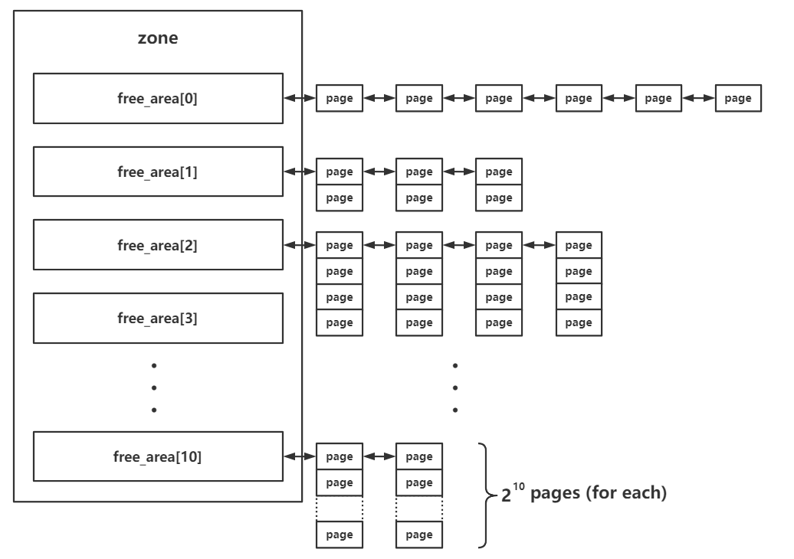
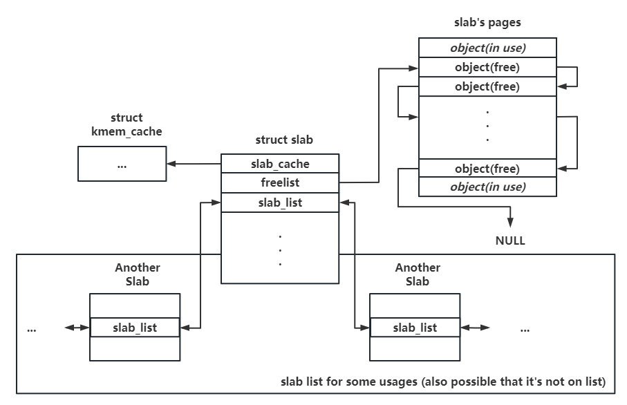
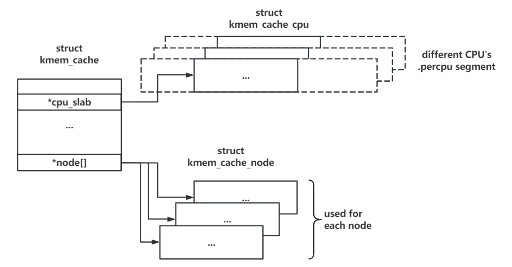

---
layout:post

title:"linux kernel学习（二）"

date:   2024-1-25

tags: [linux]

comments:true

author:Exploooosion
---
# linux kernel

## kernel pwn学习（二）

### 内核堆管理机制（参考：[Kernel 2 - 内核堆基础与 SLUB 分配器 (nebuu.la)](https://eastxuelian.nebuu.la/kernel/Kernel-How2Kernel-0x02-heap-basics)）

#### Buddy System

伙伴系统（`Buddy System`）：区级别的内存管理系统，以 **页** 为粒度进行内存分配，并管理所有物理内存。在内存的分配与释放方面，`Buddy System` 按照空闲页面的连续大小进行分阶管理，表现为zone结构体中的 `free_area`：



其中每块内存大小为 `2^order * page_size`

#### Slab allocator

`SLAB`分配器用于管理从 `Buddy System` 申请到的内存，分割成多个小的 `object` 返回给上层调用者。

##### slab 结构体

* 复用 `page` 结构体
* 作为单份 `Object` 池
* 其中关键成员包括：
  * `slab_cache`：`kmem_cache` 类型，指向对应的内存池
  * `slab_list`：多个相同用途的 `slab` 组成的双向链表
  * `freelist`：指向空闲对象的单向链表，以 `NULL` 结尾



##### kmem_cache 结构体

* 所有 `kmem_cache` 构成双向链表，且有一个全局数组 `kmalloc_caches` 存放通用 `kmem_cache`，大小为 `2`的幂次方，在分配时，其会选择一个大于其大小的 `2`的幂次方的值。（此外，为了减少内存碎片，还有一些特殊大小的 `slub`，例如 `96`字节和 `192`字节。）
* 其中关键成员包括：

  * `cpu_slab`：`struct kmem_cache_cpu __percpu *` 类型，指向当前 `CPU` 独占的内存池（同一个 `CPU` 访问自己的内存池不用上锁，优先从中分配、释放，效率高，通过 `gs`寄存器作为 `percpu`基址进行寻址，做题时先绑定 `CPU`）
  * `node`：`struct kmem_cache_node *[]` 类型，存放多个不同 `node` 的后备内存池

*

##### kmem_cache_cpu 结构体

* 对于一个 `kmem_cache`，每个 `CPU` 都有与其对应且独立的 `kmem_cache_cpu`
* 其中关键成员包括：
  * `freelist`：指向下一个可用对象（`object`）的指针，其 `freelist`与slab中的 `freelist`不同（仅当 `slab` 对象被挂在 `partial` 链表中时，其 `freelist` 才有可能被用到；分配和释放优先考虑 `kmem_cache_cpu`中的 `freelist`）
  * `slab`：指向当前用以进行内存分配的 `slab`
  * `partial`：需要开启编译选项 `CONFIG_SLUB_CPU_PARTIAL=y`，`percpu` 的 `partial slab` 链表，链表上为仍有一定空闲对象的 `slab`

##### kmem_cache_node 结构体

* 每个节点（即三级结构 `节点 -> 区 -> 页` 中的节点）对应的后备内存池，当 percpu 的独占内存池耗尽后便会从对应 node 的后备内存池尝试分配
* 不同于 `kmem_cache_cpu` 只有一个 `slab`，`kmem_cache_node` 会维护多个 `slab`，对 `kmem_cache_cpu` 的 `slab` 进行分配和回收
* 其中关键成员包括：
  * `partial`：同上，包含 `partial slab`
  * `full`：不常用，连接没有空闲对象的 `slab`

#### 分配过程

1. `slub allocator`从 `kmem_cache_cpu`上取 `object`，若 `kmem_cache_cpu`上存在，则直接返回；
2. 若不存在，该 `slub`会被加入到 `kmem_cache_node`中的 `full`链表，并从 `partial`链表中取一个 `slub`挂载到 `kmem_cache_cpu`上，然后重复第一步的操作
3. 若 `kmem_cache_cpu`的 `partial`链表也空了，那么会向 `buddy system`请求分配新的内存页，划分为多个 `object`，并给到 `kmem_cache_cpu`，取出 `object`并返回

#### 释放过程

关键于被释放的 `object`所属的slub位于哪里。

若其 `slub`现在位于 `kmem_cache_cpu`，则直接头插法插入当前 `kmem_cache_cpu`的 `freelist`链表。

若其 `slub`属于 `kmem_cache_node`的 `partial`链表上的 `slub`，则同样通过头插法插入对应的 `slub`中的 `freelist`。

若其 `slub`属于 `kmem_cache_node`的 `full`链表上的 `slub`，则会使其成为对应 `slub`的 `freelist`的头结点，并将该 `slub`从 `full`链表迁移到 `partial`

。

### 常用结构体、函数及利用方法

#### tty_struct（kmalloc-1k | GFP_KERNEL_ACCOUNT）

##### 定义：

定义于 `include/linux/tty.h` 中，当我们打开 `/dev/ptmx` 时（init文件需要挂载 `pts`）会在内核中分配一个 tty_struct 结构体，起始位置有魔数为 `0x5401`

```c
struct tty_struct {
    int    magic;
    struct kref kref;
    struct device *dev;    /* class device or NULL (e.g. ptys, serdev) */
    struct tty_driver *driver;
    const struct tty_operations *ops;
    int index;

    /* Protects ldisc changes: Lock tty not pty */
    struct ld_semaphore ldisc_sem;
    struct tty_ldisc *ldisc;

    struct mutex atomic_write_lock;
    struct mutex legacy_mutex;
    struct mutex throttle_mutex;
    struct rw_semaphore termios_rwsem;
    struct mutex winsize_mutex;
    /* Termios values are protected by the termios rwsem */
    struct ktermios termios, termios_locked;
    char name[64];
    unsigned long flags;
    int count;
    struct winsize winsize;        /* winsize_mutex */

    struct {
        spinlock_t lock;
        bool stopped;
        bool tco_stopped;
        unsigned long unused[0];
    } __aligned(sizeof(unsigned long)) flow;

    struct {
        spinlock_t lock;
        struct pid *pgrp;
        struct pid *session;
        unsigned char pktstatus;
        bool packet;
        unsigned long unused[0];
    } __aligned(sizeof(unsigned long)) ctrl;

    int hw_stopped;
    unsigned int receive_room;    /* Bytes free for queue */
    int flow_change;

    struct tty_struct *link;
    struct fasync_struct *fasync;
    wait_queue_head_t write_wait;
    wait_queue_head_t read_wait;
    struct work_struct hangup_work;
    void *disc_data;
    void *driver_data;
    spinlock_t files_lock;        /* protects tty_files list */
    struct list_head tty_files;

#define N_TTY_BUF_SIZE 4096

    int closing;
    unsigned char *write_buf;
    int write_cnt;
    /* If the tty has a pending do_SAK, queue it here - akpm */
    struct work_struct SAK_work;
    struct tty_port *port;
} __randomize_layout;

/* Each of a tty's open files has private_data pointing to tty_file_private */
struct tty_file_private {
    struct tty_struct *tty;
    struct file *file;
    struct list_head list;
};

/* tty magic number */
#define TTY_MAGIC        0x5401
```

##### 泄露内核基地址（.text段）

`tty_operations`会被初始化为全局变量 `ptm_unix98_ops`或者 `pyt_unix98_ops` ，开启了 kaslr 的内核在内存中的偏移依然以内存页为粒度，故我们可以通过比对 `tty_operations` 地址的低三16进制位来判断是 `ptm_unix98_ops` 还是 `pty_unix98_ops`

```bash
cat /proc/kallsyms | grep 'ptm_unix98_ops'
```

##### 泄露内核堆地址（内核线性映射区）

`tty_struct`中的 `dev`与 `driver`是通过 `kmalloc`分配的，可以通过这两个成员泄露内核地址。

##### 劫持内核执行流

对这个 `tty`设备（例如 `/dev/ptmx`）进行相应操作（如 `write`、`ioctl`）时便会执行我们在 `tty_operations`中布置好的恶意函数指针，从而劫持内核执行流。参数可控， `rdi`即为 `tty_struct`的地址。

```c
struct tty_operations {
    struct tty_struct * (*lookup)(struct tty_driver *driver,
            struct file *filp, int idx);
    int  (*install)(struct tty_driver *driver, struct tty_struct *tty);
    void (*remove)(struct tty_driver *driver, struct tty_struct *tty);
    int  (*open)(struct tty_struct * tty, struct file * filp);
    void (*close)(struct tty_struct * tty, struct file * filp);
    void (*shutdown)(struct tty_struct *tty);
    void (*cleanup)(struct tty_struct *tty);
    int  (*write)(struct tty_struct * tty,
              const unsigned char *buf, int count);
    int  (*put_char)(struct tty_struct *tty, unsigned char ch);
    void (*flush_chars)(struct tty_struct *tty);
    unsigned int (*write_room)(struct tty_struct *tty);
    unsigned int (*chars_in_buffer)(struct tty_struct *tty);
    int  (*ioctl)(struct tty_struct *tty,
            unsigned int cmd, unsigned long arg);
    long (*compat_ioctl)(struct tty_struct *tty,
                 unsigned int cmd, unsigned long arg);
    void (*set_termios)(struct tty_struct *tty, struct ktermios * old);
    void (*throttle)(struct tty_struct * tty);
    void (*unthrottle)(struct tty_struct * tty);
    void (*stop)(struct tty_struct *tty);
    void (*start)(struct tty_struct *tty);
    void (*hangup)(struct tty_struct *tty);
    int (*break_ctl)(struct tty_struct *tty, int state);
    void (*flush_buffer)(struct tty_struct *tty);
    void (*set_ldisc)(struct tty_struct *tty);
    void (*wait_until_sent)(struct tty_struct *tty, int timeout);
    void (*send_xchar)(struct tty_struct *tty, char ch);
    int (*tiocmget)(struct tty_struct *tty);
    int (*tiocmset)(struct tty_struct *tty,
            unsigned int set, unsigned int clear);
    int (*resize)(struct tty_struct *tty, struct winsize *ws);
    int (*get_icount)(struct tty_struct *tty,
                struct serial_icounter_struct *icount);
    int  (*get_serial)(struct tty_struct *tty, struct serial_struct *p);
    int  (*set_serial)(struct tty_struct *tty, struct serial_struct *p);
    void (*show_fdinfo)(struct tty_struct *tty, struct seq_file *m);
#ifdef CONFIG_CONSOLE_POLL
    int (*poll_init)(struct tty_driver *driver, int line, char *options);
    int (*poll_get_char)(struct tty_driver *driver, int line);
    void (*poll_put_char)(struct tty_driver *driver, int line, char ch);
#endif
    int (*proc_show)(struct seq_file *, void *);
} __randomize_layout;
```

#### work_for_cpu_fn函数

##### 定义：

```c
struct work_for_cpu {
    struct work_struct work;
    long (*fn)(void *);
    void *arg;
    long ret;
};
 
static void work_for_cpu_fn(struct work_struct *work)
{
    struct work_for_cpu *wfc = container_of(work, struct work_for_cpu, work);
 
    wfc->ret = wfc->fn(wfc->arg);
}
/*相当于执行
static void work_for_cpu_fn(size_t * args)
{
    args[6] = ((size_t (*) (size_t)) (args[4](args[5]));
}
*/
```

##### 利用：

可以将 `tty_struct`劫持为如下形式：（劫持函数表 `tty_operations`中的 `ioctl`）

```c
tty_struct[4] = (size_t)commit_creds;
tty_struct[5] = (size_t)init_cred;

/*相当于执行
((void*)tty_struct[4])(tty_struct[5]);
commit_creds(&init_cred);
*/
```

#### seq_operation(kmalloc-32 | GFP_KERNEL_ACCOUNT)

##### 定义：

* 为了简化操作，在内核 `seq_file` 系列接口中为 `file` 结构体提供了 `private data` 成员 `seq_file` 结构体(无法打开来申请内存空间)。
* 通过 `open("/proc/self/stat", O_RDONLY)`来打开，从而申请 `seq_operation`这个结构体。

  * ```c
    stat_open()        <--- stat_proc_ops.proc_open
        single_open_size()
            single_open() //可以分配seq_operations 结构体
    ```
* 该结构体定义于 `/include/linux/seq_file.h` 当中。

```c
struct seq_file {
    char *buf;
    size_t size;
    size_t from;
    size_t count;
    size_t pad_until;
    loff_t index;
    loff_t read_pos;
    struct mutex lock;
    const struct seq_operations *op;
    int poll_event;
    const struct file *file;
    void *private;
};
```

```c
struct seq_operations {
    void * (*start) (struct seq_file *m, loff_t *pos);
    void (*stop) (struct seq_file *m, void *v);
    void * (*next) (struct seq_file *m, void *v, loff_t *pos);
    int (*show) (struct seq_file *m, void *v);
};
```

##### 泄露内核基地址(.text 段)

`start`即为函数 `single_start`函数

```bash
cat /proc/kallsyms | grep 'single_start'
```

##### 劫持内核执行流

只需要控制 `seq_operations->start` 后再用 `read`读取对应 `stat` 文件便能控制内核执行流（但是参数不可控，可以配合 `pt_reg`结构体使用）。

调试时可在 `seq_read_iter`函数处下断点。

可以选择覆盖 `start`函数指针为一个 `add_rsp_xxx_ret`类似的 `gadget`，将栈抬到 `pt_reg`结构体处，从而执行ROP。

#### user_key_payload (kmalloc-any, GFP_KERNEL)

##### 定义：

```c
struct user_key_payload {
	struct rcu_head	rcu;		/* RCU destructor */
	unsigned short	datalen;	/* length of this data */
	//以上总共0x18字节
	char		data[] __aligned(__alignof__(u64)); /* actual data */
};
```

`rcu_head`结构体：

```c
struct callback_head {
	struct callback_head *next;
	void (*func)(struct callback_head *head);
} __attribute__((aligned(sizeof(void *))));
#define rcu_head callback_head
```

在内核当中存在一个用于密钥管理的子系统，内核提供了 `add_key()` 系统调用进行密钥的创建，并提供了 `keyctl()` 系统调用进行密钥的读取、更新、销毁等功能。

```c
#include <sys/types.h>
#include <keyutils.h>

key_serial_t add_key(const char *type, const char *description,
                    const void *payload, size_t plen,key_serial_t keyring);
//...
#include <asm/unistd.h>
#include <linux/keyctl.h>  
#include <unistd.h>

long syscall(__NR_keyctl, int operation, __kernel_ulong_t arg2,
             __kernel_ulong_t arg3, __kernel_ulong_t arg4,
             __kernel_ulong_t arg5);

```

当我们调用 `add_key()` 分配一个带有 `description` 字符串的、类型为 `"user"` 的、长度为 `plen` 的内容为 `payload` 的密钥时，内核会经历如下过程：

* 首先会在内核空间中分配 `obj1` 与 `obj2`，分配 `flag` 为 `GFP_KERNEL`，用以保存 `description` （字符串，最大大小为 `4096`）、`payload` （普通数据，大小无限制）
* 分配 `obj3` 保存 `description` ，分配 `obj4` 保存 `payload`，分配 `flag` 皆为 `GFP_KERNEL`
* 释放 `obj1` 与 `obj2`，返回密钥 `id`

总而言之在保存 `description`和 `payload`时都会分别利用中间体 `obj`

##### 调用 `keyctl_read`系统调用越界读

控制 `user_key_payload` 结构体中的 `datalen`为一个大于其 `payload`长度的数字，读到其他被释放的 `user_key_payload` ，即可读到 `rcu->func` 和 `rcu->func` 。

##### 泄露内核基地址

利用 `key_revoke`来销毁密钥时，`rcu->func`将会被赋值为 `user_free_payload_rcu`函数的地址。

```c
int key_revoke(int keyid)
{
    return syscall(__NR_keyctl, KEYCTL_REVOKE, keyid, 0, 0, 0);
}
```

```bash
cat /proc/kallsyms | grep 'user_free_payload_rcu'
```

##### 泄露内核堆地址

读取 `rcu->func`泄露堆地址

#### pipe相关

##### 定义：

当我们 `void pipe(int fd[])`打开管道时，会创建两个结构体，分别为 `pipe_inode_info` （`kmalloc-192 | GFP_KERNEL_ACCOUNT`）

```c
 struct pipe_inode_info {
	struct mutex mutex;
	wait_queue_head_t rd_wait, wr_wait;
	unsigned int head;
	unsigned int tail;
	unsigned int max_usage;
	unsigned int ring_size;
#ifdef CONFIG_WATCH_QUEUE
	bool note_loss;
#endif
	unsigned int nr_accounted;
	unsigned int readers;
	unsigned int writers;
	unsigned int files;
	unsigned int r_counter;
	unsigned int w_counter;
	struct page *tmp_page;
	struct fasync_struct *fasync_readers;
	struct fasync_struct *fasync_writers;
	struct pipe_buffer *bufs; //***
	struct user_struct *user;
#ifdef CONFIG_WATCH_QUEUE
	struct watch_queue *watch_queue;
#endif
};
```

和 `pipe_buffer` （`kmalloc-1k | GFP_KERNEL_ACCOUNT`），往 `pipe_fd[1]`中写入数据成功后才会初始化 `pipe_buffer`

```c
struct pipe_buffer {
	struct page *page;
	unsigned int offset, len;
	const struct pipe_buf_operations *ops;
	unsigned int flags;
	unsigned long private;
};
```

其中 `pipe_buf_operations`结构体：

```c
struct pipe_buf_operations {
	/*
	 * ->confirm() verifies that the data in the pipe buffer is there
	 * and that the contents are good. If the pages in the pipe belong
	 * to a file system, we may need to wait for IO completion in this
	 * hook. Returns 0 for good, or a negative error value in case of
	 * error.  If not present all pages are considered good.
	 */
	int (*confirm)(struct pipe_inode_info *, struct pipe_buffer *);

	/*
	 * When the contents of this pipe buffer has been completely
	 * consumed by a reader, ->release() is called.
	 */
	void (*release)(struct pipe_inode_info *, struct pipe_buffer *);

	/*
	 * Attempt to take ownership of the pipe buffer and its contents.
	 * ->try_steal() returns %true for success, in which case the contents
	 * of the pipe (the buf->page) is locked and now completely owned by the
	 * caller. The page may then be transferred to a different mapping, the
	 * most often used case is insertion into different file address space
	 * cache.
	 */
	bool (*try_steal)(struct pipe_inode_info *, struct pipe_buffer *);

	/*
	 * Get a reference to the pipe buffer.
	 */
	bool (*get)(struct pipe_inode_info *, struct pipe_buffer *);
}
```

##### 泄露内核基地址

`pipe_buffer->pipe_buf_operations`指向全局函数表

##### 劫持程序执行流

当我们利用 `close(pipe_fd[1]);close(pipe_fd[0]);`关闭管道两端时，会触发 `pipe_buffer->pipe_bufer_operations->release` 指针，因此可以覆写pipe_buf_operations函数表中的release指针或劫持函数表到可控区域，便可劫持程序执行流。其 `rdi`和 `rsi`均可控，`rdi`为 `struct pipe_inode_info`，`rsi`为 `struct pipe_buffer`。

调试时在 `pipe_buf_release`处下断点。

### 条件竞争（Race condition）

#### double fetch

满足以下可能情况：

* 不直接将用户空间的数据传入内核空间，只传入指针
* 后续操作会不止一次使用到该指针

比如第一次使用指针校验用户空间的数据信息。先开辟一个线程不断地改写指针指向的数据信息，当前线程不断将数据信息合法化，形成竞争，总会存在经校验后的信息在使用时总会不合法的情况。

#### userfaultfd系统调用（linux-5.11及以后不能使用）

大致功能：

* 利用 `mmap`函数分配一块匿名内存（没有实际物理内存页）并注册为 `userfaultfd`。
* 当某线程访问该内存（或进行数据交换）时会触发缺页异常，从而将控制权交给userfaultfd 的 uffd monitor 线程。
* 利用 `uffd monitor` 线程实现一些恶意操作，例如 `sleep`在那里造成UAF、`double fetch`将某线程的数据覆写、或对某线程读写的内核对象释放掉后再分配到我们想要的地方。

在较新版本的内核中修改了变量 `sysctl_unprivileged_userfaultfd` 的值

```
int sysctl_unprivileged_userfaultfd __read_mostly;
//...
SYSCALL_DEFINE1(userfaultfd, int, flags)
{
    struct userfaultfd_ctx *ctx;
    int fd;

    if (!sysctl_unprivileged_userfaultfd &&
        (flags & UFFD_USER_MODE_ONLY) == 0 &&
        !capable(CAP_SYS_PTRACE)) {
        printk_once(KERN_WARNING "uffd: Set unprivileged_userfaultfd "
            "sysctl knob to 1 if kernel faults must be handled "
            "without obtaining CAP_SYS_PTRACE capability\n");
        return -EPERM;
    }
//...
```

之前的版本当中 `sysctl_unprivileged_userfaultfd` 这一变量被初始化为 `1`，而在较新版本的内核当中这一变量并没有被赋予初始值，**编译器会将其放在 bss 段，默认值为 0**，意味着只 `root`用户才能使用 `userfaultfd`
